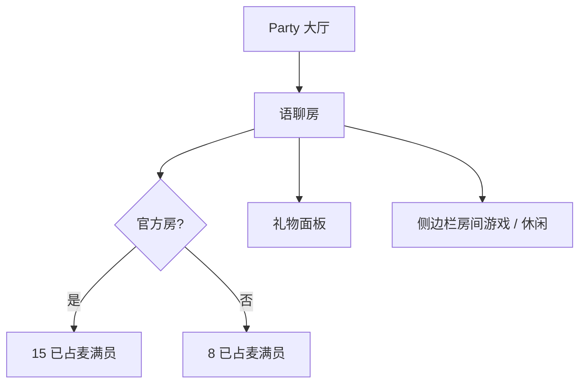

# 房间 · 现行说明

> 派生阅读层。改规则仍改 [`../PRD.md`](../PRD.md)。拍板 RQ-07、RQ-09、RQ-21。

## 元信息
<!-- chunk:no -->

| 字段 | 值 |
|---|---|
| 功能 ID | `room` |
| 截止版本 | 已收录 V1.4.0 |
| 权威 | 派生 |
| 状态 | pending-review |

---

## 范围
<!-- chunk:default section=scope id=room.scope -->

覆盖 App 房间：大厅、进房、麦位、资料、礼物、密码房、音乐、发图、侧边栏活动、计分牌、周星、爆奖礼物客户端、房间内游戏入口。Party 可见房间都是语聊房。运营侧分类仍有官方房 / 运营房 / 币商房；密码房是房间属性，不是房间模式。房间内游戏仍在。无游戏房模式，无语聊↔游戏切换，无游戏房专属背景 / 榜单入口。无主播、工会、家族。无房主专属麦、老板位、自动上麦。礼物面板无头饰卡 tab。官方房满员 / 邀请 = 15 个已占麦；非官方 = 8。列表置顶见房间列表，本文不复制。

---

## 总流程
<!-- chunk:default section=flow id=room.flow-main -->

Party 大厅进语聊房。官方房 15 麦、非官方 8 麦。侧边栏可开房间游戏或休闲面板。送礼走礼物面板（经典 / VIP / 爆奖 / 背包 / 道具）。

---

## 业务逻辑

### 房间类型 {#logic-mode}
<!-- chunk:default section=logic id=room.logic-mode -->

没有游戏房模式。列表 / 跟随里的 ludo 房、domino 房、桌球房、语聊↔游戏切换、游戏房专属背景 / 榜单入口无效。密码房是属性。幸运数字 / 掷色子是房间工具。房间内游戏入口仍在，玩法正文在房间游戏、休闲游戏。

### 麦位 {#logic-mic}
<!-- chunk:default section=logic id=room.logic-mic -->

官方房固定 15 麦，一排 5 个；房主 / 管理员不能改麦位数。非官方 8 麦。满员 / 邀请按已占麦计数。无房主专属麦、老板位、自动上麦。老包看不见多出来的麦，但听得到、送得到。VIP6 可进已满员房。VIP11 防踢 / 防禁言。

### 礼物面板 {#logic-gift}
<!-- chunk:default section=logic id=room.logic-gift -->

分类顺序：经典、VIP、爆奖、背包、道具。无头饰卡 tab。默认全麦。关面板再开保留选择；离房销毁。金币不足快捷充值不展示还差金币。爆奖礼物客户端在本文，后台在 admin-gift-burst。

---

## 客户端页面

### 大厅与房内 {#page-hall}
<!-- chunk:default section=page id=room.page-hall -->

大厅、搜索、国家筛选、创建房间、进房规则按现行 PRD。房内：顶栏、公屏、麦位、资料卡、密码房、音乐、发图、banner、周星、活动推送。礼物动效可关，本地保存，卸载重置为开。

---

## 后台影响
<!-- chunk:default section=admin id=room.admin-impact -->

房间管理：[`../../admin/PRD.md#admin-rooms`](../../admin/PRD.md#admin-rooms)。礼物：[`../../admin/PRD.md#admin-gifts`](../../admin/PRD.md#admin-gifts)。爆奖：[`../../admin/PRD.md#admin-gift-burst`](../../admin/PRD.md#admin-gift-burst)。活动：[`../../admin/PRD.md#admin-activity`](../../admin/PRD.md#admin-activity)。

---

## 关联影响

### 关联 · 运营后台 {#related-admin}
<!-- chunk:related-row section=related id=room.related-admin target=admin -->

房间管理、礼物、爆奖、房间侧边栏活动。跳转 [`../../admin/brief/current.md#admin-rooms`](../../admin/brief/current.md#admin-rooms)、[`../../admin/brief/current.md#admin-gifts`](../../admin/brief/current.md#admin-gifts)、[`../../admin/brief/current.md#admin-gift-burst`](../../admin/brief/current.md#admin-gift-burst)、[`../../admin/brief/current.md#admin-activity`](../../admin/brief/current.md#admin-activity)。

### 关联 · 房间列表 {#related-room-list}
<!-- chunk:related-row section=related id=room.related-room-list target=room-list -->

AR/EN/TR 置顶阿语官方房。跳转 [`../../room-list/brief/current.md`](../../room-list/brief/current.md)。

### 关联 · 房间游戏 {#related-room-game}
<!-- chunk:related-row section=related id=room.related-room-game target=room-game -->

侧边栏水果机等。跳转 [`../../room-game/brief/current.md`](../../room-game/brief/current.md)。

### 关联 · 休闲游戏 {#related-casual}
<!-- chunk:related-row section=related id=room.related-casual target=casual-game -->

房内休闲面板。跳转 [`../../casual-game/brief/current.md`](../../casual-game/brief/current.md)。

### 关联 · 排行榜 {#related-ranking}
<!-- chunk:related-row section=related id=room.related-ranking target=ranking -->

语聊房左上角房间榜。跳转 [`../../ranking/brief/current.md`](../../ranking/brief/current.md)。

---

## 相对变化
<!-- chunk:changelog section=changelog id=room.changelog -->

相对原文：删除游戏房模式与主播 / 家族；官方房 15 麦；礼物无头饰卡。

---

## 原文
<!-- chunk:no -->

[`../PRD.md`](../PRD.md) · [`../changelog.md`](../changelog.md) · [`../history/`](../history/)

---

## 计划预览
<!-- chunk:no -->

无。

---

## 待校对
<!-- chunk:no -->

「只能静音当下麦位」等原文待定保持 `needs-input`。
