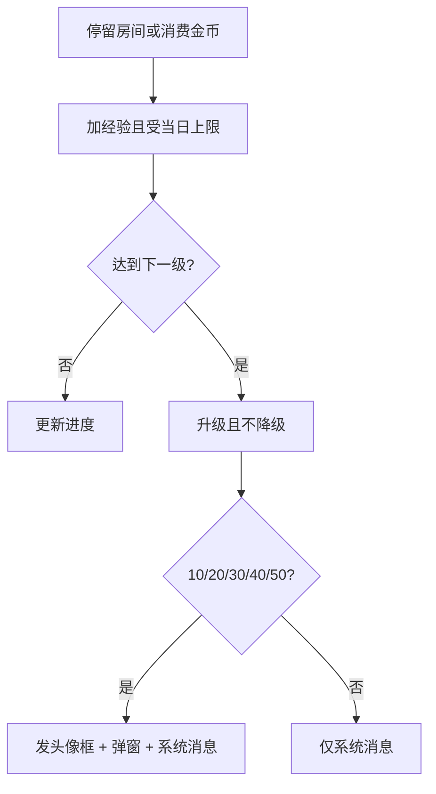

# 用户等级 · 现行说明

> 派生阅读层。改规则仍改 [`../PRD.md`](../PRD.md)。基于已收录主线 **V1.4.0**。拍板 RQ-03：用户等级现行。

## 元信息
<!-- chunk:no -->

| 字段 | 值 |
|---|---|
| 功能 ID | `user-level` |
| 截止版本 | 已收录 V1.4.0（模块正文来自 V1.0.0） |
| 权威 | 派生 |
| 状态 | pending-review |

---

## 范围
<!-- chunk:default section=scope id=user-level.scope -->

覆盖用户等级页、经验规则、升级通知。经验 = 房间停留 + 金币消费/4000（取整）。无贵族加成，无钻石经验。等级头像框仍可发。后台「没等级」作废。不覆盖 VIP 财富值。

---

## 总流程
<!-- chunk:default section=flow id=user-level.flow-main -->

Me 点「等级」进等级页。房间停留每 10 分钟发 20 经验，消费金币按 `金币数/4000` 取整加经验。达到升级要求则升级且不降级。升到 10/20/30/40/50 级自动发头像框并出升级弹窗，同时发系统消息。

---

## 业务逻辑

### 经验与升级 {#logic-exp}
<!-- chunk:default section=logic id=user-level.logic-exp -->

满级 59。经验累加，升级不清空。等级只升不降。房间：连续呆在房间每 10 分钟发 20 Exp；退出或换房时累计上个房间停留时间。消费金币：每次消费先算金币数/4000 再取整。无贵族加成，钻石不计经验。各行为有当日经验上限：已达上限则该笔作废；将超过则只补到上限。进度按自然日，每天 0 点（GMT+3）刷新。升到配置了奖品的等级自动获得；错过的等级后来加奖不补发。

### 升级通知 {#logic-notify}
<!-- chunk:default section=logic id=user-level.logic-notify -->

升到会发奖的等级（目前 10/20/30/40/50）出全局弹窗。系统消息：「恭喜你升到 xx 级。」带奖则附加头像框说明。多个升级弹窗同时触发时先低后高。

---

## 客户端页面

### 等级页 {#page-level}
<!-- chunk:default section=page id=user-level.page-level -->

入口在 Me「等级」。未满级显示「还剩 x,xxx,xxx 经验升级」（千分位）和进度条：`(当前经验-本级经验)/(下级经验-本级经验)`。满级 59 不再示进度条，文案「你已达到最高等级」，高度自适应。等级牌每 10 级一种样式（1–9、10–19 … 50–59）。升级奖励从 10 级起每 10 级一个头像框，等级牌升级不列在升级特权里。

### 升级弹窗 {#page-popup}
<!-- chunk:default section=page id=user-level.page-popup -->

升级获奖弹窗展示所升等级，按钮「查看奖品」再出奖励弹窗（单独配置的奖品图），按钮「收下」关闭。

---

## 后台影响
<!-- chunk:default section=admin id=user-level.admin-impact -->

后台用户列表「没等级」不当现行。等级头像框发放与商城/头像框页一致。

---

## 关联影响

### 关联 · 个人中心 {#related-profile}
<!-- chunk:related-row section=related id=user-level.related-profile target=profile -->

Me 等级入口和个人头像框展示在个人中心。跳转 [`../../profile/brief/current.md`](../../profile/brief/current.md)。

### 关联 · 商城 {#related-mall}
<!-- chunk:related-row section=related id=user-level.related-mall target=mall -->

等级牌和等级头像框的展示位见商城。跳转 [`../../mall/brief/current.md`](../../mall/brief/current.md)。

---

## 相对变化
<!-- chunk:changelog section=changelog id=user-level.changelog -->

相对原文：去掉贵族经验加成和钻石经验；确认等级功能现行。

---

## 原文
<!-- chunk:no -->

[`../PRD.md`](../PRD.md) · [`../changelog.md`](../changelog.md) · [`../history/`](../history/)

---

## 计划预览
<!-- chunk:no -->

无。

---

## 待校对
<!-- chunk:no -->

无。
