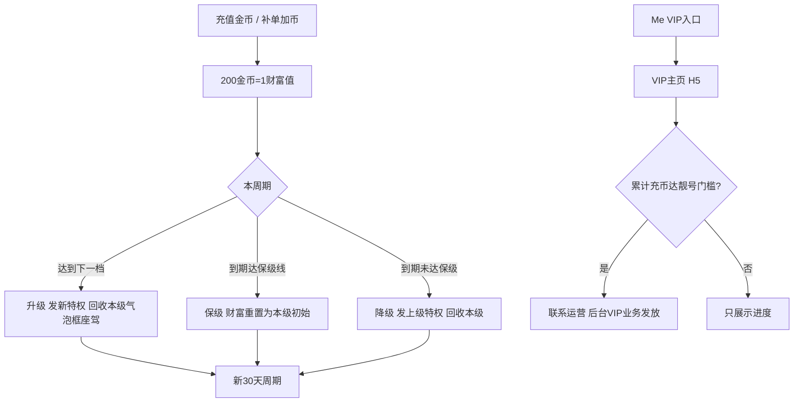

# 用户 VIP · 现行说明

> 派生阅读层。改规则仍改 [`../PRD.md`](../PRD.md)。基于已收录主线 **V1.4.0**。拍板 RQ-02、RQ-17。

## 元信息
<!-- chunk:no -->

| 字段 | 值 |
|---|---|
| 功能 ID | `vip` |
| 截止版本 | 已收录 V1.4.0 |
| 权威 | 派生；冲突以 `PRD.md` 为准，拍板见 [`../../../CONFIRMED.md`](../../../CONFIRMED.md) |
| 状态 | pending-review |

---

## 范围
<!-- chunk:default section=scope id=vip.scope -->

覆盖 App 侧 VIP 保级体系、页面、权益、通知、靓号权益展示。付费身份只有 VIP。无贵族对照、贵族可买、贵族加成、贵族聊天气泡。靓号：累计充币达标后联系运营，后台 VIP 业务下发，不是商城购买。充值返币已删除，不恢复。高级 VIP 私聊 WhatsApp 跳转已删除，不恢复。无头饰卡。

不覆盖后台 VIP 池字段表、财富值档位数字（原文未给出各等级财富表，不编造）。

---

## 总流程
<!-- chunk:default section=flow id=vip.flow-main -->

商店充值、币商或补单类加币按 200 金币 = 1 财富值计入 VIP。首次有财富值起 30 天周期，每天 GMT+3 12 点结算。周期内够下一档则升级并开新周期；到期够保级线则财富重置为本级初始并保级；不够则降级到上一级初始。Me 进 VIP 主页看进度和权益。靓号只展示累计充币与可获等级，真正发放走后台。

---

## 业务逻辑

### 财富值与周期 {#logic-wealth}
<!-- chunk:default section=logic id=vip.logic-wealth -->

VIP 是基于付费贡献的保级身份。计量单位为财富值。来源：商店充值、币商以及后续第三方充值得到的金币；运营后台加币且操作类型为「对掉单的用户补单」。比例 200 金币 = 1 财富值。其它得金币方式不加财富值（含非上述类型的后台加币、系统返币）。后台扣币不减财富值。达到最高等级保级线后财富值停在保级线，不再提升。

每轮 30 天，自首次充值（财富值有数字）起算。结算统一每天 GMT+3 12 点，故实际周期略长于 30 天。升级、降级、保级成功都重置周期，各用户周期不一致。因 12 点结算耗时，每次发放商店商品及密码房权限多发 1 小时，避免特权空窗。

### 升级、保级、降级、退款 {#logic-cycle}
<!-- chunk:default section=logic id=vip.logic-cycle -->

升级：本周期内达到下一等级所需财富值。财富值数字保持，升到下一档，发放下一档特权并回收当前等级的聊天气泡、头像框、座驾。结束本周期，开新 30 天。

保级：到期未达下一档、但达到本级保级财富值。财富值重置为本级初始，保持本级特权，开新周期。

降级：到期未达本级保级线。财富值重置为上一档初始，发放上一档特权并回收当前气泡、头像框、座驾，开新周期。

退款：按 200 退款金币 = 3 财富值扣除。因退款导致降级：保持退款后的财富值，不把充值财富值补回上一周期初始；发放上一档特权并回收当前气泡、框、座驾；开新周期。

后台赠送 VIP / 调整财富值：不触发全服飘屏；若因此升级降级保级，遵循对应逻辑但不发送相关通知（后台正文，客户端只消费结果）。

### 权益 {#logic-perk}
<!-- chunk:default section=logic id=vip.logic-perk -->

权益对应等级服务端控制，可后调。向上覆盖。VIP 标识、聊天气泡、头像框、座驾、房间背景为升级权益，每级样式或 ID 不同，升级或降级须回收旧的再发新的。无贵族气泡 / 贵族加成。去掉发放 ludo 游戏皮肤。能否使用由服务端判断；客户端有入口但服务端失败时统一 toast「你的VIP等级不足」（发图、动态头像、VIP 礼物、榜单匿名）。

按原文归属（可被服务端改档）：

- VIP1：标识、发图片、金色昵称、VIP 专属礼物、房间在线列表靠前。
- VIP2：GIF 头像、聊天气泡。
- VIP3：静态头像框；座驾体验（7 天普通座驾，非 VIP 系列）。
- VIP4：完整 VIP 座驾（周期 30 天）；静态房间背景；专属客服。
- VIP5：动态头像框。
- VIP6：进入已满员房间。
- VIP7：密码房权限；升级至 7 及以上及 7 及以上保级成功的全服房间横幅（见 `{#logic-notify}`）。
- VIP8：发送指定内容到全站（仅展示，运营操作）。
- VIP9：榜单匿名。
- VIP10：定制房间背景、解封账号（仅展示，运营）。
- VIP11：防踢 / 防禁言；Banner、定制头像框、官方举办派对（后三项仅展示，运营）。满级。

VIP4–6 房间背景为静态；VIP7 及以上为动态，获得动态不再获得静态。聊天气泡归商城背包体系但不做前端展示页；原文未单列展示坑位，不另编造。头像框 / 座驾 / 背景进背包和获得记录；升级时头像框、座驾自动佩戴或使用，用户仍可在背包改；保级不自动佩戴 / 使用。背景无自动使用。VIP3 座驾 7 天内意外降到 VIP2 不回收该座驾。

发图 / VIP 礼物 / GIF：无权益时拉半屏引导，可进 VIP 主页；非 VIP 礼物蒙层可点选但不能送，关浮层回到礼物面板。GIF 上限 2M，超则 toast「GIF图片不能超过2M」；不裁剪，预览后用原图。服务端存静态（动图第一帧）和动态两字段；VIP2 以下返回静态，升回 VIP2 返回动态，已存字段不因等级抹掉。

在线列表排序：房主 > 贡献周榜 > 贡献日榜 > VIP（等级高到低，同级再按用户等级、经验）> 管理员 > 粉丝 > 普通用户。

VIP Service 为特殊官方账号，私聊 / 好友列表有特殊标识。VIP4 及以上与该账号私聊不限条；低于 VIP4（含从 4 降级）找到该账号仍走陌生人限制。VIP 页内客服入口仅 VIP4+。按语言跳对应客服号。账号不可被搜索。无 WhatsApp 跳转。

榜单匿名：Setting-Privacy 增加项，说明「只有VIP9拥有排行榜匿名权限」。≥VIP9 可开关；已是 VIP 但 <9 引导「查看我的VIP等级」；非 VIP「查看更多VIP特权」。从 VIP9 降级自动关。生效：个人全局榜（Giver、Receiver、Billionaire）含入口头像、房间贡献榜、个人页 Top Supporter 含入口头像。客态固定头像+匿名，不带头像框、性别、VIP、等级；主态正常并打匿名 tag。点击 toast「对方是匿名状态」。

防踢 / 禁言：对 VIP11 操作失败，弹窗「对方是VIP11，你无法将对方禁言/踢出房间。如对方有严重违规行为（色情、宗教），请联系官方客服。」并给被操作 VIP 发通知。

房间资料卡上的 VIP 标识，点自己或他人都进**自己的** VIP 页，返回回房间。

标识展示位原文列出房间贡献榜、发言区、在线列表、资料卡、平台榜、Top Supporter、主页、Me、关注 / 粉丝 / 访客 / 私聊列表、私聊详情、消息好友列表、房间粉丝、邀请进房、团队 / 个人邀请充值榜和拉新列表、邀请二维码等。金色昵称位：麦位、房间发言、资料卡、在线列表、私聊列表 / 页、个人主页、房间排行榜。

### 通知与全服横幅 {#logic-notify}
<!-- chunk:default section=logic id=vip.logic-notify -->

VIP 消息走 System，用 VIP 模板。升级同时出应用内弹窗。自然触发（非后台赠送或回收）连升 / 连降发多条通知、多个弹窗，关一个出下一个；过程中点「Check My VIP」则中断队列。降到非 0 用交互图文案；降到 VIP0：Title「VIP已到期」，说明「很遗憾，你在本周期保级失败，已失去VIP身份」。另有保级提醒、保级成功、新周期开始、周报、防踢权益使用提醒。旧版本无法收这些通知。

定时（GMT+3）：VIP 过期结算每天 12 点起；VIP11 防踢权益使用提醒每天 22 点起；周报每天 14 点起；保级提醒每天 15 点起。

升级至 VIP7 及以上、以及 VIP7 及以上保级成功：全服房间内横幅，点击进该用户个人主页。升级在等级变动时刻发；保级横幅在财富值增加并超过保级线时发（不是结算真正保级时）。一次大额充值连升 / 连保则连续发。触发某级升级或保级后 29 天内不能再触发 ≤ 该通知级别的其它通知；触发更高级后 29 天限制更新。后台赠送 VIP 和调财富值不触发飘屏。

### 靓号 {#logic-pretty}
<!-- chunk:default section=logic id=vip.logic-pretty -->

靓号仅后台发放（含 VIP 联系运营挑选后下发），商城不卖。本版无头饰卡。与 VIP 等级无关：只要是 VIP 且累计充币达标即可持有；失去 VIP 则回收标记为 VIP 业务下发的靓号。累计充币口径与财富值来源一致（商店、代充、后续三方、后台「对掉单的用户补单」）。每次失去 VIP 身份，累计充币清零再累。共十级。达标后联系运营挑选、后台勾选 VIP 业务下发。

VIP 页默认停在「特权」tab，靓号为独立 tab。仅 VIP 身份展示「我的累计充币数」。个人 / 房间靓号区域四种：无 VIP 靓号（没有，或有但业务不是 VIP）展示空；有 VIP 靓号展示「我的靓号ID」数字；无 VIP 靓号但达标准展示「可获得」+ 等级；已有且可升级则同时展示 ID 与「可升级」。可获得或可升级时出「你可联系官方挑选靓号，点击联系」：VIP4+ 进 VIP Service 私聊，VIP4 以下进官方反馈。另有说明、对照表浮层、规则文案。

累计充币每达一档，系统消息「恭喜你的累计充币数达到 XXX，可免费获得靓号权益」，展示两类可获靓号；点击进 VIP 页并定位靓号 tab。失去 VIP 回收后文字系统消息「你的VIP靓号已被回收」。

---

## 客户端页面

### Me 入口与 VIP 主页 {#page-home}
<!-- chunk:default section=page id=vip.page-home -->

Me 固定 VIP 入口：未获得为「Get VIP」；已获得为用户 VIP 等级。主页为 H5。头部：头像固定展示 VIP 头像框（不是用户自主佩戴的那只）；VIP 昵称金色；VIP 标识含等级，非 VIP 为灰色 Non-VIP。有效期：未保级且周期开始 14 天内只展示截止日期；14 天之后加「还剩 X 天完成保级」；已保级成功展示下一周期截止。进度条左为本级 + 初始值，右为下级 + 初始值，值为当前财富；VIP11 右侧为保级线。非 VIP 不展示保级线。文案：未保级「还需要 X 财富值完成保级」；已保级「再获得 X 财富值即可升级到 VIP Y」；满级「保级成功，你已是满级VIP」。权益区按服务端配置出 icon、等级、文字。充值按钮浮动，下滑隐藏，上划及静止出现，点出半屏充值。VIP4+ 展示客服入口。

### 权益介绍与商店 {#page-perk}
<!-- chunk:default section=page id=vip.page-perk -->

主页点某项权益进介绍页并定位该项；顶栏可滑切换；左右滑切换；有预览的可点预览。VIP10 / VIP11 部分素材上线时可用 Coming Soon 占位。商店里按钮状态配成 VIP 专属时，头像框 / 座驾 / 背景按钮为「VIP Exclusive」，点击进 VIP 页。无权益操作时的半屏引导见 `{#logic-perk}`。座驾预览：点击一个预览时 loading 过程不允许关闭，以避免频繁点多个预览闪退。

### 隐私与资料卡 {#page-privacy}
<!-- chunk:default section=page id=vip.page-privacy -->

Setting-Privacy 的排行榜匿名见 `{#logic-perk}`。个人主页 / Me / 资料卡展示 VIP 标识与金色昵称。礼物面板（房间和私聊）有 VIP tab。

---

## 后台影响
<!-- chunk:default section=admin id=vip.admin-impact -->

VIP 等级与权益配置、赠送、财富值校正、靓号 VIP 业务发放与回收、商城「VIP Exclusive」按钮、VIP 礼物类型以后台为准。本文不复制字段。跳转 [`../../admin/PRD.md#admin-vip`](../../admin/PRD.md#admin-vip)、[`../../admin/PRD.md#admin-grant`](../../admin/PRD.md#admin-grant)。商店按钮状态另见 [`../../admin/PRD.md#admin-mall`](../../admin/PRD.md#admin-mall)。

---

## 关联影响

### 关联 · 商城 {#related-mall}
<!-- chunk:related-row section=related id=vip.related-mall target=mall -->

VIP 头像框、座驾、房间背景、聊天气泡归背包体系；靓号不在商城卖。跳转 [`../../mall/brief/current.md`](../../mall/brief/current.md)。

### 关联 · 个人中心 {#related-profile}
<!-- chunk:related-row section=related id=vip.related-profile target=profile -->

Me / 主页 VIP 入口与展示；隐私里的榜单匿名；GIF 头像入口。无贵族入口。跳转 [`../../profile/brief/current.md`](../../profile/brief/current.md)。

### 关联 · 消息 {#related-messaging}
<!-- chunk:related-row section=related id=vip.related-messaging target=messaging -->

VIP 通知在 System。VIP4+ 与 VIP Service 私聊不限条。跳转 [`../../messaging/brief/current.md`](../../messaging/brief/current.md)。

### 关联 · 金币充值 {#related-recharge}
<!-- chunk:related-row section=related id=vip.related-recharge target=recharge -->

财富值只统计充值金币及补单类加币，200 金币 = 1 财富值。跳转 [`../../recharge/brief/current.md`](../../recharge/brief/current.md)。

### 关联 · 运营后台 {#related-admin}
<!-- chunk:related-row section=related id=vip.related-admin target=admin -->

VIP 功能后台与赠送 / 靓号发放。跳转 [`../../admin/brief/current.md#admin-vip`](../../admin/brief/current.md#admin-vip)、[`../../admin/brief/current.md#admin-grant`](../../admin/brief/current.md#admin-grant)。

---

## 相对变化
<!-- chunk:changelog section=changelog id=vip.changelog -->

相对原文：贵族下线，付费身份只有 VIP。靓号仅后台发放，本版无头饰卡。充值返币、高级 VIP WhatsApp 跳转已删除不恢复。货币按金币 / 宝石，不引入钻石。去掉 ludo 皮肤权益。

---

## 原文
<!-- chunk:no -->

[`../PRD.md`](../PRD.md) · [`../changelog.md`](../changelog.md) · [`../history/`](../history/)

---

## 计划预览
<!-- chunk:no -->

V1.5.0 工作区不是现行。无已收录之后的版本计划进入本文。

---

## 待校对
<!-- chunk:no -->

- 各 VIP 等级所需财富值 / 保级线数字原文未写入本功能 PRD，本文不编造。
- VIP 聊天气泡「需展示」但原文未单列坑位，未补位置。
- 标识 / 金色昵称展示位按原文罗列，不增加未写场景。
