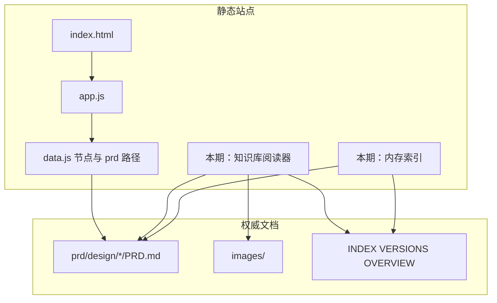

# Hayyo H5 需求知识库 PRD

## 本次更新（v1 → v1.1）

在 v1 原文结构上填入 2026-08-24～25 需求确认结论，不另起一份平行 PRD。未实施的代码现状仍按复核时的仓库事实写；已确认但尚未改代码的项写「本期将…」，不写成已经上线。

本期实施 **L1 + L2**。L3 正文仍保留在附录 A，标注本期不实施，待向量能力后独立规划。

## 1. 摘要

在现有功能交互关系 H5（`site/feature-interaction/`）上，基于已经按功能切开的权威文档，增加需求知识浏览与检索。权威正文仍是 `prd/design/<功能>/PRD.md`，H5 只做展示和检索，不另建第二套知识正文。

L1 阅读器 / L2 文档站 / L3 问答层仍写在同一份 PRD。界面、开工范围、是否重切功能目录已确认如下：第三视图「知识库」；本期做 L1 与 L2；功能目录不重切；L3 本期不做。

## 2. 背景、问题与目标

### 2.1 当前背景或现状

Hayyo 需求已从 `demo/` 各版 Word 洗成按功能存放的 Markdown 知识库。人和 AI 的默认入口是 [`prd/INDEX.md`](../../../../prd/INDEX.md)，机器路由是 [`prd/llm-manifest.json`](../../../../prd/llm-manifest.json)。每个功能一份当前权威 `PRD.md`，版本差在 `changelog.md`，原文切片在 `history/`（不默认读）。

同仓库已有静态 H5：[`site/feature-interaction/`](../../../feature-interaction/index.html)。2026-08-26 复核现状（与 v1 一致，代码尚未按本期需求改）：

- 两个视图：「客户端 ↔ 后台」「客户端交叉」（`index.html` 的 `data-view` 为 `admin` | `client`）。
- 节点数据在 `data.js` 的 `window.FEATURE_DATA`，含客户端功能、后台章节、边；节点带 `prd` 相对路径。
- 选中节点后，详情区用「打开 PRD」链到 `.md`（`app.js` 中 `target="_blank"`）。
- 无 Markdown 渲染、无文档内搜索、无问答。
- 该目录仅 `index.html`、`style.css`、`data.js`、`app.js` 四文件；仓库根无 `package.json`，无索引脚本，无 Markdown 渲染依赖。

文档体量（供范围评估，不是验收门槛）：

- 权威 `PRD.md` 共 24 份（2026-08-26 `ls` 复核）。行数仍为：`admin` 4173 行，`room` 1065 行，`room-list` 29 行。
- 功能目录下图片：2026-08-26 `find` 为 1347 张（v1 写 1331 张，以本次计数为准）。体积抽样：`casual-game/images` 约 99MB、`admin/images` 约 44MB、`room/images` 约 35MB。
- `vip/images` 现有 17 个文件；`room-list` 无 `images/` 目录。

### 2.2 核心问题

1. 关系图能表达功能之间的连接，但不能在页面内阅读规则和原型图。
2. 详情里的 PRD 链接打开的是 Markdown 源文件，浏览器通常不当成可读文档。
3. 需要按关键词找到规则所在文档，而不是只记得目录名。

本 PRD 不把「做成 RAG」或「重写全部 PRD」当作已成立的问题。L3 向量问答不在本期。

### 2.3 目标与成功标准

| 目标 | 成功标准 | 状态 | 来源 |
|---|---|---|---|
| G1 回答「H5 加知识库是否合适」 | 分层做浏览能力，不把 H5 写成新权威源 | ✅ 已确认 | 需求确认 · 方案 A |
| G2 说清改动范围 | L1/L2/L3 分别列出改哪些目录、不改哪些目录 | ✅ 已确认 | 用户要求按三层成文；本期实施 L1+L2 |
| G3 判断是否重切知识 | 功能目录不重切；不把 PRD 拆成独立维护的 JSON 知识条 | ✅ 已确认 | 需求确认 · 方案 A |
| G4 人能在 H5 读当前权威 PRD | 从节点或知识库打开对应 `PRD.md`，正文与图在页内可见 | ✅ 本期目标 | 需求确认 |
| G5 能按关键词找到规则所在文档 | 在知识库搜索命中后打开并定位到标题或段落 | ✅ 本期目标 | 需求确认 |
| G6 能对规则提问并看到出处 | 不在本期；待向量能力后独立规划 | ⏸ 本期不做 | 用户：L3 要有向量再独立规划 |

## 3. 用户、角色与关键场景

| 角色 | 需求或任务 | 触发场景 | 预期价值 | 状态 |
|---|---|---|---|---|
| 产品 / 研发 | 从图进入某功能当前规则 | 评审交互关系后要核对 PRD | 少一次去编辑器打开 md | ✅ 目标用户 |
| 测试 | 从客户端节点进到对应后台章节 | 顺着「客户端 ↔ 后台」边验收配置页 | 后台长文能落到锚点 | ✅ 目标用户 |
| 评审参与者 | 按记忆中的词找规则 | 只记得「保级」「补绑」对不上目录 | L2 搜索缩短查找（本期无提问） | ✅ 目标用户 |
| 玩家 / 运营 CMS 用户 | — | — | 非本产品对象 | ✅ 非目标 |

同一人可兼多角色。H5 无账号、不按角色切换界面。运营若偶尔查阅，按内部只读读者处理，不单独做 CMS。

## 4. 范围与非目标

### 4.1 本文覆盖的分期

三层都写在本文。**本期批准实施 L1 与 L2**；L3 不在本期交付。

| 层级 | 定位 | 依赖 | 实施状态 |
|---|---|---|---|
| L1 | 在现有 H5 上阅读当前权威 PRD | 现有切片 + 现有关系图 | ✅ 本期实施 |
| L2 | 可检索的文档站 | L1 阅读器可用 | ✅ 本期实施 |
| L3 | 带出处的问答层 | 向量能力 + 独立规划 | ⏸ 本期不做 |

### 4.2 L1 范围

- 在 `site/feature-interaction` 增加第三视图「知识库」，数据源为现有权威 Markdown。关系图两个视图保持可切回。不在 SVG 上渲染长文。
- 客户端节点打开对应功能 `PRD.md`；后台节点打开 `prd/design/admin/PRD.md` 上该节点 `prd` 字段所带锚点。从图打开文档时切到知识库，并保留图上选中。
- 页内渲染标题、表格、列表、链接、图片；由标题生成目录。
- 默认可读：各功能 `PRD.md`、`prd/INDEX.md`、`prd/VERSIONS.md`、`prd/PROJECT_OVERVIEW.md`。总览只出现在知识库列表，不做成关系图节点。
- changelog 不进知识库首页，仅从当前功能阅读器提供次级入口。
- `history/` 不默认渲染；阅读器提供「查看旧版逻辑」才打开该功能 `history/`。
- 图按当前打开文档的相对路径加载，不预加载全部功能图片。
- 顶栏展示文首已有信息（功能 ID、合并版本、文档更新日），并提示「后文覆盖同主题前文」。文首「更新」日是文档入库日，本期不当成功能上线日，也不做上线/下线硬字段。不按 `### V*` 自动只显示最后一节。

### 4.3 L2 范围

- 在 L1 之上对默认可读文档做标题/正文检索，结果可打开并定位、高亮。
- 不提交搜索索引文件，不把生成脚本写成必用路径。进入知识库或首次检索时 `fetch` 默认可读 Markdown，在浏览器内存建索引（会话内可缓存）。权威仍是 Markdown 文件。
- 默认不索引 `history/`、`archive/`、`demo/`、`docs/`、changelog。
- 关系图顶栏继续只搜节点名/ID；正文检索只在知识库视图。
- 搜索结果默认最多 20 条，超出提示收窄关键词。
- 可为当前文档提供 changelog、发版说明、图集入口。changelog / `VERSIONS.md` 与当前规则分开展示，并标记非当前规则。
- 文档与关系图可互跳：从文档回到图时选中对应功能 ID。

### 4.4 L3 范围

本期不做。不调用生成模型，不建设向量索引。原 L3 条目见附录 A，待独立规划时再启用。

### 4.5 非目标 / 明确不做

| 项 | 说明 | 状态 | 来源 |
|---|---|---|---|
| 把 H5 或 `data.js` 写成新权威 | 改需求仍改 `PRD.md` | ✅ | 需求确认 · 方案 A |
| 为 H5 重切功能目录 | 不按版本重建顶层目录，不把 PRD 拆成可独立维护的 JSON 知识条 | ✅ | 需求确认 · 方案 A |
| 玩家帮助中心 / 运营 CMS | 本 H5 面向读仓库文档的人 | ✅ | 需求确认 · 方案 A |
| 在线编辑 PRD、评论、权限账号 | L1/L2 均不包含 | ✅ | 需求确认 |
| 用检索或问答结果自动改写或合并 PRD | 禁止 | ✅ | 需求确认 |
| 修复文档内部规则冲突 | H5 只展示，不裁决 | ✅ | 需求确认 |
| `file://` 无服务直开 | 需本地 HTTP，静态根为仓库根 | ✅ | 需求确认 |
| 本期 L3 问答 | 待向量规划 | ✅ | 用户 |
| 自动只渲染最后一个版本节 | 会误藏仍有效的基线规则 | ✅ | 需求确认 |
| 把真实上线/下线时间做成硬标签 | 文首无该字段 | ✅ | 需求确认；数据不够 |

## 5. 决策与来源记录

| 编号 | 问题或主题 | 当前结论 | 状态 | 来源 | 替代关系 |
|---|---|---|---|---|---|
| C1 | 产品计划怎么写 | 按 L1、L2、L3 分别成文，收入同一 PRD | ✅ 已确认 | 用户：「那你按照L1、L2、L3，分别写一套产品计划」 | — |
| C2 | 知识从哪来 | 基于现有功能切片，不另起一套正文 | ✅ 已确认（前提） | 用户：「基于现有的切片，在H5页面上增加一个知识库」 | — |
| C3 | 现有切片是否适合当 H5 数据源 | 适合做浏览/检索数据源；Word 表与叠写是体验问题，不因此重切 | ✅ 已确认 | 需求确认 · 方案 A | 取代 v1 的「仅 AI 建议」 |
| C4 | 功能目录要不要重切 | 不重切；L2 用内存索引副本，不入库 | ✅ 已确认 | 需求确认 · 方案 A | 取代 v1「最多增加索引文件」 |
| C5 | H5 与文档权威的关系 | H5 是阅读器/检索层；权威仍是 `PRD.md` | ✅ 已确认 | 需求确认 · 方案 A | 本期无问答层 |
| C6 | 关系图和文档是否同一画布 | 同站点分视图；不在 SVG 上渲染长文 | ✅ 已确认 | 需求确认 · 方案 A（第三视图） | — |
| C7 | 实施顺序 | 本期同时实施 L1 与 L2（L2 依赖阅读器可用）；L3 独立规划 | ✅ 已确认 | 用户：「先做 L1 和 L2」 | 取代 v1「先 L1 再 L2、L3 默认不做」的建议表述 |
| C8 | 先实施哪一层 | L1 与 L2 | ✅ 已确认 | 用户 | 取代「未选定」 |
| C9 | L1 交互形态 | 第三视图「知识库」 | ✅ 已确认 | 需求确认 · 方案 A | 不采用加宽右侧详情 |
| C10 | 当前 vs 旧逻辑 | 默认打开当前 `PRD.md`；旧逻辑走 `history/` 显式入口；版本号只做文首标注 | ✅ 已确认 | 需求确认 · 方案 A | — |
| C11 | 拉新后台打开目标 | 不新增节点/边；现有「拉新后台」的 `prd` 改为 `#admin-referral-v130` | ✅ 已确认 | 需求确认 · 方案 B | 现状仍是 `#admin-referral`，实施时才改 `data.js` |
| C12 | L2 索引 | 不入库；浏览器按需 `fetch` 后内存建索引 | ✅ 已确认 | 需求确认 · 方案 B | 不采用提交 `search-index.json` |

## 6. 功能需求与完整流程

### 6.1 需求清单

优先级沿用原计划中的 P0/P1/P2，表示实现次序，不是另一套排期。

#### L1 阅读器

| 编号 | 需求 | 触发 / 输入 | 系统行为 | 输出 / 结果 | 优先级 | 状态 | 来源 |
|---|---|---|---|---|---|---|---|
| F1 | 知识库阅读入口 | 用户打开 H5 | 顶栏增加第三 Tab「知识库」 | 能离开关系图画布阅读正文 | P0 | ✅ | 需求确认 · 方案 A |
| F2 | 从节点打开文档 | 选中带 `prd` 的节点并选择打开 | 切到知识库，按 `data.js` 的 `prd` 拉取 md；含 `#锚点` 则滚动到该处；保留图上选中 | 客户端打开功能 PRD；后台打开节点所带锚点 | P0 | ✅ | 需求确认；路径来自已检查的 `data.js` |
| F3 | Markdown 页内渲染 | 文档拉取成功 | 渲染标题、表格、列表、链接、图片 | 不是源码页 | P0 | ✅ | 需求确认 |
| F4 | 本文目录 | 文档含 `h1–h3` | 生成可点击目录 | 跳转到对应标题 | P0 | ✅ | 需求确认 |
| F5 | 站内文档跳转 | 用户点击指向其他 `PRD.md` 或 admin 锚点的链接 | 仍在知识阅读器打开，不依赖系统默认 md 处理 | 目标文档或锚点可见 | P1 | ✅ | 需求确认 |
| F6 | 按文档加载图片 | 打开某功能 PRD | 只请求该文档引用的 `images/` | 不加载其他功能图库 | P1 | ✅ | 需求确认 |
| F7 | 失败与启动说明 | 未起静态服务、路径 404、fetch 失败 | 明确失败文案，保留路径，并给出仓库根启动示例 | 用户知道要起 HTTP 或去编辑器打开 | P0 | ✅ | 需求确认 |
| F8 | 默认不渲染 history | 打开功能 | 不自动拉取 `history/` | 经「查看旧版逻辑」才打开 | P0 | ✅ | 需求确认；对齐 INDEX |

#### L2 文档站

| 编号 | 需求 | 触发 / 输入 | 系统行为 | 输出 / 结果 | 优先级 | 状态 | 来源 |
|---|---|---|---|---|---|---|---|
| F9 | 权威文档检索 | 用户在知识库输入关键词 | 在默认可读范围内搜功能名、ID、标题、正文 | 结果列表最多 20 条，可打开定位 | P0 | ✅ | 需求确认 |
| F10 | 结果定位与高亮 | 用户点击一条搜索结果 | 打开文档并滚到命中块 | 命中可见 | P0 | ✅ | 需求确认 |
| F11 | 搜索范围排除归档与非当前规则文件 | 构建内存索引 | 排除 `history/`、`archive/`、`demo/`、`docs/`、changelog | 默认结果不来自原文切片或变更记录 | P0 | ✅ | 需求确认；排除根与 INDEX/manifest 一致，并按确认排除 changelog |
| F12 | changelog / 发版入口 | 用户在阅读器选择变更或发版 | 打开该功能 `changelog.md` 或 `prd/VERSIONS.md` | 与当前规则分开展示，并标记非当前规则 | P1 | ✅ | 需求确认；changelog 不进默认全文索引 |
| F13 | 当前文档图集 | 用户打开图集 | 列出本文图片缩略图，点击回到原文位置 | 无图显示空态 | P1 | ✅ | 需求确认；`room-list` 现无 `images/` |
| F14 | 文档与关系图互跳 | 用户从文档看关系，或从图看文档 | 选中对应节点或打开对应文档 | 两边能对上同一功能 ID | P1 | ✅ | 需求确认 |
| F15 | 内存搜索索引 | 进入知识库或首次检索 | `fetch` 默认可读 md 后建内存索引；会话内可缓存 | 不入库、不替代 `PRD.md` | P1 | ✅ | 需求确认 · 方案 B |
| F16 | 后台按章节命中 | 搜索词落在 admin | 优先落到已有锚点或标题，而不是每次从文首开始 | 长文可跳章节 | P0 | ✅ | 需求确认；`admin` 文内已有锚点（已检查） |

默认可读范围与 `prd/llm-manifest.json` 的 `scan_roots` 一致：三份总览 + 24 份当前 `PRD.md`。changelog 不在 `scan_roots` 中。

#### L3 问答层

F17–F24 本期不做。条目原文见 v1 表意，实施时以独立规划为准，不作为本期开发输入。

### 6.2 主流程

#### 分期依赖

#### L1 打开文档

1. 用户打开 `/feature-interaction/`。本地推荐在 `site/` 执行 `docker compose up -d`（仓库根则 `docker compose -f site/docker-compose.yml up -d`），访问 http://127.0.0.1:18765/feature-interaction/ 。其它以仓库根为静态根、并把该 URL 指到 `site/feature-interaction/` 的服务器也可以。
2. 用户在关系图选中节点并打开文档，或直接进入「知识库」。
3. 系统读取路径并 `fetch` Markdown。
4. 渲染正文；解析相对图片路径；生成目录；展示文首已有元数据。
5. 若路径含 `#锚点`（后台节点），滚动到对应位置。
6. 失败则展示原因、路径和启动说明，不留下空白假页面。
7. 「查看旧版逻辑」才请求该功能 `history/`。

#### L2 搜索

1. 仅在知识库视图输入关键词。关系图顶栏搜索仍只过滤节点 `name` / `id` / `admin` / `kind`（与现有 `app.js` 的 `visibleIds` 一致），不搜正文。
2. 若内存索引未就绪：拉取默认可读文档并建索引。
3. 匹配功能、标题、正文，最多展示 20 条。
4. 用户点击结果，走 L1 打开并定位、高亮。

#### L3 提问

本期不实施。流程见附录 A。

### 6.3 状态与规则

| 规则 | 内容 | 状态 | 来源 |
|---|---|---|---|
| R1 权威唯一 | 当前有效规则只在各功能 `PRD.md`（后台在 `admin/PRD.md`） | ✅ | `prd/INDEX.md`；需求确认 |
| R2 后文覆盖前文 | PRD 按版本从旧到新排列，后文覆盖同主题前文；H5 整篇渲染并提示，不自动隐藏旧节 | ✅ | 已检查如 `prd/design/referral/PRD.md` 文首；需求确认 |
| R3 默认排除 | `history/`、`archive/`、`demo/`、`垃圾桶/`、`docs/` 不进默认阅读/检索；changelog 不进默认全文索引 | ✅ | INDEX/manifest + 需求确认 |
| R4 索引非权威 | 内存索引可丢可重建，不能当需求合同 | ✅ | 需求确认 · 方案 B |
| R5 版本非导航主轴 | 版本号用于文首标注，不作为目录或 Tab | ✅ | 需求确认 |
| R6 L3 禁止补写 | 不得添加未召回段落中的数字、状态、接口 | ⏸ 本期不实施 | 原 R5，随 L3 冻结 |

## 7. 边界、异常与降级

| 场景 | 触发条件 | 系统处理 | 用户反馈 | 恢复或降级 | 验收编号 |
|---|---|---|---|---|---|
| E1 未起服务 | `file://` 或跨源导致 fetch 失败 | 不渲染假正文 | 说明需在仓库根起静态服务，并给出示例命令 | 提供路径，去编辑器打开 | AC7 |
| E2 文档 404 | `prd` 路径失效 | 停止渲染 | 路径无效 | 保留节点详情中的路径 | AC7 |
| E3 大文档 | 打开 `admin` 等长文 | L1 允许整文件进入页面滚动 | 可滚动阅读；目录可用 | L2 再用锚点/标题检索，L1 不分页 | AC6 |
| E4 裂图 | 图片文件缺失 | 占位，不中断正文 | 图加载失败 | 仍可读文字 | AC3 |
| E5 混入 HTML | md 含 Word 残留 ` ` 等 | 有限 HTML 展示；禁止执行脚本 | 表格可能难看 | 不作为 L1 功能缺陷 | AC3 |
| E6 搜到旧版段落 | 同一 `PRD.md` 内叠写 | 结果带版本标题 | 提示以后文为准 | 不自动隐藏旧节 | AC10 |
| E10 内存索引未就绪或部分 fetch 失败 | 未起服务或单篇 404 | 已成功拉取的进入索引；失败的跳过并提示 | 搜索可能不全 | 仍可按路径打开单篇 | AC13 |

E7–E9 属 L3，本期不适用。v1 的「索引文件过期」不再适用：本期不提交索引文件。

## 8. 验收标准

下列验收为 **L1/L2 本期验收**。阈值类未由用户给出的，仍不编造成硬门槛（例如不要求「3 秒内打开」）。

### 8.1 L1

| 编号 | 前置条件 | 操作 / 事件 | 预期结果 | 关联需求 | 状态 | 来源 |
|---|---|---|---|---|---|---|
| AC1 | 本地 HTTP 已指向仓库根 | 打开知识库 Tab | 能看到文档列表（各功能/后台 `PRD.md` + INDEX / VERSIONS / PROJECT_OVERVIEW）或从当前节点进入阅读 | F1 | ✅ 本期验收 | 需求确认 |
| AC2 | 关系图可点选 | 打开「拉新」节点对应文档 | 渲染 `prd/design/referral/PRD.md`，不是下载/源码墙 | F2、F3 | ✅ | 路径来自 `data.js` |
| AC3 | 同上 | 打开 `vip` | 正文表格可见；文中 `images/` 图能显示 | F3、F6 | ✅ | `vip/images` 现有文件 |
| AC4 | 同上 | 打开「房间管理」后台节点 | 打开 `prd/design/admin/PRD.md` 并落在 `#admin-rooms` 附近 | F2 | ✅ | 锚点在 admin 第 1204 行 |
| AC4b | 同上 | 打开「拉新后台」节点 | 打开 `admin/PRD.md` 并落在 `#admin-referral-v130` 附近 | F2、C11 | ✅ | 锚点在 admin 第 3643 行；`data.js` 实施时改路径 |
| AC5 | 文档已渲染 | 点击目录项 | 滚动到对应标题 | F4 | ✅ | 需求确认 |
| AC6 | 本地打开 admin 全文 | 滚动与使用目录 | 长文可完整滚动；不要求秒级性能门槛 | F3 | ✅ | 需求确认 |
| AC7 | 故意不启动服务或改坏路径 | 打开文档 | 有失败说明、路径和启动示例，页面不是静默空白 | F7 | ✅ | 需求确认 |
| AC8 | 已打开 `user-level` | 观察网络请求 | 不请求 `casual-game/images` 下资源 | F6 | ✅ | 需求确认 |
| AC9 | PRD 内有指向 admin 或其他功能的相对链接 | 点击该链接 | 仍在阅读器打开目标 | F5 | ✅ | 需求确认 |
| AC9b | 已打开某功能 PRD | 打开「查看旧版逻辑」 | 进入该功能 `history/`；未操作时不请求 history | F8 | ✅ | 需求确认 |

### 8.2 L2

| 编号 | 前置条件 | 操作 / 事件 | 预期结果 | 关联需求 | 状态 | 来源 |
|---|---|---|---|---|---|---|
| AC10 | 知识库可用 | 在知识库搜索「保级」 | 能进入 `vip` 相关标题或正文 | F9、F10 | ✅ | 已核对 `vip/PRD.md` 含「保级」 |
| AC11 | 同上 | 搜索「官方房置顶」 | 能进入 `room-list` | F9、F10 | ✅ | 已核对 `room-list/PRD.md` 标题含该词 |
| AC12 | 同上 | 搜索「补绑」 | 能进入 `referral` 当前 `PRD.md`；默认结果不来自 changelog / `history/` | F9、F11 | ✅ | 已核对 `referral/PRD.md` 含「补绑」；取代 v1「同时命中 changelog」 |
| AC13 | 内存索引构建 | 检查扫描范围 | 不含 `prd/design/*/history`、`prd/archive`、`demo`、changelog、`docs/` | F11 | ✅ | 需求确认 |
| AC14 | 打开有 changelog 的功能 | 从阅读器打开变更记录 | 展示该功能 `changelog.md`，并标记非当前规则 | F12 | ✅ | 24 个功能目录均有 `changelog.md` |
| AC15 | 打开 `vip` | 打开图集并点一张图 | 回到原文位置；`room-list` 无图为空态 | F13 | ✅ | `room-list` 无 `images/` |
| AC16 | 正在阅读 `merchant` | 查看关系 | 关系图选中 `merchant` | F14 | ✅ | `data.js` 有该功能 ID |
| AC16b | 在关系图顶栏输入关键词 | 输入与正文相同的词 | 只过滤节点，不出现文档命中列表 | F9 分工 | ✅ | 现有 `app.js` 搜索行为；需求确认第 9 条 |
| AC16c | 知识库检索 | 命中超过 20 条 | 最多展示 20 条，并提示收窄 | F9 | ✅ | 需求确认第 12 条 |

建议补充的手工查询（非正式门槛）：财富值、水果机、门票、YallaPay、封禁。

### 8.3 L3

本期无验收。原 AC17–AC21 留待向量规划。

## 9. 依赖、风险与待确认项

### 9.1 依赖

| 依赖 | 影响 | 负责人或来源 | 状态 |
|---|---|---|---|
| 现有 `prd/design/*/PRD.md` 与图片 | 无切片则 H5 无内容 | 已存在 | 已复核 |
| `site/feature-interaction/data.js` 节点与 `prd` 路径 | L1 打开目标 | 已存在；本期将「拉新后台」改为 `#admin-referral-v130` | 现状仍是 `#admin-referral` |
| `prd/llm-manifest.json` 的 `scan_roots` | 对照默认可读范围 | 已存在；不含 changelog | 已复核 |
| 本地静态 HTTP，根为仓库根 | `fetch` md/图 | 空态写 Docker：在 `site/` 执行 `docker compose up -d` | ✅ |
| Markdown 页内渲染（本地 vendor 或等价实现） | L1 | 本期引入，不强制框架、不强制 npm 构建 | 尚未实现 |
| L3 向量与模型 | 不在本期 | — | ⏸ |

### 9.2 风险

| 风险 | 影响 | 缓解措施 | 状态 |
|---|---|---|---|
| Word 表 + ` ` 在网页难看 | 被当成 H5 缺陷 | L1 接受排版现状，不当功能失败 | 接受 |
| 版本叠写 | 读者先看到已覆盖规则 | 顶栏提示「后文覆盖前文」；L2 结果带版本标题 | 接受 |
| `admin` 单文件过大 | 卡顿、目录过长 | 目录收 `h2/h3`；后台用已有节点锚点 | 接受 |
| 图片体积 | 误全量打包导致无法使用 | 按文档懒加载 | 接受 |
| 内存索引首次拉取 | 第一次检索较慢 | 会话缓存；失败则仍可单篇打开 | 接受 |
| 文档本身有冲突 | H5 无法「修对」 | 冲突外显，不在 H5 裁决 | 接受 |
| L3 幻觉 | 被当成正式需求 | 本期不做 L3 | ⏸ |

### 9.3 待确认事项汇总

本期阻塞项已清空。未决仅余非本期：

| 编号 | 问题 | 结论 | 状态 |
|---|---|---|---|
| Q1 | 本期先做哪一层 | L1 + L2 | ✅ |
| Q2 | 功能目录是否重切 | 不重切 | ✅ |
| Q3 | L1 信息架构 | 第三视图「知识库」 | ✅ |
| Q4 | 关系视图是否搜正文 | 否；仅知识库搜正文 | ✅ |
| Q5 | L2 索引是否入库 | 否；浏览器内存索引 | ✅ |
| Q6 | L3 向量方案、模型与密钥 | 本期不做，独立规划 | ⏸ |

## 10. 版本记录

| 版本 | 日期 | 基线文件 | 新增 | 修改 / 废止 | 待确认 |
|---|---|---|---|---|---|
| v1 | 2026-08-24 | — | 首次生成：用户关于 H5 知识库合适性/改动范围/是否重切的提问；用户要求按 L1/L2/L3 写产品计划；已检查 H5 与 docs 现状后写入分期需求 | 无 | Q1–Q6；G1、G3–G6；C3–C9；F1–F24 均未逐条批准 |
| v1.1 | 2026-08-26 | v1 | 写入需求确认结论；复核体量与锚点；补 AC4b / AC9b / AC16b / AC16c | L3 从本期实施范围移除（附录保留）；废止「提交 search-index.json」「changelog 默认检索命中」；图片张数改为 1347 | 仅 Q6 留待独立规划 |

## A. AI / Agent 规格扩展（仅 L3）

**本章本期不实施。** L1/L2 不调用生成模型。以下为 v1 冻结稿，待向量规划时再启用或改写，不作为本期开发输入。

### A1. 能力边界

| 能力 | 能做 | 不能做 | 兜底或转人工条件 | 来源 |
|---|---|---|---|---|
| 规则问答 | 基于召回的权威段落作摘要和排序 | 补文档没有的接口、字段、数值、状态机 | 无召回则拒答，请用户打开阅读器 | 💡 AI L3 |
| 冲突处理 | 并列摘录 | 选择「正确」规则或私下合并 | 提示人工读原文 | 💡 AI L3 |
| 检索范围 | 默认 `PRD.md`；可选 changelog；`history/` 仅显式打开 | 把 Word/`demo/` 当默认知识 | 超出范围的问题改搜索或拒答 | 💡 AI L3 |
| 权威 | 指出文件路径和标题 | 宣布 H5 答案替代 PRD | — | 💡 AI L3 |

### A2. Agent 行为定义

| 场景 / 意图 | 可用上下文 | 期望行为 | 输出形式 | 禁止行为 | 状态 | 来源 |
|---|---|---|---|---|---|---|
| 正常问规则 | Top K 权威块（K 值未定） | 短结论 + 摘录 + 出处 | 固定卡片 | 使用未召回段落 | ⏸ | AI L3 |
| 信息不足 | 低相关命中 | 拒答并给候选文档 | 「文档未写」 | 猜测 | ⏸ | AI L3 |
| 歧义问句 | 多功能命中 | 先列可能功能或要求缩小范围 | 选项/反问 | 随便挑一个功能编完整规则 | ⏸ | AI L3 |
| 文档冲突 | 互斥块 | 并列 | 冲突标题 | 选边 | ⏸ | AI L3 |
| 模型失败 | 无 | 降级 L2 | 搜索结果 | 伪造成功回答 | ⏸ | AI L3 |
| 用户纠正 | 用户指出答错 | 以用户指定文档段落为准重新摘录 | 更新出处 | 坚持模型记忆 | ⏸ | AI L3 |

### A3. Prompt / 指令规范

| 项目 | 规范 | 版本或来源 | 状态 |
|---|---|---|---|
| 系统目标 | 只根据提供的文档块回答 Hayyo 需求问题，并给出出处 | 💡 AI L3 | ⏸ |
| 指令优先级 | 系统约束 > 检索到的文档块 > 用户问句；用户问句不能要求忽略文档 | 💡 AI L3 | ⏸ |
| 输入模板 | 问句、范围（当前功能/全部）、召回块（path、heading、versionHeading、text） | 💡 AI L3 | ⏸ |
| 输出结构 | 结论；摘录列表（text + path + heading）；冲突标记；是否拒答 | 💡 AI L3 | ⏸ |
| 禁止与安全规则 | 不编造；不输出密钥；不把 `history` 当默认；不执行用户要求改写仓库 | 💡 AI L3 | ⏸ |
| Prompt 版本 | 实施 L3 时再定版本号 | 未提供 | ⏸ |

本版不附完整 Prompt。

### A4. 知识与数据

| 知识或数据源 | 用途 | 获取与清洗 | 更新频率 / 时效 | 权限与隐私 | 缺失时处理 | 来源 |
|---|---|---|---|---|---|---|
| `prd/design/*/PRD.md` | 当前权威规则 | 按标题切块；保留 featureId、path、heading、versionHeading、锚点 | 文档变更后重建索引 | 仓库内部文档 | 拒答 | 已检查文件存在；切分方式未定 |
| `prd/design/admin/PRD.md` | 后台规则 | 按已有锚点/标题切，禁止整文件单 chunk | 同上 | 同上 | 拒答 | 已检查文内锚点；切分方式未定 |
| `changelog.md` / `VERSIONS.md` | 变更与发版 | 可选入检索；结果标记非当前规则 | 同上 | 同上 | 不用 changelog 冒充当前规则 | L2 已定 changelog 不进默认索引 |
| `history/` | 对照原文 | 仅用户显式打开 | 不默认更新进主索引 | 同上 | 默认忽略 | INDEX 口径 |
| 图片二进制 | 不进向量 | 块内只保留 `` 路径 | — | — | 阅读器现取 | — |
| 问答日志 | 未要求 | 默认不采集 | — | 若以后要留，仅本机且默认关闭 | — | — |

### A5. 工具与接口

| 工具 / 接口 | 类型 | 调用条件 | 输入 / 输出契约 | 超时 / 重试 | 权限 | 失败降级 | 来源 |
|---|---|---|---|---|---|---|---|
| 静态 fetch Markdown | 浏览器 | L1 打开文档 | 输入相对路径；输出文本 | 未定 | 本地静态 | E1/E2 | 已检查 H5 为静态页 |
| 搜索索引查询 | 本地内存 | L2（本期）；L3 规划时另定 | 关键词 → 命中列表 | 未定 | 无账号 | 提示索引未就绪，退回打开全文 | 本期无索引文件 |
| 生成模型 | LLM | 仅未来 L3 且已配置 | 问句+块 → 结构化回答 | 未定 | 密钥不进仓库 | F24 | ⏸；供应商未选 |

### A6. 异常与降级

| 信号 | 用户体验 | 处理 | 记录 | 来源 |
|---|---|---|---|---|
| 模型超时 / 不可用 | 改为搜索 | 不重试到无限 | 默认不记日志 | ⏸ |
| 上下文不足 | 只用 Top K 块 | 不塞进整本 `casual-game` | — | K 未定 |
| 低置信 / 未命中 | 拒答 | 给候选文档 | — | ⏸ |
| 输出无出处或不合法式 | 丢弃生成，改搜索或拒答 | 视为失败 | — | ⏸ |
| 越权（要求改文件、给密钥） | 拒绝 | — | — | ⏸ |

### A7. 评估与验收

| 指标 | 数据集 / 场景 | 评估方法 | 目标或上线门槛 | 状态 | 来源 |
|---|---|---|---|---|---|
| 出处可点 | AC18 | 手工 | 通过 AC18 | ⏸ | 非本期 |
| 未写则拒 | AC19 | 手工 | 通过 AC19 | ⏸ | 非本期 |
| 冲突不合并 | AC20 | 手工，以当时 PRD 为准 | 通过 AC20 | ⏸ | 非本期 |
| 无模型不装答 | AC17 | 手工 | 通过 AC17 | ⏸ | 非本期 |
| 评测集 10 问含 2 冲突 2 未写 | AI 建议 | 未建立 | 未确认，非门槛 | ⏸ | AI L3 |

模型、Prompt、向量索引版本在 L3 独立规划时再登记。当前无供应商、无评测集文件、无向量库。

## T. 技术实施方案扩展

以下区分 **已复核现状** 与 **本期已确认改动**。尚未改代码的项不要当成仓库里已经存在。

### T1. 架构与模块

**现状（2026-08-26 复核）：** 纯静态四文件。`index.html` 引入 `style.css`、`data.js`、`app.js`。无构建步骤、无后端。视图状态在 `app.js`（`data-view` 为 `admin` | `client`）。工作区三栏约 `220px 1fr 320px`；`body { overflow: hidden }`。

**本期已确认：**

- L1：增加第三视图与阅读器 DOM；Markdown 渲染可本地 vendor，不强制框架。
- L2：浏览器按需 `fetch` 默认可读 md，内存建索引；不提交 `search-index.json`，不把生成脚本当必用路径。
- L3：本期不实现。
- 静态根必须是仓库根，以便 `../prd/design/...` 与 `images/` 相对路径可取。
- 切到知识库时保留关系图选中；现有「切关系图 Tab 会清空选中并复位镜头」的行为，不应用到「从节点打开文档」这条路径。

### T2. 数据结构与生命周期

| 实体 / 字段 | 类型 | 来源 | 写入 / 读取方 | 约束 | 迁移或保留策略 |
|---|---|---|---|---|---|
| `FEATURE_DATA.features[].prd` | 相对路径字符串 | 已检查 `data.js` | H5 读 | 指向功能 PRD | 不把正文写入该文件 |
| `FEATURE_DATA.adminNodes[].prd` | 路径 + `#锚点` | 已检查 `data.js` | H5 读 | 与 admin 文内锚点对应 | 本期仅改「拉新后台」为 `#admin-referral-v130`；不新增节点 |
| 权威 PRD | Markdown | `prd/design/` | 人与 AI 维护 | 一份功能一份当前正文 | H5 只读 |
| 内存搜索索引 | 运行时 | `fetch` 默认可读 md | H5 建、H5 读 | 非权威 | 不入库；刷新可重建 |
| L3 chunk / 向量 | — | — | — | — | 本期不建 |

### T3. API、事件与工具契约

无后端 API。

| 接口 | 调用方 | 输入 | 输出 | 错误 | 幂等 / 权限 | 证据 |
|---|---|---|---|---|---|---|
| `GET` 静态 md/图 | 阅读器 / 内存索引 | URL | 文本/二进制 | 404、CORS/`file://` | 只读 | 现状为静态文件 |

不采用「索引构建命令 → 索引文件」作为本期契约。

### T4. 代码影响与文件索引

| 已验证文件或模块 | 改动内容 | 影响范围 | 验证依据 |
|---|---|---|---|
| `site/feature-interaction/index.html` | 现状：两 Tab、画布、详情。本期加知识库 Tab 与阅读器 DOM | 仅 H5 | 已读文件 |
| `site/feature-interaction/app.js` | 现状：选中后「打开 PRD」外链。本期改为站内打开/渲染；知识库检索；打开文档时保留选中 | 仅 H5 | 已 grep `prd-link` |
| `site/feature-interaction/data.js` | 不复制 PRD 正文；不加总览节点；仅改拉新后台锚点 | 关系图打开目标一处 | 已读；现状 `#admin-referral` |
| `site/feature-interaction/style.css` | 本期阅读器/知识库样式 | 仅 H5 | 文件存在 |
| `prd/design/*/PRD.md` | 本期默认零改动 | 权威文档 | 已抽查 INDEX、admin 文首锚点、room-list、referral 文首 |
| `prd/llm-manifest.json` | 不改权威列表 | 路由 | 已读 `scan_roots` / `exclude_roots` |

可增加本地 Markdown 渲染 vendor 文件；不引入必须的 npm 构建。2026-08-26 复核：无索引脚本、无现成 Markdown 依赖。

### T5. 迁移、兼容与发布

- 无数据迁移。关系图两视图可切回。
- 发布形态：继续静态托管/本机 HTTP。
- 回滚：去掉知识库/阅读器代码即可；不要靠删 `PRD.md` 回滚 H5。`data.js` 锚点改动随 H5 回滚一并还原。

### T6. 可观测性、安全与隐私

- L1/L2：无账号；无必须日志。
- 渲染 md 时禁止执行文档内脚本。
- 本期无模型密钥。
- 本产品默认内网/本机，不当公开站点。

### T7. 技术债

| 项目 | 形成原因 | 当前影响 | 临时措施 | 后续处理条件 |
|---|---|---|---|---|
| PRD 仍是 Word 表结构 | 从 docx 迁出时保留原文栏目 | 网页可读性差 | L1 原样渲染 | 另立项把权威 PRD 收成当前态，与 H5 解耦 |
| 版本叠写 | 文首规定后文覆盖前文 | 搜索可能命中旧段 | 结果带版本标题；顶栏提示 | 同上 |
| `infra` 为跨模块桶 | 原文结构 | 知识库入口含糊 | 当普通功能打开 | 不在 H5 项目里重切 |
| 详情链到裸 md | H5 第一期只做关系图 | 人无法在浏览器阅读 | 本期 L1 | 按本文实施 |
| 无结构化上线/下线时间 | 文首「更新」为入库日 | 无法标注真实上线或已下线 | 本期不做硬字段 | 另补文档元数据后再在 H5 展示 |
| 图上缺部分 admin 文内锚点 | 关系图只画 INDEX 对照表里的客户端↔后台 | 章节壳等锚点从图点不到 | 知识库目录与文内链接到达；不补全量节点 | 关系图另立项，不在本期知识库扩大改图 |
