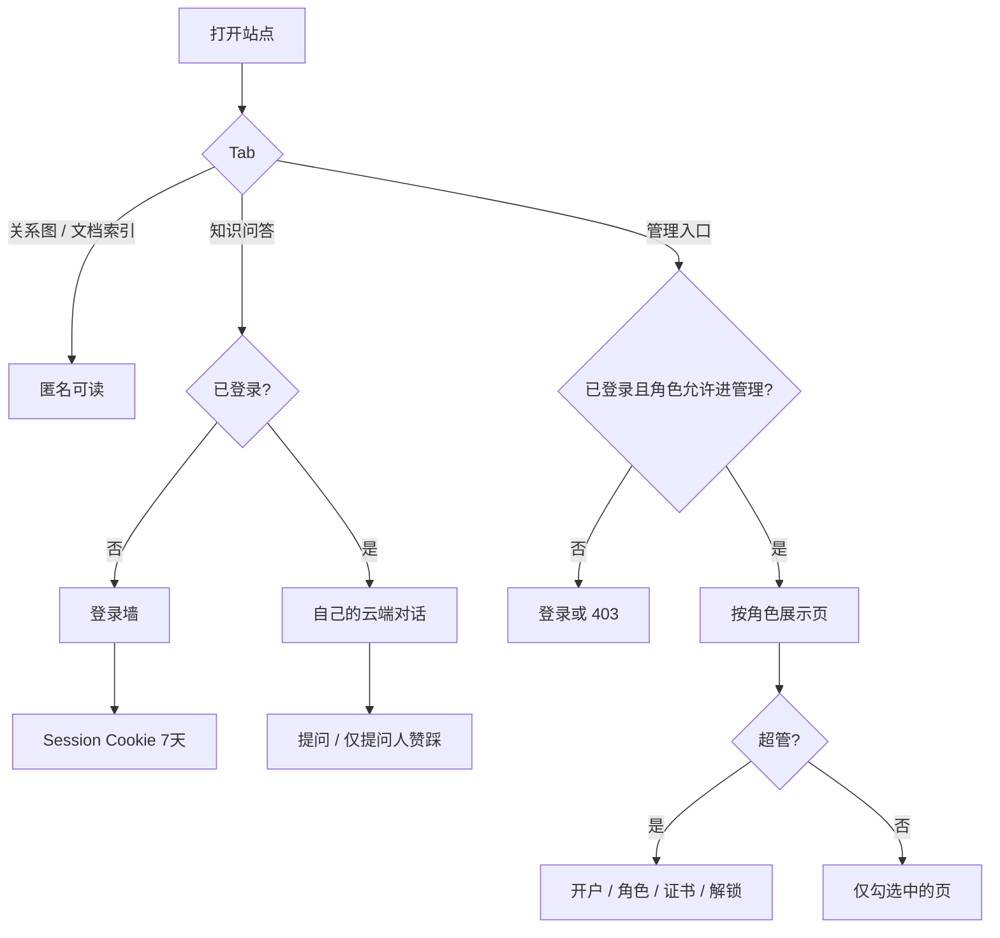
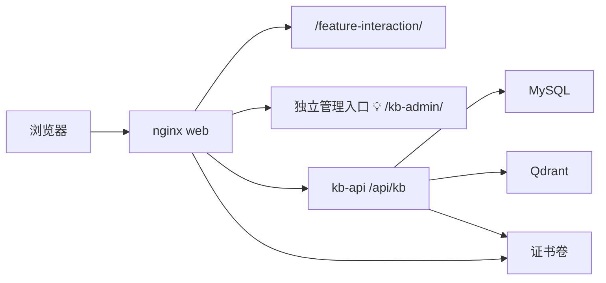

# 文档工作台账号体系与管理模块 PRD

> 本文是知识问答工作台账号专题的**当前权威**。v1 已迁入 [`history/`](history/)，**不默认读**。  
> 本文是**本仓库工程 PRD**，不是 Hayyo 产品功能规则。产品登录仍只在 [`site/core-docs/prd/design/auth-login/PRD.md`](../../../core-docs/prd/design/auth-login/PRD.md)。本站管理模块**不写入** [`site/core-docs/prd/design/admin/`](../../../core-docs/prd/design/admin/PRD.md)，也不套 [`workspace/_kit/admin-skin/`](../../../../workspace/_kit/admin-skin/INDEX.md)。  
> 知识问答检索 / 生成口径仍以 [`../kb-qa/PRD-知识问答-v3.md`](../kb-qa/PRD-知识问答-v3.md) 为准；本专题只改身份、授权、运维入口与会话归属。v3 将「登录」标为延期 D3，由本文承接。

**需求状态：** 已确认（v1 对话拍板 C1–C10；2026-09-19 req-confirm RQ-10～RQ-19 收口 Q1–Q5）。  
**实现状态：** 未实施。现网 kb-api 鉴权为 pass-through，对话在浏览器 `localStorage`。

## 1. 摘要

给本仓库文档工作台（`site/` H5 + kb-api）增加账号体系：关系图与文档索引仍可匿名阅读；知识问答必须登录；配置、重建索引、问答明细、功能热度、对话审计等运维能力收成**独立管理模块**，按角色授权。账号只能由超级管理员角色生成，登录后用户可自己改密。对话登录后上云，用户只看自己的，有权限者可看全部。认证用服务端 Session + HttpOnly Cookie，绝对 7 天过期，不用 JWT。本期本机可测；同一套 Docker 以后可放到服务器。本版不做独立网关产品，只做证书（目录挂载 + 后台上传，仅超管手动启用后 HTTP 跳 HTTPS）。

## 2. 背景、问题与目标

### 2.1 当前背景或现状

工作台入口：`http://127.0.0.1:18765/feature-interaction/`（compose 将 web 绑在 `127.0.0.1:18765`）。H5 四 Tab：关系图两套、文档索引、知识问答。配置 / 重建 / 问答明细 / 功能热度挂在问答顶栏 overlay。kb-api 经 nginx `/api/kb/` 反代；中间件 `auth_passthrough` 一律放行。轮次日志在 MySQL `qa_rounds`，预留 `user_id` / `owner_id` / `tenant_id` / `role`，现网提问固定传 `null`。浏览器会话键 `hayyo-kb-qa-conversations-v1`。知识问答 v3 明确本期不登录（RQ-17 / D3）。反馈专题 PRD 曾规定「不改顶栏运维入口」，本专题 RQ-10 覆盖该口径（不改写反馈 PRD 文件）。

已检查代码与配置：`site/kb-api/app/main.py`、`site/kb-api/sql/init.sql`、`site/feature-interaction/index.html`、`site/feature-interaction/qa.js`、`site/docker-compose.yml`、`site/docker/nginx.conf`、`site/kb-api/tests/test_site_contract.py`。

### 2.2 核心问题

1. 能打开站点的人就能改全局 Prompt、重建索引、读全站问答日志。  
2. 明细没有「谁问的」，对话不能换设备，也无法按人管理。  
3. 后续要放到公网 Docker，不能再只靠 loopback 当安全边界。  
4. 运维与问答混在同一顶栏，和「独立管理模块」不符。

### 2.3 目标与成功标准

| 目标 | 成功标准 | 状态 | 来源 |
|---|---|---|---|
| G1 问答可追溯到人 | 登录后提问 / 反馈写入该账号身份；未登录不能问 | ✅ | 确认 2 选 2 |
| G2 运维按角色授权 | 无权限不能进管理模块、不能调对应写/读接口 | ✅ | 确认 2、3、6、12-1 |
| G3 对话按人隔离 | 用户只见自己的云端会话；有权限角色可审计全部 | ✅ | 确认 4 选 2 |
| G4 公网可跑同一套 Docker | 本机 HTTP 可测；服务器 compose 可映射 80/443；证书可后台启用 HTTPS | ✅ | 确认 1、9、13-2 |
| G5 不改问答主链路语义 | 检索 / 重排 / 生成 / 关系图 / 文档索引阅读行为不因本专题改口径 | ✅ | 用户：已完成功能尽量不改；本专题范围 |
| G6 会话与锁定可验收 | 登录绝对 7 天过期；同一用户名连续 5 次失败锁定 15 分钟，超管可后台解锁 | ✅ | RQ-15、RQ-16 |

证书体积上限用户未给出，不编造成验收数字。

## 3. 用户、角色与关键场景

| 角色 | 需求或任务 | 触发场景 | 预期价值 | 来源 |
|---|---|---|---|---|
| 匿名访客 | 看关系图、文档索引 | 未登录打开前三个 Tab | 查阅规则不必先开户 | 确认 2 选 2 |
| 普通用户（预置角色） | 登录后问答、管理自己的对话、顶栏改密/退出 | 打开知识问答 | 问句可归属到人 | 确认 2、4、5、12-1；RQ-18 |
| 自定义角色账号 | 按该角色勾选的管理能力工作 | 超管开户并赋角色 | 不必人人都有重建/改 Prompt | 确认 12 选 1 |
| 超级管理员 | 开户、配角色、升/降超管、浏览全部、证书、解锁登录锁定 | 独立管理入口 | 能生成账号的角色；可多名 | 确认 12-1；RQ-12、RQ-13、RQ-16 |

Hayyo App 终端用户、产品运营后台操作员：**非本专题对象**。

## 4. 范围与非目标

### 4.1 本期范围

- 账号：仅超级管理员角色生成；无自助注册；开户时超管指定初始密码；登录后用户可自己改密（不强制首次改密）。可有多名超管；不能禁用或删光最后一名启用中的超管。  
- 登录范围：关系图 / 文档索引可匿名；知识问答必须登录；管理模块必须登录且独立入口。  
- 角色：超级管理员系统内置、全权限、不可删、不可改权限清单；可新建其它角色并勾权限；每个账号只关联一个角色；预置「普通用户」（默认仅知识问答）。  
- 管理模块：配置、重建索引、问答明细、功能热度、对话审计、健康、开户与角色、操作审计、反馈汇总、证书（上传/挂载状态、手动启用/关闭 HTTPS）、登录锁定解锁。  
- 对话：登录后上云；用户只看自己的；有权限者在管理端看全部；不迁移旧 `localStorage`。  
- 认证：服务端 Session + HttpOnly Cookie，绝对 7 天；禁用或改密立即作废该账号全部 Session；不用 JWT。连续 5 次登录失败锁定 15 分钟，超管可后台解锁。  
- 部署：本机可测；做好后可在服务器 Docker 运行；公网端口/绑定用 compose / `.env`，不进管理后台。  
- 证书：目录挂载 + 后台上传；上传只保存；仅超管点启用才 HTTPS，可关闭回 HTTP。  
- 管理 UI：本站自做页面，不套 Hayyo admin-skin。  
- 问答顶栏：去掉「重建索引 / 配置 / 问答明细 / 功能热度」；保留健康灯；右侧显示当前账号，点击或悬停出菜单（退出、修改密码）；有「进管理模块」权限者另给管理入口。  
- 赞踩：仍一轮一个值；仅该轮提问人可改；管理员只读。  
- 空状态热度 chips：须先登录；能问答的用户可读热度聚合；热度管理页仍要「功能热度」权限。

### 4.2 非目标 / 明确不做

| 项 | 说明 | 状态 | 来源 |
|---|---|---|---|
| Hayyo App 登录注册 | 不改 `site/core-docs/prd/design/auth-login` | ✅ | 本专题定位 |
| 写入产品运营后台 PRD / 套 admin-skin | 本站点工程后台 | ✅ | 确认 7 选 1；kb-qa v3 禁止项 |
| 自助注册 | 账号只能超管角色生成 | ✅ | 确认 2、5 |
| 多租户（`tenant_id` 产品化） | 字段可继续空 | ✅ | 确认过程：不做多租户 |
| JWT 登录 / JWT 放环境变量 | 改用 Session Cookie | ✅ | 按建议，不用 JWT |
| 独立网关产品 | 不做 Caddy/ACME/后台改端口/绑定/域名面板 | ✅ | 确认 13 后补充 |
| Let’s Encrypt 自动签发 | 用户已有证书、后台上传 | ✅ | 确认 13 |
| 后台改 Docker 端口或 `0.0.0.0` 绑定 | 只能 `.env` / compose | ✅ | 确认 9；网关本版不做 |
| 旧本机对话导入 | 登录后云端空列表 | ✅ | 确认 11 选 1 |
| 改检索公式、切块、生成 Prompt 默认值 | 配置页仍可改可写 Prompt，但不改默认链路语义 | ✅ | 范围隔离 |
| 关系图 / 文档索引强制登录 | 保持匿名可读 | ✅ | 确认 2 选 2 |
| 按人计赞踩 / 改 feedback 表结构 | 仍一轮一值 | ✅ | RQ-19 |
| 强制首次改密 | 开户指定初始密码即可 | ✅ | RQ-17 |
| 本期改写反馈 PRD 正文 | 顶栏口径以本文覆盖，文件不改 | ✅ | RQ-10 |

## 5. 决策与来源记录

v1 的 C1–C11 **沿用**，除非下表「替代关系」写明收窄或补充。

| 编号 | 问题或主题 | 当前结论 | 状态 | 来源 | 替代关系 |
|---|---|---|---|---|---|
| C1 | 暴露面 | 本期本机可测；后续公网；同一套 Docker 能在服务器跑 | ✅ | 确认 1、9 | — |
| C2 | 谁必须登录 | 关系图 / 文档索引匿名；知识问答必须登录；管理模块必须登录 | ✅ | 确认 2 选 2 | 废止 kb-qa v3「本期不登录」作为工作台现行口径（v3 正文不在本文件改写） |
| C3 | 管理入口与问答顶栏 | 独立入口；仅登录后可用；问答顶栏去掉运维四按钮；保留健康灯；右侧账号菜单（退出、改密）；有权限者另给管理入口。覆盖反馈 PRD「顶栏结构不动」（不改该文件） | ✅ | 确认 6；RQ-10、RQ-18 | 废止 kb-qa v3 C36 顶栏运维四钮；覆盖反馈 C7 顶栏不动（仅这四钮） |
| C4 | 权限模型 | 角色类型上配权限，账号只关联一个角色；超管锁死全权限；可新建角色；预置普通用户；开户/改角色/改角色权限仅超管角色。可把账号设为超管（多名）；不能禁用或删光最后一名启用中的超管 | ✅ | 确认 12 选 1；RQ-12 | 废止「两档权限写死」；废止「全站只能有一个超管账号」 |
| C5 | 对话归属 | 登录后会话上云；用户只看自己的；有权限角色可审计全部；不迁移 localStorage | ✅ | 确认 4 选 2；确认 11 选 1 | 收窄 kb-qa v3 C6 浏览器 localStorage 作为登录用户的会话存法 |
| C6 | 管理功能清单 | 配置、重建、明细、热度、对话审计、健康、开户与角色、操作审计、反馈汇总、证书、登录锁定解锁 | ✅ | 确认 3 选 2 + 确认 10 选 3 + RQ-16 | 废止「第一期不做操作审计/反馈汇总」 |
| C7 | 管理 UI | 本站自做，不套 admin-skin | ✅ | 确认 7 选 1 | — |
| C8 | 登录凭证 | 服务端 Session + HttpOnly Cookie；绝对 7 天过期；不用 JWT；JWT 不进环境变量 | ✅ | 本轮：按建议；RQ-15 | 补充过期规则 |
| C9 | 证书与网关 | 本版不做网关产品；证书可挂载可后台上传；上传只保存；仅超管手动启用后 HTTP→HTTPS；可关闭回 HTTP。公网需 compose 预先映射 80 与 443 | ✅ | 确认 13 选 2；确认 14 选 1；RQ-13 | 证书从「待确认是否角色开关」收为仅超管 |
| C10 | 开户与改密 | 账号只能超管角色生成；开户指定初始密码；不强制首次改密；登录后用户自己改密 | ✅ | 确认 2、5；RQ-17 | — |
| C11 | 按账号勾权限 | 不在账号上逐项勾选 | ⛔ 已废止 | 确认 8 曾被理解为每账号开关 | 被 C4 替代 |
| C12 | 热度接口分层 | 已登录且能问答的人可读热度聚合，仅用于空状态 chips；管理端热度页仍要「功能热度」权限 | ✅ | RQ-11 | — |
| C13 | 会话作废 | 禁用账号或该账号改密成功后，其已有 Session 全部立即作废 | ✅ | RQ-14 | — |
| C14 | 登录锁定 | 同一用户名连续 5 次失败锁定 15 分钟；锁定期内密码正确也不可登录；超管可在后台解除锁定（清失败次数） | ✅ | RQ-16 | — |
| C15 | 赞踩权限 | 仍一轮一个值；仅该轮提问人可赞/踩/取消；有明细权限的管理员只读，不能改别人的评价 | ✅ | RQ-19 | — |

### 5.1 需求确认台账

| ID | 结论 | 状态 | 写入 |
|---|---|---|---|
| RQ-01 | 本机可测，后续公网 Docker | 已确认 | C1 |
| RQ-02 | 问答须登录；图/索引匿名 | 已确认 | C2 |
| RQ-03 | 独立管理入口；顶栏去掉运维四按钮 | 已确认 | C3 |
| RQ-04 | 角色 RBAC；超管开户；自己改密 | 已确认 | C4、C10 |
| RQ-05 | 会话上云；不迁移本地对话 | 已确认 | C5 |
| RQ-06 | 管理模块含审计与反馈汇总 | 已确认 | C6 |
| RQ-07 | 自做管理页 | 已确认 | C7 |
| RQ-08 | Session Cookie，不用 JWT | 已确认 | C8 |
| RQ-09 | 只做证书，不做网关；手动启用 HTTPS | 已确认 | C9 |
| RQ-10 | 顶栏四钮以本文为准，覆盖反馈 PRD；健康灯可留 | 已确认 | C3 |
| RQ-11 | 登录后能问答者可读热度聚合做 chips；热度页要权限 | 已确认 | C12 |
| RQ-12 | 可多名超管；至少一名启用中的超管 | 已确认 | C4 |
| RQ-13 | 证书上传/启用/关闭仅超管 | 已确认 | C9 |
| RQ-14 | 禁用或改密立刻作废该账号全部 Session | 已确认 | C13 |
| RQ-15 | 登录绝对 7 天过期 | 已确认 | C8 |
| RQ-16 | 连续 5 次失败锁 15 分钟；超管可后台解锁 | 已确认 | C14 |
| RQ-17 | 开户由超管指定初始密码，不强制首次改密 | 已确认 | C10 |
| RQ-18 | 顶栏右侧账号；点击或悬停菜单：退出、改密 | 已确认 | C3 |
| RQ-19 | 赞踩一轮一值，仅提问人可改；管理员只读 | 已确认 | C15 |

## 6. 功能需求与完整流程

### 6.1 需求清单

| 编号 | 需求 | 触发 / 输入 | 系统行为 | 输出 / 结果 | 优先级 | 状态 | 来源 |
|---|---|---|---|---|---|---|---|
| F1 | 登录 / 登出 | 用户名+密码；登出或菜单退出 | 校验账号与锁定；建立或销毁 Session Cookie（绝对 7 天） | 已登录或匿名 | P0 | ✅ | C2、C8、C14 |
| F2 | 自己改密 | 顶栏账号菜单；旧密+新密 | 更新哈希；作废该账号全部 Session | 须重新登录 | P0 | ✅ | C10、C13、RQ-18 |
| F3 | 问答登录墙 | 未登录打开知识问答或调用提问接口 | 不能提问；页内登录 | 401 / 登录墙 | P0 | ✅ | C2 |
| F4 | 匿名只读 | 未登录打开关系图 / 文档索引 | 与现网只读行为一致 | 可浏览 | P0 | ✅ | C2 |
| F5 | 云端对话 | 登录用户新建/切换/删除/清空 | 按账号隔离持久化；上限沿用现网 40 会话 | 换浏览器仍见自己的列表 | P0 | ✅ | C5 |
| F6 | 提问与反馈带身份 | 登录后 `ask` / 赞踩 | 身份取 Session；赞踩仅提问人 | `qa_rounds.user_id` 有值；他人 403 | P0 | ✅ | C2、C5、C15 |
| F7 | 角色与开户 | 仅超管角色 | 建角色并勾权限；建/禁用账号并绑一个角色；指定初始密码；可升为超管；不可去掉最后一名启用超管；可解锁登录锁定 | 无自助注册 | P0 | ✅ | C4、C10、C14 |
| F8 | 独立管理模块 | 有「进管理模块」的已登录用户 | 独立入口：健康、配置、重建、明细、热度页、对话审计、操作审计、反馈汇总、开户角色（仅超管可见证书与解锁） | 无权限 403 | P0 | ✅ | C3、C6 |
| F9 | 问答顶栏 | 打开知识问答（已登录） | 无运维四按钮；有健康灯；右侧账号菜单；有权限者有管理入口 | 运维与问答分离 | P0 | ✅ | C3 |
| F10 | 操作审计 | 登录成败、开户、改角色、改配置、重建、改密、证书、解锁锁定 | 记谁、何时、动作、对象、IP；配置只记字段名，不记 Key/私钥 | 可筛列表 | P0 | ✅ | C6 |
| F11 | 反馈汇总 | 打开管理端该页 | 聚合已有赞/踩；被踩列表进原明细 | 不新采集 | P0 | ✅ | C6 |
| F12 | 证书保存与启用 | 仅超管上传 PEM 或使用挂载文件 | 上传只保存；点「启用 HTTPS」后对外 HTTPS，HTTP 跳转；可关闭 | 坏证书不能启用 | P0 | ✅ | C9 |
| F13 | 服务器 Docker | `.env` / compose | 可绑公网 80/443；MySQL/Qdrant 不因公网改成对外暴露 | 后台改不了端口映射 | P0 | ✅ | C1、C9 |
| F14 | 热度分层 | 空状态 chips vs 热度页 | 能问答的登录用户可读聚合；热度页要「功能热度」权限 | chips 最多再加 4 题沿用反馈 C14 | P0 | ✅ | C12 |

角色上可勾选的能力：知识问答、进管理模块、配置、重建、问答明细、功能热度、对话审计、健康、操作审计、反馈汇总。  
开户 / 改角色 / 改角色权限 / 证书 / 解锁登录锁定：**写死仅超管角色**，不做勾选项。

### 6.2 主流程

公网证书引导（已确认）：

1. 服务器 Docker 先以 HTTP 跑起来（compose 已映射 80 与 443）。  
2. 用 HTTP 登录超管。  
3. 后台上传证书与私钥（或事先把文件挂进同一卷）。  
4. 超管点「启用 HTTPS」→ nginx 提供 443，80 的 HTTP 跳到 HTTPS。  
5. 可关闭，回到 HTTP。

### 6.3 状态与规则

- 账号：启用 / 禁用。禁用后不能登录，且立即作废已有 Session。  
- 角色：一个账号同一时刻只属一个角色。超管角色不可删除、不可改权限清单。可多名超管。  
- 会话：登录成功发 Cookie，绝对 7 天；登出或改密或禁用则删除/作废。  
- 登录锁定：连续 5 次失败进入锁定 15 分钟；超管解锁后失败次数清零。  
- HTTPS：未启用 = 仅 HTTP；已启用 = HTTPS 可用且 HTTP 跳转（公网标准 80/443）。本机非标准端口不强制跳转 💡。  
- 写接口身份：以服务端 Session 为准，不信任请求体里的 `user_id` / `role`。  
- 操作审计与问答明细不是同一份数据。  
- 反馈汇总不新增采集字段，只用现有 `feedback`。  
- 删云端对话不删 `qa_rounds`（沿用 kb-qa C6）。

## 7. 边界、异常与降级

| 场景 | 触发条件 | 系统处理 | 用户反馈 | 恢复或降级 | 验收编号 |
|---|---|---|---|---|---|
| E1 | 未登录提问或打开管理 API | 拒绝 | 登录墙或 401 | 登录后重试 | AC2、AC3 |
| E2 | 已登录但角色无该权限 | 拒绝 | 403 / 无入口 | 超管改角色 | AC5 |
| E3 | 密码错误 / 已锁定 | 不登录；满 5 次锁定 15 分钟 | 不暴露用户是否存在；锁定中提示稍后重试，不暗示账号是否存在过细 | 到期自动解锁或超管后台解锁 | AC1、AC13 |
| E4 | 账号禁用 | 不能登录；已有会话立即作废 | 无法进入 | 超管重新启用 | AC6 |
| E5 | 上传非法/不匹配证书后点启用 | 不启用、维持当前协议 | 明确失败原因 | 可继续 HTTP | AC10 |
| E6 | 公网 compose 未映射 443 | 后台启用无法对外 HTTPS | 须在部署侧补端口 | `.env` / compose | AC11 |
| E7 | MySQL 写轮次失败 | 沿用 kb-qa C37：主路径仍可答 | 提示本轮日志未写入 | 该轮不进明细/热度 | — |
| E8 | 首次公网 HTTP 上传私钥 | 允许（用户选择的引导方式） | — | 或改用文件挂载 | AC10 |
| E9 | 非提问人赞踩 | 拒绝 | 403 | 提问人在自己对话里操作 | AC14 |
| E10 | 试图去掉最后一名启用超管 | 拒绝 | 明确不可 | 先指定另一名超管 | AC15 |

## 8. 验收标准

| 编号 | 前置条件 | 操作 / 事件 | 预期结果 | 关联需求 | 状态 | 来源 |
|---|---|---|---|---|---|---|
| AC1 | 空库已引导出超管 | 用引导账号登录 / 登出 | 进入已登录态；登出后问答不可问 | F1 | ✅ | C8、C2 |
| AC2 | 未登录 | 打开关系图、文档索引 | 可阅读 | F4 | ✅ | C2 |
| AC3 | 未登录 | 打开知识问答或 `POST /api/kb/ask` | 不能完成提问 | F3 | ✅ | C2 |
| AC4 | 普通用户登录 | 问答、换浏览器再打开 | 只见自己的云端会话；旧 localStorage 不出现 | F5 | ✅ | C5 |
| AC5 | 自定义角色只勾「问答明细」 | 进管理模块 | 能看明细；不能改配置、不能重建 | F7、F8 | ✅ | C4 |
| AC6 | 超管 | 开户（指定初始密码）并赋角色；禁用该账号 | 新用户用初始密码能登录；禁用后其已打开会话立即失效 | F2、F7 | ✅ | C10、C13 |
| AC7 | 任意访客 | 看问答顶栏 | 无重建/配置/明细/热度四按钮 | F9 | ✅ | C3 |
| AC8 | 超管改配置或点重建 | 打开操作审计 | 能看到对应动作（配置只见字段名） | F10 | ✅ | C6 |
| AC9 | 存在赞/踩轮次 | 打开反馈汇总 | 能统计并点进原明细；无新采集口 | F11 | ✅ | C6 |
| AC10 | 超管 | 上传证书后不点启用 / 再点启用 / 再关闭 | 未启用仍 HTTP；启用后标准 80/443 下 HTTP 跳 HTTPS；可关闭 | F12 | ✅ | C9 |
| AC11 | 服务器未映射 443 | 仅后台启用 | 不能单靠后台打开宿主机 443 | F13 | ✅ | C9 |
| AC12 | 未登录或普通用户 | `PUT /api/kb/config`、`POST /api/kb/reindex`、`GET /api/kb/rounds` | 401 或 403 | F8 | ✅ | C3、C8 |
| AC13 | 连续输错密码 5 次 | 第 6 次即使密码正确 | 15 分钟内不可登录；超管解锁后立即可以 | F1、F7 | ✅ | C14 |
| AC14 | 用户 A 的一轮 | 用户 B 或管理员调用该轮 feedback | 403；仅 A 可改 | F6 | ✅ | C15 |
| AC15 | 全站仅一名启用超管 | 禁用或去掉其超管角色 | 被拒绝 | F7 | ✅ | C4 |
| AC16 | 已登录普通用户 | 空状态 | 固定 4 chips；有热度则可再加最多 4；热度管理页进不去 | F14 | ✅ | C12 |
| AC17 | 已登录 | 顶栏右侧账号，点击或悬停 | 菜单含退出、修改密码；改密后需重新登录 | F2、F9 | ✅ | C3、C13 |
| AC18 | 登录满 7 天 | 再调需登录的接口 | 401，须重新登录 | F1 | ✅ | C8 |

## 9. 依赖、风险与待确认项

### 9.1 依赖

| 依赖 | 影响 | 负责人或来源 | 状态 |
|---|---|---|---|
| 现有 MySQL 卷 `qa_rounds` | 补账号/会话/审计表，不推翻轮次表 | 已检查 `init.sql` | 已检查 |
| 现有 nginx 反代 `/api/kb/` | 管理 API 同前缀或同站 Cookie | 已检查 `nginx.conf` | 已检查 |
| 引导超管环境变量 | 空库才能登录 | 💡 名称见 T 节 | 💡 |
| 公网 DNS / 防火墙 / 证书文件 | 启用 HTTPS 的外部条件 | 确认 9、13 | 已确认需运维侧具备 |

### 9.2 风险

| 风险 | 影响 | 缓解措施 | 状态 |
|---|---|---|---|
| 中间件切错导致全站 401 或管理接口仍裸奔 | 高 | 白名单仅登录；其余按 Session；契约测试改顶栏断言 | 已识别 |
| 本机 18765 与 443 端口不一致导致跳转锁死 | 高 | 确认 14：手动启用；非标准端口不强制跳转 💡 | 💡 |
| 首次 HTTP 传私钥 | 密钥明文过网 | 允许；可选挂载同卷 | 用户接受引导路径 |
| `test_site_contract.py` 要求顶栏四按钮 | 不改测试会失败 | 实施时改契约测试 | 已检查测试 |
| 超管全部被锁 15 分钟 | 中 | 可多名超管；另一名可解锁；到期自动解锁 | RQ-12、RQ-16 |

### 9.3 待确认项

无阻塞待确认项。路径 `/kb-admin/`、本机 HTTPS 端口 `18768`、引导环境变量名：实施说明，见 T 节。

## 10. 版本记录

| 版本 | 日期 | 基线文件 | 新增 | 修改 / 废止 | 待确认 |
|---|---|---|---|---|---|
| v2 | 2026-09-19 | history/PRD-账号体系与管理模块-v1.md | RQ-10～RQ-19：顶栏覆盖、热度分层、多名超管、证书仅超管、踢会话、7 天过期、5 次/15 分钟锁定且超管可解锁、开户初始密码、右侧账号菜单、赞踩仅提问人 | 废止 Q1–Q5 待确认；C3/C4/C8/C9 收窄 | 无 |
| v1 | 2026-09-19 | — | 从对话整理账号、独立管理模块、RBAC、会话上云、审计与反馈汇总、证书手动启用、Session 不用 JWT | 废止工作台「本期无登录」口径；废止顶栏运维四按钮；废止 JWT 进环境变量；废止按账号勾权限 | 当时 Q1–Q5，已被 v2 收口 |

---

## 技术实施方案扩展

下列路径、中间件名、表名与接口以**已检查代码**为现状；拟议表名/新接口标 💡，不是用户逐字批准的产品名词。

### T1. 架构与模块

- 读者面继续 `site/feature-interaction/`。  
- 管理面独立静态站，经 nginx 另 location。  
- kb-api 替换 `auth_passthrough`（`site/kb-api/app/main.py` 现为直接放行）。  
- TLS 终止仍在现有 nginx，不在 FastAPI 做 HTTPS。  
- 公网绑定与 80/443 映射只在 compose / `.env`：现网 `ports` 为 `127.0.0.1:${HAYYO_WEB_PORT:-18765}:80`，契约测试断言 compose 正文不含 `0.0.0.0`。

### T2. 数据结构与生命周期

| 实体 / 字段 | 类型 | 来源 | 写入 / 读取方 | 约束 | 迁移或保留策略 |
|---|---|---|---|---|---|
| `qa_rounds.user_id` 等四字段 | 已有可空列 | 已检查 `init.sql` | 登录后 ask 写入 | 身份以 Session 为准 | 旧行保持空；不重建表 |
| 角色 / 账号 / 会话 / 云端对话 / 审计 / 登录失败计数 | 新表 💡 | AI 建议 | kb-api | 账号绑一个角色；Session 绝对 7 天 | `CREATE IF NOT EXISTS`；空库引导超管 |
| 浏览器 `hayyo-kb-qa-conversations-v1` | localStorage | 已检查 `qa.js` | 登录用户不再作为权威 | 上限 40 | 不导入（C5） |
| `qa_rounds.feedback` | 已有 | 已检查 | 仅提问人可写；汇总只读 | 一轮一个值 | 不改采集语义 |
| 证书文件 | 卷内 PEM | 确认 13 | 仅超管上传或挂载 | 私钥不回显 | 启用/关闭只改 nginx 状态 |

引导超管：💡 `KB_BOOTSTRAP_USER` / `KB_BOOTSTRAP_PASSWORD`，仅账号表为空时创建一次。  
密码哈希：💡 用现有依赖 `cryptography` + 标准 KDF，不明文。  
Cookie：💡 `HttpOnly`、`SameSite=Lax`、`Path=/`、绝对 Max-Age 7 天；仅 HTTPS 启用后 `Secure`。

### T3. API、事件与工具契约

**现状（已检查 `main.py`，全部无鉴权）：**  
`GET /api/kb/health`，`GET|PUT /api/kb/config`，`POST /api/kb/reindex`，`GET /api/kb/rounds`，`GET /api/kb/rounds/{id}`，`POST /api/kb/rounds/{id}/feedback`，`GET /api/kb/heatmap`，`POST /api/kb/ask`。

**拟议（💡）：**  
`POST /api/kb/auth/login|logout`，`GET /api/kb/auth/me`，`POST /api/kb/auth/password`；会话 CRUD；角色/账号 CRUD（仅超管）；审计列表；反馈汇总；证书上传/启用/关闭；超管解锁登录锁定。  
`PUT config` / `POST reindex` / `GET rounds` / 全站对话审计：登录 + 对应角色权限。  
`POST ask` / 自己的会话：登录 + 知识问答权限。  
`GET heatmap`：已登录且有知识问答权限（chips）；热度**页**另要「功能热度」。  
`POST feedback`：仅该轮 `user_id` 对应账号。  
`GET health`：问答登录后健康灯可用。  
写操作校验同源 `Origin` 💡。登录按用户名计失败次数（C14）；另可对 IP 做短期限流 💡。

### T4. 代码影响与文件索引

| 已验证文件或模块 | 改动内容 | 影响范围 | 验证依据 |
|---|---|---|---|
| `site/kb-api/app/main.py` | 替换 `auth_passthrough`；ask 从 Session 填 `user_id` | 全部 `/api/kb` | 已读中间件与 `_ask_events` |
| `site/kb-api/sql/init.sql` | 新表；不删 `qa_rounds` | MySQL 卷 | 已读建表 |
| `site/kb-api/app/logs.py` | 继续写轮次；身份不再来自请求体伪造 | 明细/热度 | 已读 `insert_running` |
| `site/feature-interaction/index.html` | 去掉四钮；右侧账号菜单；可留健康灯 | 顶栏 | 已读 `#qaTopActions` |
| `site/feature-interaction/qa.js` | 登录墙；会话改 API；删除运维 overlay；chips 仍可打 heatmap | 问答 Tab | 已读 `CONV_KEY` 与 fetch |
| `site/docker/nginx.conf` | 管理入口 location；TLS include | 路由 | 已读仅 listen 80 |
| `site/docker-compose.yml` | 证书卷；可选 443 映射；bind 用变量默认 127.0.0.1 | 部署 | 已读 ports |
| `site/kb-api/tests/test_site_contract.py` | 顶栏四按钮断言改为「不应存在」；compose 仍禁止正文出现 `0.0.0.0` | 契约 | 已读测试 |
| `pipeline.py` / `indexer.py` / `kb.js` / 关系图逻辑 | **不改** | 隔离 | 范围 |

### T5. 迁移、兼容与发布

- 已有 Docker 卷：补表，不灌旧对话。  
- 本机默认仍 `127.0.0.1:18765` HTTP，需登录后才能问答。  
- 公网：`.env` 设绑定与 `HAYYO_WEB_PORT=80`、`HAYYO_TLS_PORT=443`（端口名 💡）。不要把 `0.0.0.0` 写进 compose 正文。本机 HTTPS 💡 `18768→443`。  
- 回滚：关 HTTPS 开关；代码回滚后新表可留。引导密码不在每次启动重置。  
- 发布顺序 💡：账号会话 → 问答挂身份 → 管理模块搬家 → 审计与反馈汇总 → 证书。

### T6. 可观测性、安全与隐私

- 操作审计：F10；不把 API Key、私钥、密码写入审计。解锁锁定记一条审计。  
- 现网 Key 已在 `site/.env`，不进配置页明文（kb-qa 既有口径，沿用）。  
- 公网不要映射 MySQL `18766`、Qdrant `18767` 到非本机（现网已是 127.0.0.1）。  
- 首次启用 HTTPS 前用 HTTP 传私钥：用户确认的引导方式；风险见 E8。

### T7. 技术债

| 项目 | 形成原因 | 当前影响 | 临时措施 | 后续处理条件 |
|---|---|---|---|---|
| kb-qa v3 仍写「本期不登录 / 顶栏运维入口」 | 本专题未改 v3 文件 | 两份工程 PRD 口径并存 | 改登录/运维入口时以本文为准 | 用户授权再出 kb-qa 修订版 |
| 反馈 PRD 仍写「顶栏结构不动」 | RQ-10 不改该文件 | 旧口径残留 | 以本文 C3 覆盖四钮 | 用户授权再出反馈 PRD 修订版 |
| 契约测试锁死顶栏四按钮与 compose 无 `0.0.0.0` | 当时本机无账号 | 实施必须改测试 | 按 T4 改断言 | 实施时 |
| 无网关、无 ACME | 本版明确不做 | 证书依赖已有 PEM 与 80/443 映射 | 后台上传 + 挂载 | 以后若要自动证书再开专题 |
