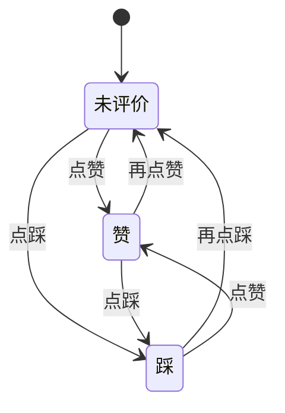
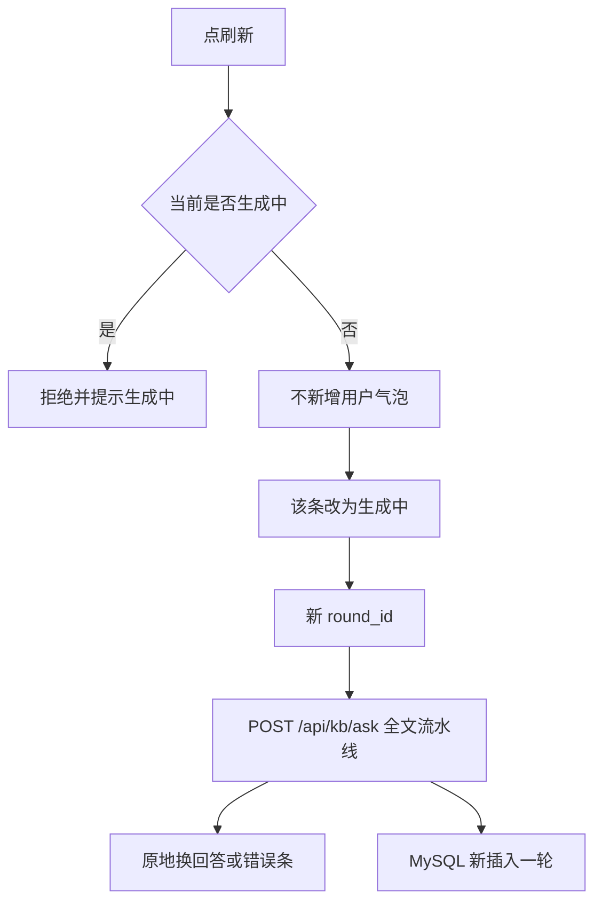

# 知识问答 · 反馈与对话样式 PRD

本文是**独立增量 PRD**，目录在 `site/docs/design/kb-qa-feedback/`，与 `design/kb-qa/`（v3 主链路）并列。只覆盖：回答效果采集（复制 / 赞 / 踩 / 刷新）与第四 Tab 右侧对话区的 Grok 风格布局。不修订、不替代 `site/docs/design/kb-qa/PRD-知识问答-v3.md`。检索、改写、切块、日志存法 B、热度聚合公式以现网代码为准，本期不改那些规则。

v1 已归档到 [`history/PRD-知识问答-反馈与对话样式-v1.md`](history/PRD-知识问答-反馈与对话样式-v1.md)，**不默认读、不作为实施依据**。

**需求状态：** 已确认（确认点 1–16；req-confirm RQ-01～RQ-04）。  
**实现状态：** 未实施。宿主为现网第四 Tab 知识问答。

## 1. 摘要

给本机「知识问答」工作区补上每条回答的效果反馈和重新生成，并把右侧对话做成居中等宽的 Grok 式阅读栏：空状态可点建议问句，输入框与消息同一条内容柱。面向在本机核对 Hayyo 规则的产品 / 研发 / 测试，用来判断回答好坏、换一种理解再生成，而不是改知识源或检索公式。

## 2. 背景、问题与目标

### 2.1 当前背景或现状

现网第四 Tab 已能多会话提问、流式回答、折叠出处、复制回答；轮次写入 MySQL `qa_rounds`，顶栏可打开问答明细与功能热度。已检查代码：

- 复制是文案按钮「复制回答」，挂在 assistant 气泡上（`site/feature-interaction/qa.js` `messageHtml`）。
- 无赞、踩、刷新。
- 提问时生成 `round_id` 并传给 `POST /api/kb/ask`，**没有写回消息对象**。
- 消息区 `max-width: 760px` 且用户靠右、回答靠左；输入框 `max-width: 840px` 左对齐，二者不是同一条居中栏（`site/feature-interaction/qa.css`）。
- 空状态为标题+说明，无建议问句（`qa.js` `emptyHtml`）。
- `qa_rounds` 无反馈字段（`site/kb-api/sql/init.sql`）。
- 热度接口 `GET /api/kb/heatmap` 返回 `{ items: [{feature_id, count}], unclassified }`（`logs.py` `heatmap`）。

### 2.2 核心问题

1. 无法采集「这条回答好不好」，明细里也看不到评价。  
2. 对同一句不满意时，只能再发一条用户问句，对话里会重复提问，服务端也不易当成「同一问句的新一轮生成」。  
3. 对话区拉满宽度、气泡+底栏分割，长文不好读，输入也不像常见对话产品。

### 2.3 目标与成功标准

| 目标 | 成功标准 | 状态 | 来源 |
|---|---|---|---|
| G1 采集回答好坏 | 每条有正文的回答可赞/踩/取消；写库成功的一轮在明细可见「未评价 / 赞 / 踩」 | ✅ | 本轮对话目标；确认点 4、6 |
| G2 同一问句可换理解 | 点刷新不新增用户气泡；服务端新插入一轮完整流水线日志；热度按新轮计 | ✅ | 本轮对话目标；确认点 2、3 |
| G3 对话区可扫描 | 消息与输入同一条居中栏（约 768px），输入为卡片式 | ✅ | 本轮对话确认点 7–10 |
| G4 空状态可起问 | 常驻 4 条测题 chip；有热度再加 4 条模板问句；点击即发送 | ✅ | 本轮对话确认点 12–15；现网覆盖口径见 C22 |

## 3. 用户、角色与关键场景

| 角色 | 需求或任务 | 触发场景 | 预期价值 | 来源 |
|---|---|---|---|---|
| 产品 / 研发 / 测试 | 判断模型回答是否可用 | 看完一条回答 | 明细能回放好坏 | 本轮对话目标 |
| 同上 | 同一句再生成一次 | 对当前理解不满意 | 对话不重复问句；日志多一行新轮 | 确认点 2、3 |
| 同上 | 从空会话开始压测 | 刚打开或清空当前对话 | 一点即可发出已验证过的复杂问句 | 确认点 14；对话 [知识库高难度测题](b85f3368-ad43-4bc8-bfe3-7c4b21e97ce5) |
| 同上 | 阅读长回答 | 窗口很宽或缩窄 | 内容柱锁定/留边，不拉满屏 | 确认点 8 |

本期无登录。反馈没有「提问人」身份，一轮一个值。现网日志用户字段仍为空（`qa.js` 发送 `user_id: null`）。

## 4. 范围与非目标

### 4.1 本期范围

- 右侧对话区：消息列、空状态、建议 chip、底部输入卡片、回答下操作条。  
- 赞/踩写入与问答明细展示。  
- 刷新：客户端原地替换该回答；服务端按新 `round_id` 走现有 `POST /api/kb/ask` 全链路。  
- 空状态建议搜索：常驻 4 题 + 热度 Top 4 追加。

### 4.2 非目标 / 明确不做

- 截图中的「链接」「更多」键（确认点 1 选只做四键）。  
- 改左侧会话列表结构、四个主 Tab、顶栏配置/重建/明细/热度入口形态（确认点 7、16）。  
- 改切块、两库检索、重排、改写/生成 Prompt、热度聚合公式。  
- 登录、按人计票、赞踩筛选明细。  
- 刷新时在新旧 round 之间建父子关联字段。  
- 把「那退款呢」做成空状态 chip（依赖上一轮，已排除）。  
- 把本增量写进 `site/core-docs/prd/design/*/PRD.md`。  
- 修订 `PRD-知识问答-v3.md` 正文。现网空状态 chips 与相关测试以本文覆盖 v3 C32/AC21 中「无建议问法 chips」；「无过程栏」仍以 v3 为准（C22）。

## 5. 决策与来源记录

| 编号 | 问题或主题 | 当前结论 | 状态 | 来源 | 替代关系 |
|---|---|---|---|---|---|
| C1 | 操作条键 | 只做复制、赞、踩、刷新 | ✅ 已确认 | 本轮确认点 1 选 1 | — |
| C2 | 刷新的对话形态 | 原地替换当前回答，不新增用户气泡；旧轮次只留在明细 | ✅ 已确认 | 本轮确认点 2 选 1 | — |
| C3 | 刷新流水线 | 整轮重跑改写→检索→重排→生成；问句用原文；history / last_chunks 用该轮首次发送快照；热度按新轮 +1 | ✅ 已确认 | 本轮确认点 3 选 1；用户说明「刷新是为了可能得到新的理解」 | — |
| C4 | 赞/踩 | 空 / 赞 / 踩 互斥；点另一键覆盖；再点当前键取消回未评价 | ✅ 已确认 | 本轮确认点 4 选 1；用户确认「再次点击取消」 | — |
| C5 | 哪些气泡出键 | 有完整回答正文（含拒答但仍有文本）出四键；纯错误提示只出刷新 | ✅ 已确认 | 本轮确认点 5 选 1 | — |
| C6 | 明细与写库失败 | 详情在回答后增加「反馈」：未评价 / 赞 / 踩；列表可加一列；写库失败时赞踩只留浏览器并提示不进明细 | ✅ 已确认 | 本轮确认点 6 选 1 | — |
| C7 | UI 改哪些区域 | 只改右侧对话区；左侧列表与顶栏结构不动 | ✅ 已确认 | 本轮确认点 7 选 1 | — |
| C8 | 内容柱宽度 | 最大约 768px；更宽居中锁定；更窄随 `.qa-main` 收缩，左右约 24px | ✅ 已确认 | 本轮确认点 8 选 1 | — |
| C9 | 输入框 | Grok 式圆角卡片；发送收进卡片右下；随字增高；Enter 发送、Shift+Enter 换行不变 | ✅ 已确认 | 本轮确认点 9 选 1 | — |
| C10 | 消息样式 | 用户问句右侧圆角块；回答无厚边框、占满内容柱；出处与四键在回答下方 | ✅ 已确认 | 本轮确认点 10 选 1 | — |
| C11 | 空状态骨架 | 中间短欢迎 + 说明；输入卡片钉在底部、与内容柱等宽 | ✅ 已确认 | 本轮确认点 11 被用户用「下面加建议搜索」推进，确认点 16 收束 | — |
| C12 | 空状态 chips | 允许；只出现在空会话（含清空后）；点击等于发送 | ✅ 已确认 | 本轮确认点 12 选 3 | 现网覆盖 v3 C32，见 C22；不改 v3 正文 |
| C13 | 常驻测题来源 | 用对话 `b85f3368-ad43-4bc8-bfe3-7c4b21e97ce5` 中已跑过的高难度题，而不是 VIP/拉新四条简单句 | ✅ 已确认 | 本轮用户指定该对话 id | 替代此前「4 条简单固定问句」的草案 |
| C14 | chip 数量 | 常驻固定 4 个；有热度排行再**增加** 4 个（不替换） | ✅ 已确认 | 本轮确认点 14 用户改为「3.固定4个，然后如果有了排行，再增加4个」 | 替代「始终 8 题」与「有热度则整表替换」 |
| C15 | 常驻 4 题选哪几道 | 链接支付权益、代充三套账、Game Center、保级对照；chip 短标题，点击发全文 | ✅ 已确认 | 本轮确认点 14 选项 3 的推荐四题；用户确认固定 4 个 | — |
| C16 | 热度 chip 文案 | 直接显示完整句「{中文名} 有哪些现行规则？」；点击发送该句 | ✅ 已确认 | 本轮确认点 15 选 2 | 中文名规则见 C20 |
| C17 | UI 范围收束 | 阶段文案与出处折叠保留，放入新内容柱；不再加其它视觉项 | ✅ 已确认 | 本轮确认点 16 选 1 | — |
| C18 | 生成中点刷新 | 与发送同等锁定：`state.busy` 时拒绝刷新，toast「生成中…」，不发起第二路、不中断本轮；复制/赞/踩对已完成的其它气泡可用。浏览器刷新页面仍走 v3 AC18 | ✅ 已确认 | req-confirm RQ-01 选 A | 把「刷新」补进 v3 C38 锁集合；不改 v3 正文 |
| C19 | 反馈落库取值 | 库内用 `up` / `down` / 空；界面文案为赞 / 踩 / 未评价 | 实施说明 | 改代码前方案；本轮未作为产品选项投票 | 不改变界面契约 |
| C20 | 热度中文名映射 | 在 `load_aliases()` 合并去重后的列表中，取第一条含汉字的别名；若无汉字，取 `feature_aliases.json` 该 id 第一项；若仍无，用 `feature_id` | ✅ 已确认 | req-confirm RQ-02 选 A | — |
| C21 | 空状态欢迎正文 | 沿用现网 `emptyHtml` 的标题与「brief 不是需求合同」说明 | 可查事实 | 现网 `qa.js`；本轮未改文案 | — |
| C22 | 与 v3 空状态口径 | 不改 v3 正文。现网第四 Tab 空状态 chips、相关测试与 STEP 以本文为准，覆盖 v3 C32/AC21 中「无建议问法 chips」；「无过程栏」仍以 v3 为准 | ✅ 已确认 | req-confirm RQ-04 选 B | 覆盖现网验收，不废止 v3 文件 |
| C23 | 刷新后的 `lastChunks` | 只刷新当前最后一条且成功时，才把 `conv.lastChunks` 换成新的进生成块；刷新历史中间某条只换该气泡，不改当前 `lastChunks` | ✅ 已确认 | req-confirm RQ-03 选 A | 请求体快照仍按 C3 |

## 6. 功能需求与完整流程

### 6.1 需求清单

| 编号 | 需求 | 触发 / 输入 | 系统行为 | 输出 / 结果 | 优先级 | 状态 | 来源 |
|---|---|---|---|---|---|---|---|
| F1 | 复制回答 | 有完整回答正文时点复制 | 复制该回答正文 | toast「已复制回答」（现网文案） | P0 | ✅ | 本轮「复制已有」；现网 `copyText` |
| F2 | 赞 / 踩 | 有完整回答正文时点赞或踩 | 按 C4 切换三态；写库成功则更新该 `round_id` 的反馈 | 按钮选中态；明细可回放 | P0 | ✅ | 确认点 4、6 |
| F3 | 刷新重新生成 | 点刷新 | 不新增用户气泡；该条进入生成中；新 `round_id` 调用现有 ask 全链路；query 与首次快照按 C3 | 对话里只换这一条答案；明细多一行新轮；旧行仍在 | P0 | ✅ | 确认点 2、3 |
| F4 | 明细展示反馈 | 打开问答明细列表或详情 | 详情在「回答或错误态」后显示反馈；列表可加一列 | 未评价 / 赞 / 踩 | P0 | ✅ | 确认点 6 |
| F5 | 居中内容柱 | 打开知识问答右侧 | 消息、chips、输入框同一 `max-width ≈ 768px` 居中栏；窄时随聊天区缩并左右约 24px | 不拉满 `.qa-main` | P0 | ✅ | 确认点 7、8 |
| F6 | 输入卡片 | 空会话或对话中 | 圆角卡片、轻边框/阴影，发送在卡片内右下，高度随内容变 | 底栏不再是「框+右侧发送」硬分割 | P0 | ✅ | 确认点 9 |
| F7 | 消息排版 | 渲染用户句 / 回答 | 用户：栏内右侧圆角块。回答：无厚边框、占满栏。出处与操作条在回答下 | 长文更接近文档阅读 | P0 | ✅ | 确认点 10 |
| F8 | 空状态建议搜索 | 当前对话 `messages` 为空 | 欢迎在中、输入钉底；常驻 4 chip；`heatmap.items` 有数据则再追加最多 4 条模板 chip | 点击 chip = 发送该问句 | P0 | ✅ | 确认点 11–15；C22 |
| F9 | 纯错误刷新 | 改写失败等无完整回答的系统提示 | 只显示刷新，不显示赞踩 | 刷新按 F3 重跑该问句 | P0 | ✅ | 确认点 5 |

### 6.2 主流程

**赞/踩**



1. 用户点赞或踩。  
2. 浏览器更新该条消息的反馈。  
3. 若本轮 `logWritten` 为真：请求更新对应 `round_id`。  
4. 若本轮日志未写入：不请求；提示本轮日志未写入，反馈不会进明细。

**刷新**



1. 取该条保存的原文 `query` 与首次发送的 `history` / `last_chunks` 快照。  
2. 服务端按新问题记录插入 `running` 并跑完现网 ask。  
3. 成功后该条展示新正文与出处；旧 `round_id` 行不覆盖。  
4. `conv.lastChunks` 按 C23 更新。

**空状态 chip**

1. 无消息时渲染常驻 4 chip。  
2. 请求 `GET /api/kb/heatmap`；`items` 按现网已是降序；取前 4 个 `feature_id`（`unclassified` 不进入 `items`，故不会占用这 4 个名额）。  
3. 按 C20 把 `feature_id` 收成显示名，追加最多 4 条「{显示名} 有哪些现行规则？」。不足 4 个则有几条加几条。  
4. 点击后把对应全文写入发送路径，与输入框发送相同。

### 6.3 状态与规则

**操作条出现规则**

| 气泡 | 复制 | 赞/踩 | 刷新 |
|---|---|---|---|
| 有完整回答正文的 assistant（含仍给出文本的拒答） | 要 | 要 | 要 |
| 纯错误 / 失败提示 | 不要 | 不要 | 要 |
| 生成中 pending | 不要 | 不要 | 不要 |
| 用户问句 | 不要 | 不要 | 不要 |

**刷新快照**

- `query`：该轮用户原句。  
- `history` / `last_chunks`：该轮**第一次发送时**的快照；同一条多次刷新都用这一份，不把「正在刷新的这句」再当追问。  
- `conv.lastChunks`：按 C23。刷新请求体仍用该条首次快照，不把会话级 `lastChunks` 误当成快照。

**热度**

- 刷新成功写入的新轮，按现网 `heatmap()` 对进生成块 `feature_id` 计数，因此会 +1。  
- 空状态追加的 4 条来自 `items` 前 4，不是「未归类」行。  
- 显示名按 C20，不改顶栏热度页（仍展示 `feature_id`）。

**常驻 4 chip（短标题 → 发送全文）**

| 短标题 | 发送全文 | 来源 |
|---|---|---|
| 链接支付权益 | 币商用链接支付帮朋友充金币：付款人能拿 VIP 积分和拉新返利吗？收货人呢？这笔算不算收货人的首充？会不会进充值任务进度？ | [知识库高难度测题](b85f3368-ad43-4bc8-bfe3-7c4b21e97ce5) Q1 |
| 代充三套账 | 币商给用户转了 20000 金币。这笔会进 Billionaires 充值榜吗？算不算用户首充？会不会给用户加 VIP 财富值？ | 同上 Q2 |
| Game Center | 非 VIP 在语聊房 Game Center 点 Bounty Racing 会怎样？如果这个房间同时开着 Ludo，我关掉数值游戏弹窗后，休闲游戏还在吗？Lord of Olympus 有 VIP 限制吗？ | 同上 Q4 |
| 保级对照 | VIP 保级扣的是财富值还是金币？200 金币等于多少财富值？退款怎么扣？ | 同上 Q8 |

**并发**

- 现网 `state.busy` 时禁用输入/发送/新建/删除/切换/清空（`qa.js` `lockGuard` / `renderLock`）。  
- 刷新走同一把锁（C18）。复制/赞/踩对已完成的其它气泡可用。

## 7. 边界、异常与降级

| 场景 | 触发条件 | 系统处理 | 用户反馈 | 恢复或降级 | 验收编号 |
|---|---|---|---|---|---|
| E1 写库失败仍评价 | 该轮 ask 已提示日志未写入 | 不调用反馈接口；本地仍可改赞踩 | 提示不会进明细 | 查明 MySQL 后新轮可写入 | AC6 |
| E2 反馈时 round 不存在 | 写库成功标志与库不一致 | 接口失败；本地态可保留 | 提示未写入明细 | 以明细为准 | AC6 |
| E3 生成中刷新 | `state.busy` | 不发起第二路 ask | toast「生成中…」 | 等本轮结束 | AC3、AC5 |
| E4 旧消息无快照 | 刷新前未存 history 快照 | 问句取相邻用户句；`last_chunks` 用空数组，避免并入更晚一轮的块 | 仍可刷新 | 仅影响旧对话 | AC3 |
| E5 热度为空 | `items.length = 0` | 只渲染常驻 4 chip | 无额外报错 | 有日志后自动多 4 条 | AC8 |
| E6 热度接口失败 | heatmap 非 2xx | 只显示常驻 4 chip | 不阻断空状态 | 稍后刷新页面 | AC8 |
| E7 刷新后主路径失败 | 缺 Key / 改写失败等 | 该条变为现网错误提示；只留刷新 | 现网错误文案 | 再点刷新 | AC3、AC5 |
| E8 无登录串票 | 本机多人共用浏览器 | 一轮一个反馈值，后写覆盖 | 无「谁评的」 | 接受 | — |

无 `round_id` 的旧本地消息：赞踩走与 E1 同类路径（只留浏览器并提示不进明细）。刷新无快照走 E4。来源 C6 兼容现网未绑 `round_id` 的消息。

## 8. 验收标准

| 编号 | 前置条件 | 操作 / 事件 | 预期结果 | 关联需求 | 状态 | 来源 |
|---|---|---|---|---|---|---|
| AC1 | 有完整回答 | 点复制 | 剪贴板为该回答正文；赞踩刷新仍在 | F1 | ✅ | 确认点 1；现网复制 |
| AC2 | 有完整回答 | 赞 → 踩 → 再点踩 | 依次为赞、踩、未评价 | F2 | ✅ | 确认点 4 |
| AC3 | 回答已结束 | 点刷新 | 用户气泡不增加；该条流式重画；明细新增一行，旧行仍在；`original_query` 与首次相同 | F3 | ✅ | 确认点 2、3 |
| AC4 | 纯错误提示 | 查看操作条 | 只有刷新，无赞踩复制 | F9 | ✅ | 确认点 5 |
| AC5 | 生成未结束 | 点刷新或发送 | 被拒绝；本轮不中断 | F3 | ✅ | RQ-01 选 A；C18 |
| AC6 | 写库成功的一轮已赞 | 打开问答明细详情 | 回答后可见反馈=赞；列表可看到该列 | F4 | ✅ | 确认点 6 |
| AC7 | 写库失败的一轮 | 点赞 | 浏览器有选中；明细无该轮；有未写入提示 | F2、F4 | ✅ | 确认点 6 |
| AC8 | 空会话 | 打开问答 | 欢迎在中、输入在底；4 个常驻 chip；有热度时再多最多 4 条完整模板句；点常驻 chip 发出对应全文 | F8 | ✅ | 确认点 11–15；C22 覆盖现网原 AC21「无 chips」 |
| AC9 | 宽窗口 | 看消息与输入 | 同一条约 768px 居中栏 | F5、F6 | ✅ | 确认点 8、9 |
| AC10 | 窄聊天区 | 缩小 `.qa-main` | 栏随宽度收缩，左右约 24px，不贴死 | F5 | ✅ | 确认点 8 |
| AC11 | 有回答 | 看排版 | 用户右圆角块；回答无厚边框占满栏；出处与四键在下 | F7 | ✅ | 确认点 10 |
| AC12 | 刷新写入成功且进生成有 feature | 打开功能热度 | 新轮按现网规则计入，同一功能可再 +1 | F3 | ✅ | 确认点 3 |
| AC13 | 左列表/顶栏 | 完成本期 UI | 仍可新建/切换/删除/清空；四个主 Tab 仍在；配置/明细/热度仍是顶栏而非新 Tab | C7 | ✅ | 确认点 7、16 |

补充：刷新当前最后一条成功后，后续追问使用新的 `lastChunks`；刷新中间条成功后，后续追问仍用刷新前的 `lastChunks`（C23）。热度 chip 显示名抽样：`vip`→用户VIP、`yallapay`→链接支付（C20）。

## 9. 依赖、风险与待确认项

### 9.1 依赖

| 依赖 | 影响 | 负责人或来源 | 状态 |
|---|---|---|---|
| 现网 `POST /api/kb/ask` SSE | 刷新复用，不新开生成公式 | 已检查 `main.py` `_ask_events` | 已有 |
| `GET /api/kb/heatmap` | 空状态追加 4 chip | 已检查 `logs.heatmap` | 已有 |
| MySQL `qa_rounds` | 反馈列；已有数据卷不会自动跑 `init.sql` | `sql/init.sql` 仅 `CREATE TABLE IF NOT EXISTS` | 需迁移 |
| 功能别名表 | 热度 chip 显示名按 C20 | `aliases.py` / `feature_aliases.json` | 已有 |
| 无登录 | 反馈无法按人去重 | 现网发送 `user_id: null` | 接受 |
| 现网契约测试 / STEP AC21 | `test_site_contract.py` 与 STEP-004 原要求空状态无 chips | 以 C22 覆盖，实施时改测试，不改 v3 正文 | 需随实施改测试 |

### 9.2 风险

| 风险 | 影响 | 缓解措施 | 状态 |
|---|---|---|---|
| 原地替换与 `lastChunks` 弄错轮次 | 后续追问并入错误块 | 快照绑在消息上；非最后一条不改 `lastChunks`（C23） | 已确认 |
| 已有 MySQL 卷无新列 | 反馈接口失败 | 启动补列或手工 ALTER | 需实施时做 |
| 8 个长 chip 换行 | 空状态变挤 | 常驻用短标题；热度用完整句（已确认） | 接受 |
| 刷新重复计热度 | 同一问句功能次数升高 | 确认点 3 已接受 | 接受 |
| v3 与本文字面不一致 | 读 v3 的人仍看到「无 chips」 | C22：现网以本文为准，不改 v3 | 接受 |

### 9.3 待确认项

无产品待确认项。

实施说明（不占用确认）：反馈库内枚举 `up`/`down`/空（C19）；欢迎文案沿用现网（C21）；反馈写入拟 `POST /api/kb/rounds/{round_id}/feedback`；`qa_rounds` 拟增 `feedback`、`feedback_at`；已有 MySQL 卷需启动补列或手工 ALTER。

## 10. 版本记录

| 版本 | 日期 | 基线文件 | 新增 | 修改 / 废止 | 待确认 |
|---|---|---|---|---|---|
| v1 | 2026-09-17 | — | 回答反馈与刷新；Grok 式右侧对话区；空状态 4+4 chips | 无基线。不废止 v3 文件 | U1–U4 |
| v2 | 2026-09-17 | history v1 | RQ-01～RQ-04 写入正文；C18/C20/C22/C23 已确认；AC5 生效 | 消化 U1–U4；C19/C21 降为实施说明/可查事实；v1 归档到 `history/` | 无 |

## A. AI / Agent 规格扩展

本期不改模型选型、Prompt、切块与检索。刷新只是再次调用现网问答 Agent。

### A1. 能力边界

| 能力 | 能做 | 不能做 | 兜底或转人工条件 | 来源 |
|---|---|---|---|---|
| 刷新 | 对同一原句再跑现网改写/检索/生成 | 不保证两次答案相同；不复用旧 `c_gen`（C3） | 失败走现网错误条 | 确认点 3 |
| 反馈 | 记录人工好坏 | 不自动按赞踩改 Prompt 或索引 | 写库失败则明细无记录 | 确认点 6 |
| Chip 发送 | 把固定/热度问句送进现网 Agent | 不在前端编造规则答案 | 热度失败则只有 4 条常驻 | 确认点 12–15 |

权威仍是各功能 `PRD.md`；问答结果不是需求合同（现网空状态说明，C21）。

### A2. Agent 行为定义

| 场景 / 意图 | 可用上下文 | 期望行为 | 输出形式 | 禁止行为 | 状态 | 来源 |
|---|---|---|---|---|---|---|
| 刷新 | 原文 + 首次发送 history/last_chunks | 与该句第一次发送相同的 ask 语义 | 流式回答或现网错误 | 把当前句再塞进 history 当追问 | ✅ | C3 |
| 点 chip | 无会话历史 | 等同用户输入该全文并发送 | 普通一轮问答 | 只填输入框不发送 | ✅ | C12 |
| 赞踩 | 无模型调用 | 只改反馈状态 | 按钮 + 明细字段 | 因踩而改写知识库 | ✅ | C4 |

### A3. Prompt / 指令规范

| 项目 | 规范 | 版本或来源 | 状态 |
|---|---|---|---|
| 系统目标 | 本期不修改 `SYSTEM_PROMPT` / `REWRITE_PROMPT` | 现网 `site/kb-api/app/settings.py` | ✅ 范围排除 |
| 刷新 | 不另写 Prompt；复用配置页当前 Prompt | 现网 `config_store` | ✅ |

### A4. 知识与数据

| 知识或数据源 | 用途 | 获取与清洗 | 更新频率 / 时效 | 权限与隐私 | 缺失时处理 | 来源 |
|---|---|---|---|---|---|---|
| brief `chunk:default` | 刷新时的回答知识 | 现网索引，本期不改 | 重建索引后 | 本机 | 现网缺 Key/未就绪 | 现网；非本 PRD 范围 |
| `qa_rounds` | 反馈字段、热度 chip | 现网写入；本期加反馈列 | 每轮 | 无登录 | 写失败不进明细 | C6；已检查表结构 |
| 对话 `b85f3368-…` 的 4 句 | 常驻 chip | 固定文案 | 随本 PRD | 无隐私 | 不适用 | C13–C15 |
| `GET /api/kb/heatmap` | 追加 4 chip | 现网按进生成 `feature_id` 计数；显示名按 C20 | 读时 | 本机 | 只显示常驻 4 条 | 已检查 `heatmap()` |

### A5. 工具与接口

| 工具 / 接口 | 类型 | 调用条件 | 输入 / 输出契约 | 超时 / 重试 | 权限 | 失败降级 | 来源 |
|---|---|---|---|---|---|---|---|
| `POST /api/kb/ask` | API / SSE | 发送与刷新 | 现网：`conversation_id`、`round_id`、`query`、`history`、`last_chunks` | 现网断开 → `interrupted` | 本机 | 现网 error 事件 | 已检查 `main.py` |
| `GET /api/kb/heatmap` | API | 渲染空状态 | `{items, unclassified}` | 失败则不用 items | 本机 | 仅常驻 chip | 已检查 |
| `GET /api/kb/rounds/{id}` | API | 打开明细 | 现网整行；本期多反馈字段 | 404 提示未找到 | 本机 | toast | 已检查 `get_round` |
| 反馈写入接口 | API | 赞/踩且日志已写入 | 实施说明：`POST /api/kb/rounds/{round_id}/feedback`，body `feedback= up\|down\|null` | 失败当 E2 | 本机 | 本地仍显示 | C19 |

### A6. 异常与降级

模型超时、知识未命中、缺 Key：沿用现网 ask 错误态，本 PRD 只要求错误条可刷新（F9）。输出不合规：不在本期改数字门禁或拒答模板。服务不可用：heatmap 失败见 E6；MySQL 失败见 E1。生成中点刷新见 E3。

### A7. 评估与验收

| 指标 | 数据集 / 场景 | 评估方法 | 目标或上线门槛 | 状态 | 来源 |
|---|---|---|---|---|---|
| 刷新是否新轮 | 任意一句成功回答 | 明细行数 +1 且对话用户句不增加 | 必须满足 AC3 | ✅ | 确认点 2、3 |
| Chip 问句正确 | 常驻 4 句 | 点击后 `original_query` 等于上表全文 | 必须 | ✅ | C15 |
| 回答质量门槛 | — | — | 无数值门槛 | ⚠️ | 用户未给 |

常驻 4 句来自已跑过的高难度测题，**不是**本期成功率验收集。

## T. 技术实施方案扩展

技术方案来自本轮已检查代码 + 确认需求。拟议接口与列名是实施说明，不是另一次产品投票。

### T1. 架构与模块

```text
浏览器 qa.js / qa.css
  右侧对话区（本期改）
    居中内容柱 ≈768px
    消息（用户块 / 回答正文 / 出处 / 四键）
    空状态 chips
    输入卡片
  左侧会话列表、顶栏（本期不改结构）
nginx → kb-api
  POST /api/kb/ask     发送与刷新复用（现网）
  GET  /api/kb/heatmap 空状态追加 chip（现网）
  GET  /api/kb/rounds  明细（现网 + 投影反馈）
  反馈写入             实施说明：新接口
MySQL qa_rounds        现网一行一轮；实施说明：增反馈列
```

刷新不得新开第二条生成公式。生成中不得并行第二路 ask（C18）。

### T2. 数据结构与生命周期

| 实体 / 字段 | 类型 | 来源 | 写入 / 读取方 | 约束 | 迁移或保留策略 |
|---|---|---|---|---|---|
| `qa_rounds.round_id` 等 | 现网表 | `init.sql` | ask 写入；明细读取 | 一行一轮 | 不删旧列 |
| `qa_rounds.feedback` | 实施说明 `VARCHAR` 空/`up`/`down` | C19 | 赞踩写入；明细读取 | 一轮一个值 | 已有卷需 ALTER；新卷写入 `init.sql` |
| `qa_rounds.feedback_at` | 实施说明 `DATETIME(3)` | 方案 | 随反馈更新 | 可空 | 同上 |
| 浏览器消息 `round_id` | 字符串 | 现网已生成但未挂上消息 | send/regen 写入 | 刷新换新 id | localStorage 随消息持久化；pending 仍不落盘 |
| 浏览器消息 `feedback` | 空/赞/踩 | C4 | 本地即时 | 与库可能短暂不一致 | 写库失败以本地+提示为准 |
| `query` / `historySnapshot` / `lastChunksSnapshot` | 消息字段 | C3 | 首次发送写入；刷新只读 | 多次刷新不改快照 | 旧消息缺失见 E4 |
| `conv.lastChunks` | 会话字段 | 现网；C23 | 仅「刷新最后一条且成功」时更新 | 中间条刷新不写回 | 追问仍跟末轮走 |

现网 `sanitizeConv` 保留消息对象上的额外字段（只过滤 `!m.pending`），加字段不必改存储键 `hayyo-kb-qa-conversations-v1`。无 `round_id` 的旧消息赞踩走 E1 同类提示。

### T3. API、事件与工具契约

| 接口 | 调用方 | 输入 | 输出 | 错误 | 幂等 / 权限 | 证据 |
|---|---|---|---|---|---|---|
| `POST /api/kb/ask` | 发送、刷新 | 现网 JSON + SSE | 现网 stage/token/done/error | 现网 | 每 round_id 一次插入 | `main.py` |
| `GET /api/kb/heatmap` | 空状态 | 无 | `{items, unclassified}` | 5xx | 读 | `logs.heatmap` |
| `GET /api/kb/rounds` / `{id}` | 明细 | 现网查询 | 行内含反馈（实施后） | 404 | 读 | `main.py` 149–154 行 |
| 实施说明 `POST /api/kb/rounds/{round_id}/feedback` | 赞踩 | `{feedback}` | 更新后的行或 ok | 404 无此轮 | 后写覆盖；本机无鉴权 | 现网无此路由 |

### T4. 代码影响与文件索引

| 已验证文件或模块 | 改动内容 | 影响范围 | 验证依据 |
|---|---|---|---|
| `site/feature-interaction/qa.js` | 操作条、send/刷新抽共用 SSE、空状态 chips、消息字段、busy 锁覆盖刷新 | 仅问答 Tab | 已读 `messageHtml`/`send`/`emptyHtml`/`openRounds`/`lockGuard` |
| `site/feature-interaction/qa.css` | 内容柱、输入卡片、无厚边框回答、chip | 仅问答 Tab | 已读 `.qa-row` 760px、`.qa-composer-box` 840px |
| `site/feature-interaction/index.html` | 输入区 DOM 若需把发送移入卡片 | 问答输入 | 已读 `#qaInput` `#qaSend` |
| `site/kb-api/sql/init.sql` | 新列 | 新数据卷 | 已读无 feedback 列 |
| `site/kb-api/app/logs.py` | 允许更新反馈；启动补列 | 日志 | 已读 `update_round` allowed 集合 |
| `site/kb-api/app/main.py` | 反馈路由；明细自然带新列 | API | 已读 rounds / heatmap / ask |
| `site/kb-api/app/aliases.py` | 只读中文名（C20），不改别名数据 | chip 文案 | 已读 `load_aliases` / `EXTRA_ALIASES` |
| `site/kb-api/tests/test_site_contract.py` 及 STEP AC21 相关断言 | 按 C22 改为允许空状态 chips；仍禁止过程栏 | 契约测试 | 现网断言 `qa-chip` / `data-suggest` 不在 `index.html` |
| 不改 | `pipeline.py` 检索/重排、`chunking.py`、另外三 Tab、v3 PRD 正文 | — | 范围排除 |

### T5. 迁移、兼容与发布

- 浏览器：新字段向后兼容；旧对话无快照时刷新走 E4；无 `round_id` 时赞踩走 E1 同类。  
- MySQL：`CREATE TABLE IF NOT EXISTS` 不会给已有库加列，实施时必须补列。  
- 回滚：去掉操作条与反馈接口后，多两列空值不影响旧 ask。  
- 无灰度开关。本机 compose。  
- v3 文件不改字；现网行为与测试以本文为准（C22）。

### T6. 可观测性、安全与隐私

- 反馈随 `qa_rounds`，不另建审计表。  
- 不存 Key（现网已遵守）。  
- 本期仍无登录，接口与现网同样暴露在 `127.0.0.1`。  
- 日志保留天数：用户未给，不编造。

### T7. 技术债

| 项目 | 形成原因 | 当前影响 | 临时措施 | 后续处理条件 |
|---|---|---|---|---|
| 消息未绑 `round_id` | 现网 send 只把 id 放进请求体 | 不改则赞踩对不上明细 | 本期写入消息 | 本期做掉 |
| init.sql 非迁移 | compose 只初始化空卷 | 加列易漏 | 启动 ALTER 或文档说明 | 本期做掉 |
| 无登录反馈 | 产品范围 | 不能按人统计 | 一轮一值 | 账号需求启动时 |
| v3 仍写「无 chips」 | RQ-04 选 B 不改 v3 | 两份文档字面不一致 | C22 声明现网权威 | 若以后要统一文档再开 v3 修订 |
