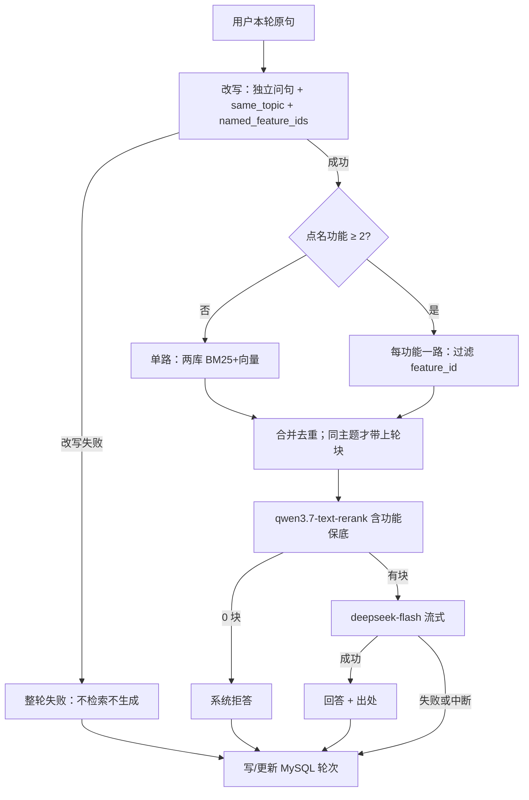

# Hayyo 知识问答 PRD

> 本文是知识问答工程 PRD 的**当前权威**。v2 / v1 已迁入 [`history/`](history/)，**不默认读**。

**需求状态：** 已确认（v3 纳入原型 UI、浏览器多会话、轮次日志 MySQL、多意图分路；2026-09-17 补确认 RQ-18～RQ-21）。  
**实现状态：** 未实施正式站点（仓库仍无 kb-api / 第四 Tab / Qdrant / MySQL）。工作区原型在 `workspace/kb-qa-proto/`（mock，非 kb-api）。二者不可互相替代。

> 2026-10-04 路径同步：产品唯一源已迁入 `site/core-docs/prd/`；本文既往基线与运行期标识不因此改写。本次只迁目录和物理引用，Docker / 运行映射尚未适配；适配前不得启动或重启容器 / API、不得重建索引（启动也会触发重建）。详见[工程入口](../../INDEX.md#迁移阶段边界2026-10-04)。

## 1. 摘要

给本仓库文档工作台（`site/`）增加「知识问答」：对已清洗的功能 `brief/current.md` 切块、阿里云 embedding、Qdrant 混合检索与重排，再用 DeepSeek 多轮流式回答并给出可点出处。问句若点名多个功能，**每个点名功能各检索一轮**再合并生成。本机提供配置页、问答明细与功能热度页。每轮过程与回答写入 MySQL（存法 B），供上线后核对；正式问答页不展示调试过程栏。面向在本机查阅 Hayyo 规则的产品 / 研发 / 测试。权威正文仍是各功能 `PRD.md`；问答层只检索派生 brief，不能当需求合同。

本文是**本仓库工程 PRD**，不是 Hayyo 产品功能规则。产品规则的唯一物理位置是 `site/core-docs/prd/design/<功能>/PRD.md`。日志页与热度页也是本站点工程后台，**不写入** `site/core-docs/prd/design/admin/`。

## 2. 背景、问题与目标

### 2.1 当前背景或现状

仓库已是本地 Docker 静态站：在 `site/` 执行 `docker compose up -d`（仓库根则 `docker compose -f site/docker-compose.yml up -d`），`http://127.0.0.1:18765/feature-interaction/`。`site/docker-compose.yml` 目前只有 nginx；本机备注端口中 3306、3307 已占用，本站占用 18765。

H5 顶栏三个 Tab（已检查）：「客户端 ↔ 后台」「客户端交叉」「文档索引」。知识问答第四 Tab **尚未接入现网** `site/feature-interaction/`。

2026-09-16 在 `workspace/kb-qa-proto/` 做出可交互 mock 原型（Demo A / Demo B）。用户选定 **Demo B 布局作调试工作台**：左对话列表、中会话、右本轮过程。并确认：正式上线问答页**不展示**右侧过程栏；过程进入日志明细页。

产品文档现行切块口径不变：默认切 `brief/current.md` 的 `chunk:default`；不切 `PRD.md` / `history/`。

### 2.2 核心问题

1. 关键词检索对不上换说法的问句。
2. 需要语义召回、重排、带出处回答。
3. 需要本机 Docker；embedding 走阿里云；向量库存本地。
4. 正式页不展示检索过程，出问题无法在对话里核对。
5. 一句点名多个功能时，单路检索可能把某功能挤出 Top 块。

### 2.3 目标与成功标准

| 目标 | 成功标准 | 状态 | 来源 |
|---|---|---|---|
| G1 语义问规则 | 在「知识问答」Tab 用自然语言提问，能看到基于召回块的回答和可点出处 | ✅ | v2 |
| G2 本机可运行 | 仓库根 Docker Compose 拉起静态站 + 问答依赖 + 日志库；仅绑定 127.0.0.1 | ✅ | v2；v3 日志库 |
| G3 出处可核对 | 点出处切到「文档索引」，打开对应 brief 节；切回问答对话仍在 | ✅ | v2 |
| G4 不编造规则 | 证据不足拒答；冲突并列摘录、不选边 | ✅ | v2 |
| G5 便于后续扩站点 | 知识源仍是文件；问答**轮次日志**进 MySQL；payload 预留账号字段；Qdrant 分 collection；重建变更清单可被以后落库 | ✅ | v2 G5 **收窄**：废止「本期完全不上 MySQL」 |
| G6 事后可核对 | 写库成功时，每轮原句、改写、分路统计、进生成块摘录、回答或错误态可在明细页打开；写库失败见 C37 | ✅ | v3 对话；RQ-19、RQ-20 |
| G7 多意图不丢功能 | 点名 ≥2 个功能时，每个点名功能各检索一轮；有块则出处能带到该功能 | ✅ | v3 对话 |

阈值类（秒级延迟、召回条数硬门槛）用户未给出，不编造成验收数字。

## 3. 用户、角色与关键场景

| 角色 | 需求或任务 | 触发场景 | 预期价值 | 来源 |
|---|---|---|---|---|
| 产品 / 研发 | 用口语问现行规则并核对原文 | 「保级」「补绑」；跨功能组合问 | 少全文搜索 | v2 |
| 测试 | 追问后台字段；排障看日志 | 「拉新后台奖励组有哪些字段」；上线后对不上回答 | 跨 brief；事后核对 | v2；v3 |
| 玩家 / 公网用户 | — | — | 非本期对象 | v2：仅 127.0.0.1 |

H5 本期仍无登录、不按角色切问答界面。日志页与配置页同一本机信任边界。账号 / 权益**预留字段、本期不实现**。

## 4. 范围与非目标

### 4.1 本期范围

- 顶栏「文档索引」右侧 Tab **「知识问答」**。
- 问答 UI（正式）：左对话列表 + 中会话。过程栏**不**进正式问答页。
- 完整链路：改写（独立问句 + 是否同一主题 + **点名功能 ID 列表**）→ 改写成功才检索 → 若点名功能 ≥2 则**每功能各检索一轮**后合并，否则两库单路混合召回 → 重排 → 流式回答。
- 切块 / 索引 / 重建 / 出处跳转 / 配置页锁死与可改：同 v2。
- 浏览器多会话：新建、切换、删除、清空当前；localStorage 刷新恢复；可释放。生成中禁止再发送、新建、切换、删除、清空；允许切其它 Tab 与打开配置 / 明细 / 热度。
- 每轮日志进 MySQL（存法 B）；问答明细页与功能热度页由第四 Tab 顶栏进入（与配置 / 重建并列，不是第 5 / 第 6 Tab；本站点，非 Hayyo 运营后台）。
- 预留：`user_id` / `owner_id` / `tenant_id` / `role`（本期空）；鉴权中间件 pass-through。

### 4.2 非目标 / 明确不做

| 项 | 说明 | 状态 | 来源 |
|---|---|---|---|
| 把问答或向量当权威 | 改规则仍改 `PRD.md` | ✅ | v2 |
| 默认切 `PRD.md` / `history/` / changelog | 与切块口径一致 | ✅ | v2 |
| 索引 `chunk:related-row`、`chunk:no` | 不进向量 | ✅ | v2 |
| 把 brief 全文进 MySQL | 知识源仍是文件；MySQL 只存**轮次日志** | ✅ | v3 收窄原「本期不上 MySQL」 |
| 本期账号 / 登录 / 权限实现 | 只预留字段 | ✅ | v2；v3 仍不实现登录 |
| 正式问答页展示过程栏 | 过程只在明细页 / 调试原型 | ✅ | v3：选 B 为调试，正式不展示 |
| 正式空状态建议问法 chips | 原型可有；上线问答页不做 | ✅ | v3：用户确认上线无此展示 |
| 原型剧本条（未配 Key 等） | 仅 mock 验收，非产品 | ✅ | 原型 |
| 问答 Tab 内嵌第二套阅读器 | 出处切文档索引 | ✅ | v2 |
| 浏览器直连模型 / Qdrant | 密钥不进前端 | ✅ | v2 |
| 用检索或回答改仓库 PRD | 禁止 | ✅ | v2 |
| 公开站点、映射 0.0.0.0 | 仅 127.0.0.1 | ✅ | v2 |
| 用户手动范围过滤 UI | 仍不提供「只搜某功能」勾选 | ✅ 延期 D1 | RQ-10；与 F21 不互相替代 |
| 入索引全文快照 | 人看 diff 用 git | ✅ | v2 |
| 配置页改锁死项或 Key | 不可改、不可见明文 | ✅ | v2 |
| 超长块二次切分 | 超限不入库 | ✅ | v2 |
| 改写失败降级原句检索 | 整轮失败 | ✅ | v2 |
| 把日志/热度做成 Hayyo 运营后台产品页 | 禁止写入 `site/core-docs/prd/design/admin` | ✅ | v3 |
| 明细 / 热度做成第 5 / 第 6 Tab | 顶栏按钮进入独立工作区，不与四个主 Tab 平级 | ✅ | RQ-18；C36 |
| 日志写失败落本地副本或自动回灌 | 只提示未写入；不另存本机日志、不回灌 | ✅ | RQ-20；C37 |
| 配置页改关系图 / 文档索引参数 | 本页只覆盖问答链路 | ✅ | v2 |

**废止 v2 非目标「对话持久化：关页或刷新即清空」。** 改为浏览器 localStorage 可恢复，用户可删。

## 5. 决策与来源记录

v2 的 C1–C5、C7–C12、C14–C29 **沿用**，除非下表「替代关系」写明废止或收窄。

| 编号 | 问题或主题 | 当前结论 | 状态 | 来源 | 替代关系 |
|---|---|---|---|---|---|
| C6 | 会话寿命 | **两层**：① 浏览器多会话走 localStorage，刷新恢复，删除才释放；② 服务端轮次日志走 MySQL，删浏览器对话不删日志 | ✅ v3 | 原型多会话 + 日志需求 | 废止 v2「刷新/关页清空」 |
| C13 | MySQL 与账号 | 知识源不上库；**轮次日志上 MySQL**；账号表不实现；字段预留 `user_id` / `owner_id` / `tenant_id` / `role` | ✅ v3 | 用户要日志；登录以后做 | 废止 v2「本期完全不上 MySQL」 |
| C30 | 多意图分路 | 改写返回 `named_feature_ids`；**≥2 个**则每个功能各检索一轮再合并重排；0 或 1 个走 v2 单路两库检索 | ✅ v3 | 用户：点名几个功能就必须每功能检索一轮 | 废止「无单独话题路由」作为唯一路径 |
| C31 | 问答布局 | 正式：左列表 + 中对话。右过程栏仅调试原型。过程数据正式只在日志明细页看 | ✅ v3 | 用户选 B 方便调试；确认正式不展示过程栏 | — |
| C32 | 建议问法 | 正式空状态不做 chips | ✅ v3 | 用户问上线是否展示，结论否 | 原型可保留 |
| C33 | 日志存法 | 存法 B：回答全文 + **进生成 Top n** 每块最多 500 字摘录 + path / chunk_id / 锚点 / feature_id / collection。分路只记 `named_feature_ids` 与每路条数 / 是否空，不把召回 K 条全文入库 | ✅ v3；RQ-19 | 用户选 B；审查补确认 A | 补充「每块」范围 |
| C34 | 热度口径 | **命中** = 本轮进生成块上出现过的 `feature_id`（去重，各 +1）。整轮无进生成块（改写失败、重排 0 块、重排前中断）计「未归类」。点名但该路 0 块、其它路有块时**不计**空路。页按次数降序。明细筛选「功能」同一口径 | ✅ v3；RQ-19 | 用户「可以」；审查补确认 A | 补充「命中」层级 |
| C35 | 中途刷新 | 发送即尝试写 `running`（失败见 C37）；刷新/断流在写库成功时记 `interrupted` 等错误态；UI 仍不展示半段当成功答 | ✅ v3 | 用户：错误状态记录 | 补充 C21、C25；与 C37 对齐 |
| C18′ | 多意图与 n | 默认 n=8 可配；多意图时每个点名功能在该路非空时**至少 1 块**进生成；若点名功能数 > n，则 n 提升为功能数（仍可配，不进硬验收） | ✅ v3 | 审核冲突 | 补充 C18，不废止默认 64/8/5 |
| C36 | 明细 / 热度入口 | 在「知识问答」顶栏与配置 / 重建并列。点开为独立工作区，可关可回问答。不是第 5、第 6 Tab。出处复用「文档索引」，当前对话保留 | ✅ v3；RQ-18 | 审查补确认 A | — |
| C37 | 日志库不可用 | MySQL 不可用或本轮写库失败：主路径仍可答；明确提示本轮日志未写入；不落本机日志副本、不自动回灌。该轮不出现在明细 / 热度。浏览器对话仍按 C6 | ✅ v3；RQ-20 | 审查补确认 A | 收窄 E12「本地降级或提示」 |
| C38 | 生成中锁定 | 禁止再发送、新建、切换、删除、清空。允许切文档索引 / 关系图，允许开配置 / 明细 / 热度（配置只对后续轮生效）。本轮结束后切换对话互不串 | ✅ v3；RQ-21 | 审查补确认 B | 补充 F16「禁止切换」 |

### 5.1 需求确认台账

v2 RQ-01～RQ-12.1 沿用。RQ-10 仍是「无手动范围过滤 UI」，**不**覆盖 F21。

| ID | 结论 | 状态 | 写入 |
|---|---|---|---|
| RQ-13 | 浏览器多会话 + localStorage | 已确认 | C6、F16 |
| RQ-14 | 轮次日志 MySQL 存法 B；明细页 + 热度页 | 已确认 | C13、C33、C34、F18–F20 |
| RQ-15 | 多意图：点名 ≥2 功能则每功能检索一轮 | 已确认 | C30、F21 |
| RQ-16 | 正式问答不展示过程栏 / 不做建议 chips | 已确认 | C31、C32 |
| RQ-17 | 账号字段预留，本期不登录 | 已确认 | C13、F14 |
| RQ-18 | 明细 / 热度：第四 Tab 顶栏与配置 / 重建并列进入；独立工作区；不是第 5 / 第 6 Tab | 已确认 | C36、F19、F20、AC22 |
| RQ-19 | 摘录与热度只用进生成 Top n；分路只记统计；无进生成块 → 未归类；空路不计热度 | 已确认 | C33、C34、F18–F20、AC19、AC20 |
| RQ-20 | 库挂仍可问答；提示日志未写入；不落本地副本；该轮不进明细 / 热度 | 已确认 | C37、E12、AC19 前置、AC24 |
| RQ-21 | 生成中禁止再发送、新建、切换、删除、清空；可切其它 Tab 与开配置 / 明细 / 热度 | 已确认 | C38、F16、AC23 |

## 6. 功能需求与完整流程

### 6.1 需求清单

v2 的 F1–F15 沿用，变更处如下：F2 会话改为多会话；F3 改写增加点名功能列表；F5 检索增加分路。新增 F16–F21。

| 编号 | 需求 | 触发 / 输入 | 系统行为 | 输出 / 结果 | 优先级 | 状态 | 来源 |
|---|---|---|---|---|---|---|---|
| F1 | 知识问答入口 | 打开 H5 | 顶栏「文档索引」右侧「知识问答」 | 进入问答工作区 | P0 | ✅ | C11 |
| F2 | 多轮提问 | 在**当前对话**发送 | 带上该对话最近轮；改写；检索；生成 | 回答 + 出处；可追问 | P0 | ✅ | C5、C6 |
| F3 | 追问改写 | 依赖上文 | 独立问句 + `same_topic` + `named_feature_ids`；ID/数字原样 | 见 F5 / F21 | P0 | ✅ | C5、C27、C30 |
| F4 | 换题丢旧块 | `same_topic=false` | 不携带上一轮 chunk | 避免串题 | P0 | ✅ | C27 |
| F5 | 混合召回（单路） | 改写成功且点名功能 0 或 1 个 | 两 collection BM25+向量，合并约 K 条 | 候选块 | P0 | ✅ | C3、C9、C18 |
| F6 | 重排 | 候选就绪 | `qwen3.7-text-rerank`；多意图时按 C18′ 保底 | Top n 进生成 | P0 | ✅ | C4、C18′ |
| F7 | 带出处流式回答 | 重排后有块 | `deepseek-flash` stream；思考关；结束后挂出处 | 气泡 + 可点出处 | P0 | ✅ | C21 |
| F8 | 拒答 | 空结果或模型声明未写 | 不装完整规则 | 「文档未写」+ 候选 | P0 | ✅ | C7、C26 |
| F9 | 冲突并列 | 互斥块同入 Top | 并列、不选边 | 请读原文 | P0 | ✅ | C7 |
| F10 | 出处跳转 | 点一条出处 | 切文档索引定位；**当前对话**仍在 | 可切回 | P0 | ✅ | C12 |
| F11 | 重建索引 | 启动或按钮 | 同 v2 | 变更清单 | P0 | ✅ | C14 |
| F12 | 密钥与绑定 | 配 Key、起容器 | Key 仅服务端；绑 127.0.0.1 | 前端无明文 | P0 | ✅ | C15 |
| F13 | 文档索引降级 | 第三 Tab | 关键词 + 阅读器保持 | 问答挂了仍能读 | P0 | ✅ | v2 |
| F14 | 预留鉴权点 | 本期无登录 | 中间件 pass-through；日志行预留用户字段（空） | 以后账号不推翻库 | P1 | ✅ | C13 |
| F15 | 本机配置页 | 问答入口打开 | 同 v2 只读/可改 | 保存后用于后续问 | P0 | ✅ | C23 |
| F16 | 多会话 | 新建 / 点列表 / 删除 / 清空当前 | 左列表；标题取首条用户问句截断约 18 字；生成中禁止再发送、新建、切换、删除、清空；允许切其它 Tab 与打开配置 / 明细 / 热度 | 会话隔离；刷新恢复；生成中切对话被拒绝且不中断本轮 | P0 | ✅ | C6、C31、C38 |
| F17 | 阶段与出处折叠 | 发送后 / 回答结束 | 阶段文案：改写中→检索中→重排中→生成中；出处默认「N 条出处」可展开；可复制回答 | 正式页有阶段与出处，无过程栏 | P0 | ✅ | 原型 2/5/6；C31 |
| F18 | 轮次日志 | 每点发送 | 先插 `running`；结束更新终态；存法 B（摘录仅进生成 Top n，分路只记统计）；写库失败不阻断问答，提示本轮日志未写入；不存 Key | MySQL 一行一轮；失败则该轮不进明细 / 热度 | P0 | ✅ | C13、C33、C35、C37 |
| F19 | 问答明细页 | 知识问答顶栏「问答明细」（与配置 / 重建并列） | 筛时间、原句、功能、结果类型；点开=过程+回答或错误态；出处可跳文档索引；筛选「功能」口径同 C34 | 排障 | P0 | ✅ | G6、C36 |
| F20 | 功能热度页 | 知识问答顶栏「功能热度」（与配置 / 重建并列） | 按已写入的 F18 行、按 C34 聚合；降序；未归类单独一行 | 观察问什么功能 | P0 | ✅ | C34、C36 |
| F21 | 多意图分路检索 | `named_feature_ids.length ≥ 2` | 每个 ID 各做一轮混合召回（payload 限定该 `feature_id`）；合并去重后再 F6 | 每功能有路；空路在回答里声明该功能文档未写 | P0 | ✅ | C30 |

**配置页只读 / 可改：** 同 v2。切块口径只读仍写「默认两库都搜；点名多功能时另走 F21，不是用户勾选过滤」。

### 6.1.1 原型已加、正式如何落地（UI）

原型：`workspace/kb-qa-proto/`（A+B mock）。用户选 **B 作调试皮**。

| 原型能力 | 正式问答页 | 正式其它页 | 说明 |
|---|---|---|---|
| 第四 Tab「知识问答」 | 要 | — | F1；尚未接到 `feature-interaction` |
| 左对话列表、新建、切换、删除、清空当前 | 要 | — | F16 |
| 中：空状态说明 + 输入 + 流式气泡 + 出处折叠 + 复制 | 要 | — | F2、F7、F17 |
| 空状态建议问法 chips | 不要 | 原型可留 | C32 |
| 右「本轮过程」 | 不要 | 明细页展示等价信息 | C31 |
| 阶段文案、生成中锁定本轮 | 要 | — | F16、F17、C38 |
| 顶栏配置 / 重建 | 要 | 明细、热度同为顶栏按钮，不是新 Tab | F11、F15、C36 |
| 仅原型剧本条 | 不要 | — | mock |
| 浏览器 localStorage 多会话 | 要 | — | C6；上限见 T2 |
| 问答明细 / 功能热度 | 不在对话中间 | 独立本机页；入口在第四 Tab 顶栏，与配置 / 重建并列 | F19、F20、C36 |

### 6.2 主流程

#### 索引

同 v2（只切 `chunk:default`；admin → `hayyo-admin`，其余 → `hayyo-client`）。

#### 问答（每一轮）



1. 发送即写日志 `running`（有原句）。写库失败不阻断本轮，提示本轮日志未写入（C37）。
2. 读**当前对话**最近轮（默认 5，可配）。
3. 改写：独立问句 + `same_topic` + `named_feature_ids`（只允许仓库已有功能 ID，禁止发明）。改写失败 → 不检索、不生成；日志 `rewrite_fail`。
4. `named_feature_ids` 为 0 或 1：检索查询 = 原句 + 改写句，两库混合召回（F5）。
5. ≥2：对每个 ID 各检索一轮（查询仍为原句+改写句，**过滤**该 `feature_id`）；各路结果合并去重。某路 0 块不导致整轮失败。
6. 同主题可并入上轮 Top 块再重排；换题不并入。多意图保底见 C18′。
7. 重排后 0 块 → 系统拒答，日志 `empty`。有块 → 流式生成；某点名功能全程 0 块则回答须声明该功能文档未写，不得用其它功能块编该功能规则。
8. 成功 → 挂出处，日志 `success` 或模型拒答 `refuse`。失败 / 刷新 / 断流 → UI 丢半段，日志 `gen_fail` / `interrupted`。
9. 点出处切文档索引；当前对话保留。
10. 生成未结束时：禁止再发送、新建、切换、删除、清空；允许切其它 Tab 与打开配置 / 明细 / 热度（C38）。

`named_feature_ids` 的识别在改写步骤，不是用户勾选范围（D1 仍延期）。

### 6.3 状态与规则

| 规则 | 内容 | 状态 | 来源 |
|---|---|---|---|
| R1 权威唯一 | 权威是各功能 `PRD.md` | ✅ | v2 |
| R2 向量非权威 | 索引可重建，非合同 | ✅ | v2 |
| R3 默认切块 | 只切 `chunk:default` | ✅ | v2 |
| R4 生成不得补写 | 不得使用未进本轮生成集的块中的数字/字段/状态 | ✅ | v2；F21 空路同此 |
| R5 会话两层 | 浏览器对话可恢复可删；日志独立，删对话不删日志 | ✅ | C6 |
| R6 密钥 | 两 Key 不进 git、不进配置页明文、不进日志 | ✅ | v2 |
| R7 出处定位 | 按 `{#锚点}` 或标题；chunk 注释不能当 DOM id | ✅ | v2 |
| R8 配置分层 | 同 v2 | ✅ | v2 |
| R9 点名功能 | 未进 `named_feature_ids` 的功能不保证有专路；未点名仍可能被单路召回 | ✅ | C30 |
| R10 日志非权威 | 日志用于核对当时检索，不能当规则合同；brief 以后改了以 git 为准 | ✅ | C33 |
| R11 生成中锁定 | 本轮未结束禁止再发送、新建、切换、删除、清空；可切其它 Tab | ✅ | C38 |
| R12 热度命中 | 只统计进生成块上的 `feature_id`；无进生成块计未归类；空路不计 | ✅ | C34 |

## 7. 边界、异常与降级

v2 E1–E8 沿用。新增：

| 场景 | 触发条件 | 系统处理 | 用户反馈 | 恢复或降级 | 验收编号 |
|---|---|---|---|---|---|
| E9 中途刷新 / 关页 | 已发送、生成未完成 | 日志 `interrupted`（写库成功时）；不把半段当成功答 | 再打开对话可能无本轮气泡；写库成功则明细页有错误态 | 可重试 | AC18 |
| E10 浏览器配额 | localStorage 写失败或超条数 | 淘汰最旧非当前对话；失败则提示存不下 | 明确「对话未保存」 | 删除旧对话 | AC16 |
| E11 某分路空 | 点名功能该 `feature_id` 0 块 | 其它路继续；生成时声明该功能未写 | 不编该功能完整规则 | 点文档索引 | AC17 |
| E12 日志库不可用 | MySQL 挂或本轮写库失败 | 问答主路径仍可答；明确提示本轮日志未写入；不落本地日志副本、不自动回灌；该轮不进明细 / 热度 | 对话气泡仍可在浏览器；不因日志失败而编造回答 | 查明库端口/容器 | AC24 |

## 8. 验收标准

v2 AC1–AC14 沿用（AC3/AC6 的「会话」理解为**当前对话**）。新增：

| 编号 | 前置条件 | 操作 / 事件 | 预期结果 | 关联需求 | 状态 | 来源 |
|---|---|---|---|---|---|---|
| AC15 | 问答页 | 新建对话、各问一句、切换 | 列表标题来自首问；内容不串；刷新后仍在。生成未结束时的切换见 AC23 | F16 | ✅ | C6、C38 |
| AC16 | 有多条对话 | 删除一条 | 列表与 localStorage 去掉该条；日志明细里旧轮次仍在 | F16、F18 | ✅ | C6 |
| AC17 | 索引完成 | 问「用户等级 2、VIP5，在拉新页能获得什么 / 能做什么」 | 对 `user-level`、`vip`、`referral` 各至少一路检索；有块的功能出处能带到；不得只编其中一个的完整规则冒充全部 | F21 | ✅ | C30 |
| AC18 | 发送后刷新（MySQL 可用） | 生成未结束时刷新 | 明细为 `interrupted` 或等价错误态；无半段成功气泡 | F18 | ✅ | C35 |
| AC19 | MySQL 可用且至少一轮写库成功 | 打开明细页 | 可见原句、改写句、点名功能、每路条数 / 是否空、进生成块摘录（≤500 字）、回答或错误态 | F19 | ✅ | C33、C36 |
| AC20 | 有跨功能进生成块且已写入日志 | 打开热度页 | 这些 `feature_id` 各 +1，降序；空路不计。另：整轮无进生成块且写库成功时，热度出现「未归类」 | F20 | ✅ | C34、C36 |
| AC21 | 正式问答页（非原型） | 打开空会话 | 无建议问法 chips；无右侧过程栏 | F17、C31、C32 | ✅ | v3 |
| AC22 | 正式问答页 | 点顶栏「问答明细」「功能热度」 | 进入独立工作区，可回问答；顶栏无第 5、第 6 Tab；从明细点出处切到文档索引，再回问答，当前对话仍在 | F19、F20 | ✅ | C36 |
| AC23 | 已发送且生成未结束 | 点左侧其它对话；切文档索引 | 输入禁用；切对话有提示且不切换、本轮不中断；可切文档索引。本轮结束后切换不串 | F16 | ✅ | C38 |
| AC24 | MySQL 停或本轮写库失败 | 提问 | 主路径仍可按既有失败 / 成功口径作答（不因写日志失败而编造）；提示本轮日志未写入；明细 / 热度无该轮 | F18、E12 | ✅ | C37 |

## 9. 依赖、风险与延期项

### 9.1 依赖

v2 依赖沿用。新增：本机 MySQL（compose 新服务，**避开 3306/3307**，只绑 127.0.0.1；具体端口实施时定）。功能别名 → `feature_id` 表实施时维护，产品文档源的物理位置为 `site/core-docs/prd/design/*`，功能 ID 沿用现有值，禁止编造。

### 9.2 风险

v2 风险沿用。新增：多意图增加检索次数与费用；改写漏点名则该功能无专路（缓解：原句也参与检索；日志可核对 `named_feature_ids`）；无登录时明细没有「谁问的」（接受，字段预留）。

### 9.3 延期项

| 编号 | 问题 | 为什么延期 | 重新讨论条件 |
|---|---|---|---|
| D1 | 用户勾选「只搜某功能/某文档」 | 与 F21 不同：F21 是系统按点名分路，不是手动过滤 UI | 串功能严重或做账号后台 |
| D2 | 文档索引默认可读改为 brief | 同 v2 | 另立项 |
| D3 | 登录与账号权益实现 | 只预留字段 | 用户启动账号需求时 |

### 9.4 实施说明（不占用确认）

- 后端语言、路径前缀、MySQL 端口、功能别名表：实施时定。
- collection 默认 `hayyo-client` / `hayyo-admin`。
- 浏览器对话条数上限实施默认 40；单条超限提示删除。
- 日志保留天数用户未定，不编造硬验收。
- 日志写失败不落本地副本、不自动回灌（C37）。配置页用抽屉或整页 overlay 均可，以 AC13 字段分层为准。

## 10. 版本记录

| 版本 | 日期 | 基线 | 新增 | 修改 / 废止 | 待确认 |
|---|---|---|---|---|---|
| v1 | 2026-09-16 | — | 首份工程 PRD | 不把 h5-kb L3 当本期 | 已迁入 history |
| v2 | 2026-09-16 | v1 | embedding v4/1024、对账、失败口径、配置页、无范围 UI | 废止改写降级等 | 已迁入 history |
| v3 | 2026-09-16 | v2 | 原型 UI 分层落地、多会话、日志 MySQL 存法 B、明细/热度、多意图分路、错误态 interrupted | 废止刷新清空、本期完全不上 MySQL、无话题路由唯一路径；G5/C6/C13 收窄；D1 仍延期 | 无产品未决；D3 账号实现延期 |
| v3 补确认 | 2026-09-17 | v3 | RQ-18 顶栏入口；RQ-19 进生成块摘录与热度；RQ-20 写库失败只提示；RQ-21 生成中锁定；AC22–AC24 | 收窄 E12「本地降级或」；C33/C34 补充层级 | 无产品未决；D1–D3 仍延期 |

## 11. 本文档怎么管理

同 v2 约定。当前权威为本文件 **v3**。STEP 实施读同目录 [`Hayyo-知识问答-STEP-验证版.md`](Hayyo-知识问答-STEP-验证版.md)。`history/`（含旧版 PRD、STEP 草稿、审查过程）**不默认读**。不要把本文写进 `site/core-docs/prd/design/*/PRD.md`。

概念讲解、案例对照、接口打印示意（非需求合同）放在仓库根 [`knowledge/`](../../../../knowledge/INDEX.md)，专题入口见 [`INDEX.md`](INDEX.md)。讲解稿不进产品扫描；与 PRD 冲突以本文件为准。

## 12. 与 v2 冲突审核（本版已消化）

| 冲突点 | v2 原文口径 | v3 处理 | 是否还冲突 |
|---|---|---|---|
| 刷新即清空 | C6；非目标「对话持久化」 | 浏览器可恢复；日志另存 | 已消化 |
| 本期不上 MySQL | C13、G5、§4.2 | 仅轮次日志上库；brief 仍不上库 | 已消化（收窄） |
| 问答日志不采集 | A4 | 默认采集轮次 | 已消化 |
| 无话题路由 | §6.2 末句 | ≥2 点名功能走 F21 | 已消化 |
| 无范围过滤 UI（RQ-10/D1） | 用户不能只搜某库 | F21 不是勾选 UI，D1 仍延期 | **不冲突** |
| 默认 n=8 | C18 | 多意图保底每功能 ≥1 块 | 已消化（C18′） |
| A2 多功能「可都引用」 | 单路碰巧都进 Top 才引用 | 改为点名则必有专路 | 已消化（加强） |
| 过程栏 | v2 未写右侧栏 | 正式不展示；原型 B / 明细页才有 | 已消化 |
| 建议 chips | v2 无 | 正式不做 | 已消化 |
| 会话 vs 日志 | 未分层 | 删对话不删日志 | 已消化 |
| 日志页 vs 运营后台 | — | 禁止进 admin 产品 PRD | 已消化 |
| 改写失败整轮失败 | C24 | 分路发生在改写成功之后，不改 C24 | **不冲突** |
| 生成不得补写 | R4 | 空路不得用别的功能块编该功能 | **不冲突**（加强） |
| 两 collection | C9 | 单路仍两库；分路按 `feature_id` 过滤（admin 点名为 `admin`） | **不冲突** |
| 实现状态 | 未实施 | 原型 ≠ 现网第四 Tab | 写清，避免把 mock 当 kb-api |
| 明细 / 热度入口 | 只写「本机打开」 | 第四 Tab 顶栏与配置并列，非新 Tab | 已消化（C36） |
| 热度「命中」层级 | 未写清召回 / 生成 / 点名 | 进生成 Top n；空路不计；无块未归类 | 已消化（C34） |
| E12 本地降级或提示 | 两可 | 只提示未写入，不落本地副本 | 已消化（C37） |
| 生成中锁定 | 只写禁止切换 | 锁定本轮对话操作，可切其它 Tab | 已消化（C38） |

**残留风险（接受，不另开未决）：** 改写漏点名则无专路；无登录则明细无提问人；多路检索更慢更贵（无时延验收）。

## A. AI / Agent 规格扩展

### A1. 能力边界

v2 A1 沿用。补充：能对点名的多个功能分路检索；不能把未点名、也未召回的功能编进完整规则；不能把交叉组合（等级×VIP×拉新）写成文档没写的合成权益。

### A2. Agent 行为定义

v2 行沿用，修改「歧义 / 多功能」与「用户纠正」：

| 场景 / 意图 | 可用上下文 | 期望行为 | 输出形式 | 禁止行为 | 状态 | 来源 |
|---|---|---|---|---|---|---|
| 点名多功能 | 各分路块合并重排后 | 每点名功能有专路；有块则引用；空路声明未写 | 流式答 + 多功能出处 | 只挑一个功能编完假装覆盖全部 | ✅ | C30、F21 |
| 用户纠正 / 只搜某文档 | — | 仍无勾选 UI；请改问法或点出处 | — | 假装已按指定文档过滤 | 延期 D1 | RQ-10 |

### A3. Prompt / 指令规范

改写产出：**独立问句 + 是否同一主题 + `named_feature_ids`（已有功能 ID 数组，可空）**。禁止改写时发明功能 ID、版本号、数值。生成时若某点名功能无块，必须声明该功能文档未写。

### A4. 知识与数据

| 知识或数据源 | 用途 | 获取与清洗 | 更新 | 权限 | 缺失 | 来源 |
|---|---|---|---|---|---|---|
| brief `chunk:default` | 切块与回答 | 同 v2 | 增量对账 | 本机 | 拒答 | v2 |
| 浏览器对话 | 多会话 UI | localStorage | 用户删或上限淘汰 | 本机无账号 | 空列表 | C6 |
| 轮次日志 | 明细 / 热度 | MySQL 存法 B | 每轮 | 本机；user_id 空 | 主路径仍可答；提示未写入；该轮不进明细 / 热度 | C13、C37 |
| 会话（服务端） | 不落对话全文快照当第二知识源 | — | — | — | — | 与 F18 区分 |

### A5. 工具与接口

v2 接口沿用。新增语义：改写输出含 `named_feature_ids`；问答一轮开始写日志；读明细列表/详情；读热度聚合。前端不得拿 Key。

### A6–A7

见第 7、8 章。新增手工 AC15–AC24。

## T. 技术实施方案扩展

拟议路径未实施前不要当成现网已存在。原型 `workspace/kb-qa-proto/` 是 mock。

### T1. 架构

```text
浏览器 H5
  ├─ 文档索引：现有 kb.js
  └─ 知识问答：独立工作区（左列表 + 中对话；无正式过程栏）
        ├─ localStorage 多会话
        ├─ nginx → kb-api
        │     ├─ 改写 / 分路检索 / 重排 / stream
        │     ├─ Qdrant 两 collection
        │     └─ MySQL 轮次日志（127.0.0.1，避开 3306/3307）
        ├─ 配置页（顶栏）
        ├─ 问答明细页（顶栏，与配置并列）
        └─ 功能热度页（顶栏，与配置并列）
调试原型 Demo B 另含右侧过程栏，正式不接该栏。
```

### T2. 数据

- 浏览器对话：id、title、messages、上轮 chunk、`same_topic` 相关字段；上限默认 40。
- 日志行：时间、会话 id、轮次 id、原句、改写句、same_topic、named_feature_ids、每路条数 / 是否空、进生成 Top n 的块元数据与 ≤500 字摘录、回答全文或空、status（`running` / `success` / `refuse` / `rewrite_fail` / `gen_fail` / `empty` / `interrupted`）、型号快照、预留用户字段（空）、content_hash 可选。
- 不存 Key；不把 brief 当知识源再抄一份进 MySQL；写库失败不另存本机日志副本。

### T3–T7

T4 现网文件改动范围同 v2，另加 compose 的 qdrant、kb-api、mysql 与日志两页 DOM（入口在第四 Tab 顶栏，不是新 Tab）。T6：本期仍无登录；**有**必须问答日志；写库失败只提示、不落本地副本。T7：账号未做改为 D3；无范围过滤 UI 仍为 D1；新增「改写漏点名」。

原型路径：`workspace/kb-qa-proto/`（非权威实现）。正式实现仍以接入 `site/feature-interaction/` 第四 Tab 为准。
