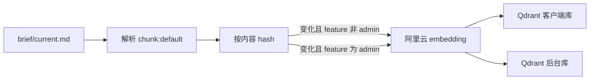
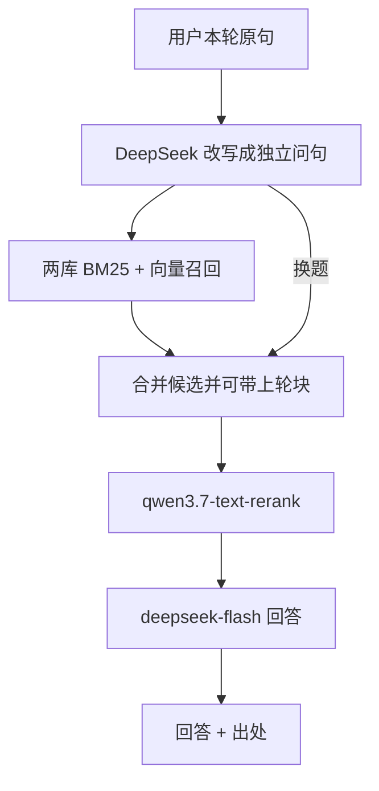

# Hayyo 知识问答 PRD

> 本文是知识问答工程 PRD 的 **v1 历史稿**，放在本功能 `history/`，**不默认读、不作为实施依据**。  
> 当前权威：[`../PRD-知识问答-v3.md`](../PRD-知识问答-v3.md)。

## 1. 摘要

给本仓库文档工作台（`site/`）增加「知识问答」：对已清洗的功能 `brief/current.md` 切块、阿里云 embedding、Qdrant 混合检索与重排，再用 DeepSeek 多轮回答并给出可点出处。面向在本机查阅 Hayyo 规则的产品 / 研发 / 测试。权威正文仍是各功能 `PRD.md`；问答层只检索派生 brief，不能当需求合同。

本文是**本仓库工程 PRD**，不是 Hayyo 产品功能规则。产品规则仍只在 `prd/design/<功能>/PRD.md`。

## 2. 背景、问题与目标

### 2.1 当前背景或现状

仓库已是本地 Docker 静态站：仓库根 `docker compose up -d`，`http://127.0.0.1:18765/feature-interaction/`。`site/docker-compose.yml` 目前只有 nginx，仓库根只读挂载；无后端、无向量库、无 MySQL。本机备注端口中 3306 已占用，本站占用 18765。

H5 顶栏三个 Tab（已检查 `site/feature-interaction/index.html`）：「客户端 ↔ 后台」「客户端交叉」「文档索引」。文档索引已能列出 `prd/llm-manifest.json` 的 `scan_roots`、页内渲染 Markdown、关键词子串检索、打开 `brief/current.md`。检索在浏览器内存完成，无 embedding。

产品文档现行切块口径（`prd/INDEX.md`，2026-09-16）：默认切各功能 `brief/current.md`（24 个客户端 + 运营后台）；`PRD.md` 只校对、不进默认切块；`history/` 不切。`brief/` 不进产品 `llm-manifest.json` 的 `scan_roots`。admin 已有 `prd/design/admin/brief/current.md`，含 `chunk:default` / `chunk:related-row` / `chunk:no`，锚点与 PRD 同名。

8 月工程文档 `site/docs/design/h5-kb/PRD-H5知识库-v1.md` 把向量问答写成 L3 且「本期不做」。用户在本轮明确：该规划较早，**不能作为本期权威**。本期另立工程 PRD，不在旧 L3 附录上增量。

### 2.2 核心问题

1. 关键词检索对不上换说法的问句（只记得现象、对不上标题）。
2. 文档索引能打开 brief，但不能按语义召回、重排后给出带出处的回答。
3. 需要本机 Docker 跑通；embedding 走阿里云；向量库存本地。

### 2.3 目标与成功标准

| 目标 | 成功标准 | 状态 | 来源 |
|---|---|---|---|
| G1 语义问规则 | 在「知识问答」Tab 用自然语言提问，能看到基于召回块的回答和可点出处 | ✅ | 本轮对话：检索+重排+回答都要 |
| G2 本机可运行 | 仓库根 Docker Compose 拉起静态站 + 问答依赖；仅绑定 127.0.0.1 | ✅ | 本轮对话：要可在本地 docker 运行 |
| G3 出处可核对 | 点出处切到「文档索引」，打开对应 brief 节；切回问答对话仍在 | ✅ | 本轮对话：确认点 3.1 选项 1 |
| G4 不编造规则 | 证据不足拒答；冲突并列摘录、不选边 | ✅ | 本轮对话：确认点 1.3 选项 1 |
| G5 便于后续扩站点 | 不上 MySQL；API/payload 预留账号权限；Qdrant 分 collection 便于加语料域 | ✅ | 本轮对话：确认点 4 选项 1 + 预留后台账号 |

阈值类（秒级延迟、召回条数硬门槛）用户未给出，不编造成验收数字。

## 3. 用户、角色与关键场景

| 角色 | 需求或任务 | 触发场景 | 预期价值 | 来源 |
|---|---|---|---|---|
| 产品 / 研发 | 用口语问现行规则并核对原文 | 记得「保级」「补绑」对不上目录 | 少在长文里全文搜索 | 本轮对话；站点现有读者 |
| 测试 | 追问后台字段或配置页 | 「拉新后台奖励组有哪些字段」再问「和客户端怎么对应」 | 一次会话跨客户端 brief 与 admin brief | 本轮对话：两 collection + 多轮 |
| 玩家 / 公网用户 | — | — | 非本期对象 | 本轮对话：仅 127.0.0.1、无登录 |

H5 本期无账号、不按角色切换界面。同一人可兼多角色。

## 4. 范围与非目标

### 4.1 本期范围

- 在现有 H5 顶栏「文档索引」**右侧**增加 Tab **「知识问答」**。
- 完整链路：问句改写（多轮）→ BM25 + 向量混合召回（两个 Qdrant collection）→ `qwen3.7-text-rerank` → `deepseek-flash` 回答（关闭思考模式）。
- 切块：所有 `prd/design/*/brief/current.md`（含 admin）中 `<!-- chunk:default -->` 标记的块。
- 索引：容器启动后按文件 hash 增量重建；问答页提供「重建索引」。
- 出处打开现有文档索引阅读器，不新做阅读器。
- 密钥用环境变量，不进仓库。
- 预留：`collection`、可插拔鉴权中间件、payload 可加 `tenant_id` / `owner_id`（本期空）；以后后台账号权限、MySQL 文档登记再接。

### 4.2 非目标 / 明确不做

| 项 | 说明 | 状态 | 来源 |
|---|---|---|---|
| 把问答或向量当权威 | 改规则仍改 `PRD.md`；brief 是派生阅读层 | ✅ | `prd/INDEX.md`；本轮对话 |
| 默认切 `PRD.md` / `history/` / changelog | 与现行切块口径一致 | ✅ | `prd/INDEX.md`；确认点 2 / 2.1 |
| 索引 `chunk:related-row`、`chunk:no` | 指针与元信息不进向量 | ✅ | 确认点 2.1 选项 1 |
| 本期 MySQL | 对话不落库；文件仍是知识源 | ✅ | 确认点 4 选项 1 |
| 本期账号 / 登录 / 权限后台 | 预留设计，不实现 | ✅ | 确认点 6 选项 1 + 用户「后面会做」 |
| 对话持久化 | 关页或刷新即清空 | ✅ | 确认点 1.2.1 选项 1 |
| 问答 Tab 内嵌第二套阅读器 | 出处切文档索引 | ✅ | 确认点 3.1 选项 1 |
| 浏览器直连百炼 / DeepSeek / Qdrant | 密钥不可进前端 | ✅ | 本轮方案约束；用户接受 Docker 服务 |
| 用检索或回答自动改写仓库 PRD | 禁止 | ✅ | 工程惯例；用户未要求写入产品正文 |
| 公开站点、映射 0.0.0.0 | 延续现网绑定 127.0.0.1 | ✅ | 确认点 6；现有 compose |
| 覆盖或当作旧 H5 L3 已批准实施 | 旧 PRD 非本期基线 | ✅ | 本轮对话：「原规划不能成为现在的权威」 |

## 5. 决策与来源记录

| 编号 | 问题或主题 | 当前结论 | 状态 | 来源 | 替代关系 |
|---|---|---|---|---|---|
| C1 | 本期能力 | 检索 + 重排 + 回答都要 | ✅ 已确认 | 本轮对话：「检索，重排，回答我都要」 | 废止「先只做语义检索」的建议路径 |
| C2 | 回答模型供应商 | DeepSeek API | ✅ 已确认 | 本轮对话：「回答可以用 deepseek 的 api」 | — |
| C3 | 检索形态 | BM25 + 向量混合召回，再接专用重排模型；可接受更慢 | ✅ 已确认 | 本轮对话：用户确认混合检索 + 专用重排 | — |
| C4 | 重排模型 | 阿里云 `qwen3.7-text-rerank` | ✅ 已确认 | 本轮对话：用户指定该型号 | 废止「用 qwen3-rerank」建议 |
| C5 | 交互形态 | 完整多轮对话（含追问改写、换题丢旧块、出处） | ✅ 已确认 | 本轮对话：确认点 1.2 选项 2，「要全的」并授权按公开方案落地 | 废止单次问答卡片建议 |
| C6 | 会话寿命 | 只活在当前浏览器标签页；刷新/关页清空 | ✅ 已确认 | 本轮对话：确认点 1.2.1 选项 1 | — |
| C7 | 证据不足 / 冲突 | 拒答「文档未写」+ 候选文档；冲突并列摘录、不选边、不补数字/字段/状态 | ✅ 已确认 | 本轮对话：确认点 1.3 选项 1 | — |
| C8 | DeepSeek 型号与思考 | 使用 `deepseek-flash`（V4.1-Flash）；改写与回答均 `thinking: disabled` | ✅ 已确认 | 本轮对话：用户要求按官方文档选性价比；依据 https://api-docs.deepseek.com/zh-cn/ | 废止旧名 `deepseek-chat` / `deepseek-reasoner` 作为本期型号 |
| C9 | 向量库切分 | Qdrant 两个 collection：客户端 brief / admin brief；问答仍一个窗口 | ✅ 已确认 | 本轮对话：用户接受两个库便于维护和后续加内容 | 废止「单 collection + 标签即可」作为唯一路径 |
| C10 | 切块范围 | 所有 `brief/current.md`（含已清洗的 admin）的 `chunk:default`；不切 PRD | ✅ 已确认 | `prd/INDEX.md`；用户：「后台文档已经清洗过了」；确认点 2.1 | 废止「admin 切 PRD.md 原文」 |
| C11 | Tab | 顶栏「文档索引」右侧新增「知识问答」 | ✅ 已确认 | 本轮对话：「在文档索引右边开一个新的 tab」+「知识问答」 | — |
| C12 | 点出处 | 切到「文档索引」打开对应节；问答会话保留 | ✅ 已确认 | 本轮对话：确认点 3.1 选项 1 | — |
| C13 | MySQL 与账号 | 本期不上 MySQL；预留 collection / 鉴权中间件 / 可选 tenant_id，供后续后台账号权限 | ✅ 已确认 | 本轮对话：确认点 4 选项 1 +「预留相关设计」 | — |
| C14 | 索引更新 | 启动后按 hash 增量重建；问答页「重建索引」 | ✅ 已确认 | 本轮对话：确认点 5 选项 1 | — |
| C15 | 访问控制 | 仅 127.0.0.1，无登录；reindex 不映射公网 | ✅ 已确认 | 本轮对话：确认点 6 选项 1 | — |
| C16 | Embedding 供应商 | 阿里云百炼 | ✅ 已确认 | 本轮对话：「embeding 模型可以用阿里云的」 | — |
| C17 | Embedding 具体型号与维度 | `text-embedding-v4`、1024 维 | 💡 AI 建议 | 阿里云文档；用户未点名型号 | — |
| C18 | 召回/重排条数 | 混合召回约 50～80，重排后约 5～10 块进生成 | 💡 AI 建议 | 本轮方案说明；用户未给数字 | — |
| C19 | 多轮历史长度 | 最近 5 轮 | 💡 AI 建议 | 本轮方案说明；用户未给数字 | — |
| C20 | 后端实现 | 独立 `kb-api` 服务 + nginx 反代；Qdrant 仅内网 | 💡 AI 建议 | 本轮方案；用户确认要 Docker，未指定语言 | — |
| C21 | 流式回答 | 打开 stream，降低首字等待 | 💡 AI 建议 | 选型 DeepSeek 时的附带建议 | — |
| C22 | collection 名称 | `hayyo-client` / `hayyo-admin` | 💡 AI 建议 | 本轮方案用名；用户只确认「两个库」 | — |

## 6. 功能需求与完整流程

### 6.1 需求清单

| 编号 | 需求 | 触发 / 输入 | 系统行为 | 输出 / 结果 | 优先级 | 状态 | 来源 |
|---|---|---|---|---|---|---|---|
| F1 | 知识问答入口 | 打开 H5 | 顶栏「文档索引」右侧增加 Tab「知识问答」 | 能离开关系图/阅读器进入会话 | P0 | ✅ | C11 |
| F2 | 多轮提问 | 用户在该 Tab 发送问题 | 带上本标签页会话；改写成独立问句；检索+重排+生成 | 回答 + 出处；可追问 | P0 | ✅ | C5 |
| F3 | 追问改写 | 问句依赖上文（「那退款呢」） | 改写为可检索的独立问句；保留功能 ID/字段名/数字原样；已独立则原样 | 检索用「本轮原句 + 改写句」 | P0 | ✅ | C5；用户授权完整多轮方案 |
| F4 | 换题丢旧块 | 改写后主题与上一轮明显不同 | 不携带上一轮 chunk | 避免 VIP 上下文污染拉新问题 | P0 | ✅ | C5 |
| F5 | 混合召回 | 独立问句就绪 | 两 collection 均做 BM25 + 向量召回后合并 | 候选块列表 | P0 | ✅ | C3、C9 |
| F6 | 重排 | 候选块就绪 | 调用 `qwen3.7-text-rerank` | 按本轮独立问句排序的 Top 块 | P0 | ✅ | C4 |
| F7 | 带出处回答 | 重排后有足够块 | `deepseek-flash` 只根据这些块回答；思考关闭 | 回答 + 可点出处（path、标题、chunk id） | P0 | ✅ | C1、C2、C8 |
| F8 | 拒答 | 无召回或证据不够 | 不生成假装完整的规则 | 「文档未写」+ 可打开的候选文档 | P0 | ✅ | C7 |
| F9 | 冲突并列 | 召回块对同一规则互斥 | 并列摘录，不选边 | 提示去读原文；后文覆盖前文仍由人判 | P0 | ✅ | C7 |
| F10 | 出处跳转 | 点击一条出处 | 切到文档索引，打开该 brief 并定位节 | 问答 Tab 会话仍在 | P0 | ✅ | C12 |
| F11 | 重建索引 | 启动，或用户点「重建索引」 | 按文件 hash 增量切块/embedding/upsert；只处理变化块 | 可查询的最新向量；失败则明确原因 | P0 | ✅ | C14 |
| F12 | 密钥与绑定 | 配置 API Key、起容器 | Key 仅服务端环境变量；服务绑 127.0.0.1 | 前端拿不到 Key | P0 | ✅ | C15、C16 |
| F13 | 文档索引降级 | 用户仍用第三 Tab | 关键词检索与阅读器保持可用 | 问答服务挂了仍能读文档、关键词搜 | P0 | ✅ | 确认点 3 用户改为独立 Tab，未要求删除文档索引 |
| F14 | 预留鉴权点 | 本期无登录 | 网关预留中间件；payload 预留 collection / 可选用户字段 | 后续账号不推翻向量库 | P1 | ✅ | C13 |

默认可切范围与 `prd/INDEX.md` 切块口径一致：各功能 `brief/current.md` 的 `chunk:default`。admin 走独立 collection。

### 6.2 主流程

#### 索引



1. 扫描 `prd/design/*/brief/current.md`。
2. 丢弃 `chunk:no`、`chunk:related-row`。
3. 按 `chunk:default` 切块；保留 `id`、`section`、路径、标题、锚点、`feature_id`。
4. 与已入库 hash 比较，未变化则跳过 embedding。
5. `feature_id === admin` 写入 admin collection，其余写入 client collection。
6. 启动时自动跑一轮；也可在问答页手动触发。

#### 问答（每一轮）



1. 读取本标签页最近对话（不落盘）。
2. 改写独立问句；检索查询 = 本轮原句 + 改写句。
3. 两库混合召回并合并；非换题时可并入上一轮 Top 块，再整体重排。
4. 块足够则生成回答；否则拒答。
5. 点出处 → 文档索引打开 `brief` 对应锚点/标题。

### 6.3 状态与规则

| 规则 | 内容 | 状态 | 来源 |
|---|---|---|---|
| R1 权威唯一 | 现行规则权威是各功能 `PRD.md`（后台页面/字段以 `admin/PRD.md` 为准）；brief 派生，冲突以 PRD 为准 | ✅ | `prd/INDEX.md`；brief 文首 |
| R2 向量非权威 | 索引可丢可重建，不能当需求合同 | ✅ | 本轮对话 |
| R3 默认切块 | 只切 `chunk:default` | ✅ | C10、C 确认点 2.1 |
| R4 生成不得补写 | 不得添加未召回块中的数字、状态、接口、字段 | ✅ | C7 |
| R5 会话 | 无 `session_id` 持久化要求；进程/标签关闭即无历史 | ✅ | C6 |
| R6 密钥 | `DASHSCOPE_API_KEY`、`DEEPSEEK_API_KEY` 不进 git | ✅ | C12/C16 约束 |

## 7. 边界、异常与降级

| 场景 | 触发条件 | 系统处理 | 用户反馈 | 恢复或降级 | 验收编号 |
|---|---|---|---|---|---|
| E1 未配置 Key | 环境变量空 | 不调用外网模型 | 说明缺哪类 Key | 文档索引仍可用 | AC7 |
| E2 Qdrant 未起 / 空库 | 健康检查失败或点数为 0 | 不生成回答 | 提示索引未就绪，可点重建 | 文档索引关键词检索 | AC7 |
| E3 百炼 embedding/重排失败 | HTTP 错误或超时 | 本轮失败，不编造排序 | 明确「检索/重排失败」 | 可重试；可回文档索引 | AC8 |
| E4 DeepSeek 失败 | 超时或 4xx/5xx | 不展示假回答 | 明确「生成失败」 | 仍展示已召回出处（若有）⚠️ 待确认是否展示裸块 | AC8 |
| E5 证据不足 | 重排后低相关或空 | 拒答 | 「文档未写」+ 候选 | 打开候选 brief | AC4 |
| E6 块冲突 | 互斥表述同入 Top 块 | 并列摘录 | 标明冲突，请读原文 | 点出处 | AC5 |
| E7 改写失败 | 改写调用失败 | ⚠️ 待确认：用原句检索或整轮失败 | 提示失败 | 可重试 | — |
| E8 超长块 | 单块接近模型上限 | 💡 按标题/段落二次切，overlap 约 10% | 对用户无感 | 重建索引 | — |

超时秒数、重试次数用户未定，不编造。

## 8. 验收标准

| 编号 | 前置条件 | 操作 / 事件 | 预期结果 | 关联需求 | 状态 | 来源 |
|---|---|---|---|---|---|---|
| AC1 | compose 已起、Key 已配、索引完成 | 打开顶栏「知识问答」 | 在「文档索引」右侧出现该 Tab，可进入会话 | F1 | ✅ | C11 |
| AC2 | 同上 | 问「保级扣的是财富值还是金币」 | 有基于 VIP brief 块的回答，并有可点出处 | F5–F7 | ✅ | C1 |
| AC3 | 刚问过保级 | 追问「那退款呢」 | 按 VIP 退款相关块答，而不是当成全新无关问题 | F3 | ✅ | C5 |
| AC4 | 问 brief 未写的具体数字表 | 提问 | 拒答或声明文档未写，不编造表 | F8 | ✅ | C7 |
| AC5 | 召回块对同一规则打架 | 提问 | 并列摘录，不宣称其中一条为唯一现行 | F9 | ✅ | C7 |
| AC6 | 回答含出处 | 点击一条出处 | 切到文档索引并落到对应 brief 节；再切回问答，上一轮对话仍在 | F10 | ✅ | C12 |
| AC7 | 故意不配 Key 或停 Qdrant | 提问 | 失败说明可读；文档索引仍能打开文档 | F12、F13 | ✅ | C15 |
| AC8 | 外网模型 5xx | 提问 | 不出现无出处的完整规则答 | F7、E3/E4 | ✅ | C7 |
| AC9 | 改某个 `chunk:default` 正文 | 点重建索引后再问 | 回答能反映新文（hash 变化的块被重 embed） | F11 | ✅ | C14 |
| AC10 | 问纯后台字段 | 提问 | 能命中 admin brief 页面块，出处路径含 `admin/brief` | F5、C9 | ✅ | 用户：后台已可切 |
| AC11 | 关系图两 Tab | 切回「客户端 ↔ 后台」 | 行为与现网一致，不被问答破坏 | F13 | ✅ | 本轮：扩展现有站点 |
| AC12 | 文档索引顶栏关键词 | 输入正文词 | 仍只做现有关键词检索，不强制走向量 | F13 | ✅ | 现有 `kb.js`；本期不删 |

无用户给出的性能门槛（例如 3 秒内出答），不写入硬验收。

## 9. 依赖、风险与待确认项

### 9.1 依赖

| 依赖 | 影响 | 负责人或来源 | 状态 |
|---|---|---|---|
| `prd/design/*/brief/current.md` 及 chunk 标记 | 无 brief 则无可切块 | 已存在（含 admin） | 已检查 |
| 阿里云百炼 API Key | embedding、重排 | 用户环境 | 待运行时配置 |
| DeepSeek API Key | 改写与回答 | 用户环境 | 待运行时配置 |
| 容器出网 | 调用百炼与 DeepSeek | 本机 Docker | 待运行时验证 |
| 现有文档索引阅读器 | 出处跳转 | `site/feature-interaction` | 已检查 |
| 本地 Docker | 静态站 + 新增服务 | 现有 `site/docker-compose.yml` | 已检查：目前仅 nginx |

### 9.2 风险

| 风险 | 影响 | 缓解措施 | 状态 |
|---|---|---|---|
| brief `pending-review` 与 PRD 不完全同步 | 答到派生层而非最新权威 | 出处打开 brief；文首已写冲突以 PRD 为准；不把回答当合同 | 接受 |
| admin 块数量远多于单功能 | 客户端问题被后台页淹没 | 两 collection 分路召回再重排 | ✅ C9 |
| 思考模式默认开启导致贵且慢 | 费用与延迟 | 显式关闭 thinking | ✅ C8 |
| Key 泄漏 | 额度被刷 | 仅服务端 env；不映射 Qdrant 到公网 | ✅ C15 |
| 旧 H5 PRD 被误当本期合同 | 做错 L1/L2 或冻结 L3 | 本文独立；INDEX 分开登记 | 本文件 |

### 9.3 待确认项

| 编号 | 问题 | 为什么影响实现或验收 | 建议下一步 |
|---|---|---|---|
| Q1 | embedding 型号与维度是否采用 C17 | 建 collection 后改维度必须重建 | 实施时可按建议值，或用户改口 |
| Q2 | 召回 K、重排 top_n、历史轮数 | 影响质量/费用，无硬验收数字 | 先用 C18/C19 建议值，可调配置 |
| Q3 | 生成失败时是否仍展示已召回块 | E4 体验 | 实施时默认：有块则列出出处、无完整回答 |
| Q4 | 后端语言与目录名 | 不影响产品验收，影响仓库结构 | 见 T 章 AI 建议 |
| Q5 | 改写失败是降级原句检索还是整轮失败 | E7 | 建议原句检索并提示「未改写」 |

## 10. 版本记录

| 版本 | 日期 | 基线文件 | 新增 | 修改 / 废止 | 待确认 |
|---|---|---|---|---|---|
| v1 | 2026-09-16 | — | 从本轮对话首次生成工程 PRD：知识问答 Tab、混合检索、qwen3.7-text-rerank、deepseek-flash、两 Qdrant collection、brief 切块、预留账号、文档管理约定 | 不把 `site/docs/design/h5-kb/PRD-H5知识库-v1.md` 的 L3 当本期范围 | Q1–Q5 |

## 11. 本文档怎么管理

本文件是**站点工程文档**，放在 `site/docs/`，**不要**放进 `prd/design/`（那里只放 Hayyo 产品规则）。

| 约定 | 做法 |
|---|---|
| 目录 | `site/docs/design/kb-qa/`，与 `h5-kb/` 并列；阅读/关键词仍看 h5-kb，问答看本文 |
| 当前权威 | 文件名带版本：`PRD-知识问答-vN.md`。`site/docs/INDEX.md` 的任务表只指向**最新一份** |
| 增量 | 对话有实质拍板后用 prd-from-chat 出 `vN+1`，**保留**旧 `vN`，不覆盖 |
| 机器入口 | 根 `llm-manifest.json` 的 `scan_roots` / `documents` 增加本文路径；不进 `prd/llm-manifest.json`（产品扫描不含工程文档） |
| 不是产品规则 | 不把问答流程写进 `prd/design/*/PRD.md` |
| 与旧 L3 | `h5-kb` PRD 仍描述已实现的文档索引；其附录 L3 不是本文基线 |

## A. AI / Agent 规格扩展

### A1. 能力边界

| 能力 | 能做 | 不能做 | 兜底或转人工条件 | 来源 |
|---|---|---|---|---|
| 规则问答 | 基于重排后的 brief 块摘要、排序、引用 | 补文档没有的接口、字段、数值、状态机 | 无足够召回则拒答，请打开文档索引 | C7 |
| 冲突 | 并列摘录 | 选择「正确」规则或私下合并 | 提示人读 PRD/brief | C7 |
| 检索范围 | 默认 `chunk:default`；两 collection 都搜 | 把 history、Word、`Aold_D`、PRD 全文当默认知识 | 超出则拒答或请用户改去文档索引 | C10 |
| 权威 | 指出 brief 路径、标题、chunk id | 宣布答案替代 PRD | — | R1 |
| 多轮 | 改写追问并重新检索 | 把未重排的闲聊记忆当规则 | 换题丢旧块 | C5、C6 |

### A2. Agent 行为定义

| 场景 / 意图 | 可用上下文 | 期望行为 | 输出形式 | 禁止行为 | 状态 | 来源 |
|---|---|---|---|---|---|---|
| 正常问规则 | 重排 Top 块 + 短对话 | 短结论 + 摘录 + 出处 | 对话气泡 + 出处列表 | 使用未召回段落 | ✅ | C1、C7 |
| 追问 | 最近轮 + 改写句 | 先改写再检索重排 | 同正常 | 只用上一轮块不检索 | ✅ | C5 |
| 信息不足 | 低相关或空 | 拒答 + 候选文档 | 「文档未写」 | 猜测 | ✅ | C7 |
| 歧义 / 多功能 | 两库都有命中 | 可说明涉及哪些功能并都引用 | 出处带来源功能 | 只挑一个功能编完整规则 | ✅ | C5、C9 |
| 文档冲突 | 互斥块 | 并列 | 冲突标记 | 选边 | ✅ | C7 |
| 模型失败 | 无生成 | 失败说明；文档索引仍可用 | 错误文案 | 伪造成功回答 | ✅ | C7 |
| 用户纠正 | 用户指定某文档 | 以用户指定路径重新检索该范围 | 更新出处 | 坚持模型记忆 | ⚠️ | 用户未细订范围过滤 UI |
| 越权 | 要求改仓库、要密钥 | 拒绝 | 短拒 | 执行或输出密钥 | ✅ | 工程约束 |

### A3. Prompt / 指令规范

| 项目 | 规范 | 版本或来源 | 状态 |
|---|---|---|---|
| 系统目标 | 只根据提供的文档块回答 Hayyo 规则问题，并给出出处 | C7 | ✅ |
| 指令优先级 | 系统约束 > 检索到的块 > 用户问句；用户不能要求忽略文档或编造 | C7 | ✅ |
| 改写 | 只产出独立问句；禁止改写时发明版本号/数值；功能 ID 原样 | C5 | ✅ |
| 输入模板 | 用户原句、改写句、历史摘要、块列表（path、heading、chunk_id、text、feature_id、collection） | 本轮方案 | 💡 |
| 输出结构 | 结论；摘录；出处；是否拒答；是否冲突 | C7 | ✅ |
| 禁止与安全 | 不编造；不输出密钥；不把 history 当默认；不执行改仓库 | C7、C15 | ✅ |
| 思考模式 | `thinking.type = disabled` | C8 | ✅ |
| Prompt 版本 | 实施时再定版本号并写入配置 | 未提供 | ⚠️ |

本版不附完整 Prompt 正文。

### A4. 知识与数据

| 知识或数据源 | 用途 | 获取与清洗 | 更新频率 / 时效 | 权限与隐私 | 缺失时处理 | 来源 |
|---|---|---|---|---|---|---|
| `prd/design/*/brief/current.md` 的 `chunk:default` | 默认切块与回答依据 | 按 HTML 注释标记切；保留 id/section/锚点 | 启动增量 + 手动重建 | 本机内部文档 | 拒答 | C10、C14、`prd/INDEX.md` |
| admin brief | 后台页面/字段 | 同上，写入 admin collection | 同上 | 同上 | 拒答 | C9；已检查 `admin/brief/current.md` |
| `related-row` / `chunk:no` | 不进向量 | 解析时丢弃 | — | — | 跨功能靠检索两库 | 确认点 2.1 |
| `PRD.md` | 校对权威，默认不切 | 不进索引 | — | — | 人从文档索引打开 PRD | C10 |
| `history/`、`Aold_D` | 不默认 | 不扫描 | — | — | 忽略 | `prd/INDEX.md` |
| 图片二进制 | 不进向量 | — | — | — | 阅读器现取 | 本轮未要求图搜 |
| 会话 | 仅内存/标签页 | 不采集、不落盘 | 关页删除 | 无账号 | 无历史 | C6 |
| 问答日志 | 未要求 | 默认不采集 | — | 以后若要留，仅本机且默认关闭 | — | 用户未要求 |

### A5. 工具与接口

| 工具 / 接口 | 类型 | 调用条件 | 输入 / 输出契约 | 超时 / 重试 | 权限 | 失败降级 | 来源 |
|---|---|---|---|---|---|---|---|
| 阿里云 embedding | API | 索引 | 文本 → 向量；型号 ⚠️ 见 Q1 | 未定 | 服务端 Key | 该块跳过或整次失败 | C16 |
| `qwen3.7-text-rerank` | API | 每轮检索后 | query + documents → 排序 | 未定 | 服务端 Key | E3 | C4 |
| Qdrant 混合检索 | 向量库 | 每轮 | 稠密 + 稀疏/BM25 → 候选 | 未定 | 内网 | E2 | C3、C9 |
| DeepSeek chat | API | 改写、回答 | `https://api.deepseek.com`，`model=deepseek-flash` | 未定 | 服务端 Key | E4、E7 | C8 |
| 静态 fetch brief | 浏览器 | 文档索引打开出处 | 现有阅读器 | 现有 | 无账号 | 现有失败文案 | 已检查 `kb.js` |
| 重建索引 | 本机 API | 启动或按钮 | 无或强制全量 ⚠️ | 未定 | 仅本机 | E2 | C14 |

前端不得直连接口地址里的 Key。路径前缀（如 `/api/kb`）为 💡，实施时再定。

### A6. 异常与降级

见第 7 章。补充：低置信与未命中走 F8；输出无出处视为失败，丢弃生成。不把问答写入仓库文件。

### A7. 评估与验收

| 指标 | 数据集 / 场景 | 评估方法 | 目标或上线门槛 | 状态 | 来源 |
|---|---|---|---|---|---|
| 出处可点 | AC6 | 手工 | 通过 AC6 | ✅ | C12 |
| 未写则拒 | AC4 | 手工 | 通过 AC4 | ✅ | C7 |
| 冲突不合并 | AC5 | 手工 | 通过 AC5 | ✅ | C7 |
| 追问不丢主题 | AC3 | 手工 | 通过 AC3 | ✅ | C5 |
| 无服务不装答 | AC7、AC8 | 手工 | 通过 | ✅ | C7 |
| 延迟与费用 | — | — | 未设门槛 | ⚠️ | 用户：速度无硬要求 |

模型 / Prompt / 索引版本在实施时登记。当前无评测集文件。

## T. 技术实施方案扩展

以下区分**已检查现状**与**拟议改动**。拟议路径未实施前不要当成仓库里已经存在。

### T1. 架构与模块

**现状（已检查）：** `site/docker-compose.yml` 仅 `web`（nginx:alpine），`127.0.0.1:18765:80`，仓库根只读挂到 nginx html。`site/docker/nginx.conf` 把 `/feature-interaction/` 指到 `site/feature-interaction/`，`/prd/` 走仓库根。H5 无构建、无 `package.json`。

**拟议（💡，用户确认要 Docker 扩展，未指定框架）：**

```text
浏览器 H5
  ├─ 文档索引：现有 kb.js（关键词 + 阅读器）
  └─ 知识问答：新前端模块 → nginx /api/… → kb-api
                                              ├─ 读 brief（只读挂载仓库）
                                              ├─ DashScope embedding + qwen3.7-text-rerank
                                              ├─ DeepSeek deepseek-flash
                                              └─ Qdrant 两 collection（仅 compose 内网）
```

Qdrant 与 kb-api **不要**映射到 0.0.0.0。nginx 继续只绑 127.0.0.1:18765。

### T2. 数据结构与生命周期

| 实体 / 字段 | 类型 | 来源 | 写入 / 读取方 | 约束 | 迁移或保留策略 |
|---|---|---|---|---|---|
| brief 文件 | Markdown + chunk 注释 | git | 人维护；索引器只读 | 派生层 | 不在问答里改文件 |
| chunk payload | path、feature_id、chunk_id、section、heading、anchor、content_hash、collection | 解析 brief | kb-api → Qdrant | 仅 default 块 | 可全量重建 |
| 向量 | 稠密 + 稀疏/BM25 | embedding + 本地 BM25 | Qdrant | 维度随 embedding 锁定 | 换维重建 collection |
| 浏览器会话 | 最近消息、上轮 chunk id | 本机标签页 | 仅前端/短时 API | 不落盘 | 关页丢弃 |
| 用户表 | — | — | — | 本期无 | 预留，以后 MySQL |

### T3. API、事件与工具契约

实施前接口路径为 💡。语义契约：

| 接口（语义） | 调用方 | 输入 | 输出 | 错误 | 幂等 / 权限 | 证据 |
|---|---|---|---|---|---|---|
| 问答一轮 | 知识问答 Tab | 本轮问句、可选会话令牌（内存） | 回答、出处、是否拒答、改写句（可调试） | E1–E8 | 本机匿名 | 本期需求 |
| 重建索引 | 按钮 / 启动 | 可选 force | 扫描数、更新块数、失败路径 | Key/Qdrant 失败 | 本机；不公开网 | C14 |
| 健康检查 | UI | 无 | qdrant、配置是否就绪、块数 | 降级 | 本机 | C14、E2 |

幂等：同一文件 hash 重复重建不重复计费 embedding（增量）。

### T4. 代码影响与文件索引

| 已验证文件或模块 | 改动内容 | 影响范围 | 验证依据 |
|---|---|---|---|
| `site/feature-interaction/index.html` | 现状三 Tab，第三为「文档索引」。本期加第四 Tab「知识问答」及会话 DOM | 仅 H5 壳 | 已读文件 |
| `site/feature-interaction/app.js` | 现状切 Tab、打开文档走 `KB.openFromHref`。本期增加第四视图，切问答时不要拆阅读器状态以外的无关逻辑 | H5 | 已读 `setView` / `GraphApp` |
| `site/feature-interaction/kb.js` | 现状关键词索引与阅读器。本期出处跳转复用 `openDocument`；**不删除**关键词检索 | 文档索引 | 已读 `splitBlocks`、`window.KB` |
| `site/feature-interaction/style.css` | 问答 Tab 布局 | 仅 H5 | 文件存在 |
| `site/docker-compose.yml` | 现状仅 nginx。本期加 qdrant、kb-api（名称 💡） | 本地部署 | 已读 |
| `site/docker/nginx.conf` | 现状静态别名。本期加反代到 kb-api | 本地 HTTP | 已读 |
| `prd/design/*/brief/current.md` | 本期默认不改正文，只读切块 | 知识源 | 已抽查 vip/admin brief 标记 |
| `prd/design/*/PRD.md` | 本期不改 | 产品权威 | 范围排除 |
| `site/docs/design/h5-kb/*` | 不把本文内容写进旧 L3；INDEX 交叉引用即可 | 工程文档 | 用户：旧规划非权威 |

拟议新增目录 `site/kb/`（或等价）存放索引与 API，💡 未实施。

### T5. 迁移、兼容与发布

- 无产品数据迁移。关系图与文档索引可切回。
- 发布：仍本机 compose。新增 volume 持久化 Qdrant。
- 回滚：去掉问答 Tab 与新服务即可；不要靠删 brief 回滚。
- 换 embedding 维度：新建 collection 或重建，旧向量不混用。

### T6. 可观测性、安全与隐私

- 本期无账号、无必须问答日志。
- Key 只在服务端。
- 渲染/展示出处时不执行文档内脚本（沿用现有阅读器约束）。
- 预留鉴权中间件，默认 pass-through。
- 本产品默认本机，不当公开站。

### T7. 技术债

| 项目 | 形成原因 | 当前影响 | 临时措施 | 后续处理条件 |
|---|---|---|---|---|
| brief pending-review | 派生层尚未全部审完 | 问答可能落后 PRD | 出处可跳转；冲突以 PRD 为准 | 审 brief 或允许显式「打开 PRD 校对」 |
| 文档索引仍索引 PRD scan_roots | L1/L2 既有行为 | 关键词搜 PRD，问答搜 brief，两套语料 | 两 Tab 分工写清 | 另立项是否让文档索引也默认 brief |
| 无评测集 | 本期未要求 | 质量靠手工 AC | 手工问保级/补绑/后台字段 | 需要回归时再补 10 问 |
| 账号未做 | C13 | 局域网共用会共享额度 | 仅 127.0.0.1 | 后续后台账号权限 |
