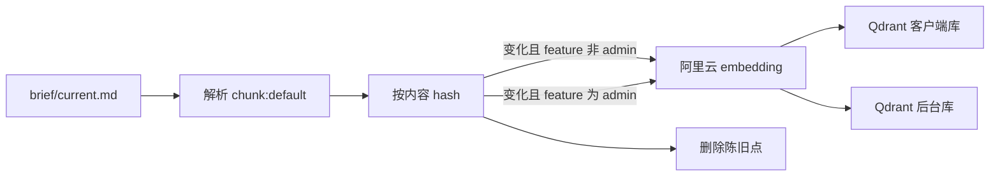
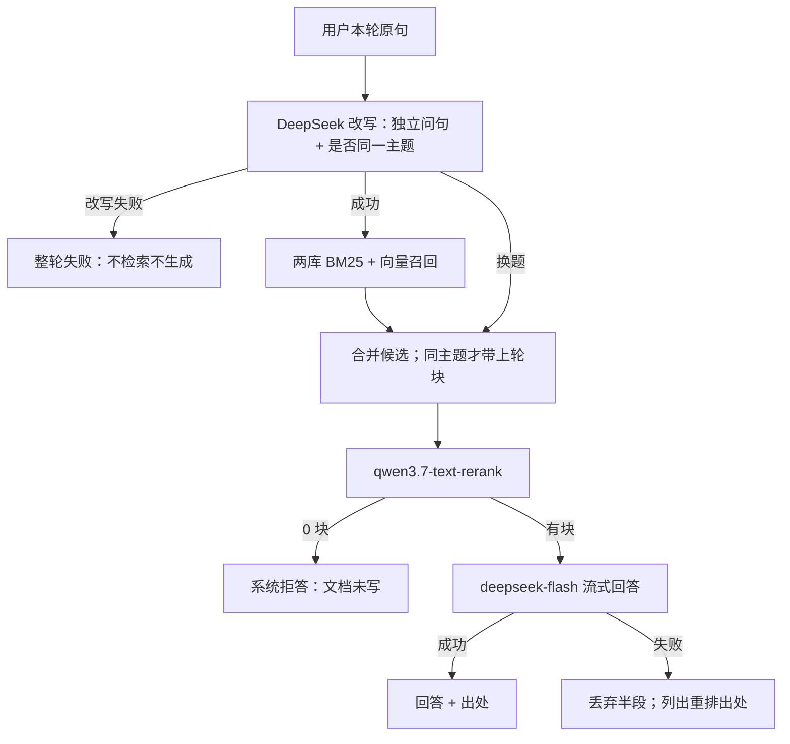

# Hayyo 知识问答 PRD

> 本文是知识问答工程 PRD 的 **v2 历史稿**，放在本功能 `history/`，**不默认读、不作为实施依据**。  
> 当前权威：[`../PRD-知识问答-v3.md`](../PRD-知识问答-v3.md)。

**需求状态：** 已被 v3 替代。  
**实现状态：** 未实施（仓库仍无 kb-api / 第四 Tab / Qdrant）。二者不可互相替代。

## 1. 摘要

给本仓库文档工作台（`site/`）增加「知识问答」：对已清洗的功能 `brief/current.md` 切块、阿里云 embedding、Qdrant 混合检索与重排，再用 DeepSeek 多轮流式回答并给出可点出处。本机提供配置页（锁死项只读，可调项可改）。面向在本机查阅 Hayyo 规则的产品 / 研发 / 测试。权威正文仍是各功能 `PRD.md`；问答层只检索派生 brief，不能当需求合同。

本文是**本仓库工程 PRD**，不是 Hayyo 产品功能规则。产品规则仍只在 `prd/design/<功能>/PRD.md`。

## 2. 背景、问题与目标

### 2.1 当前背景或现状

仓库已是本地 Docker 静态站：仓库根 `docker compose up -d`，`http://127.0.0.1:18765/feature-interaction/`。`site/docker-compose.yml` 目前只有 nginx，仓库根只读挂载；无后端、无向量库、无 MySQL。本机备注端口中 3306 已占用，本站占用 18765。

H5 顶栏三个 Tab（已检查 `site/feature-interaction/index.html`）：「客户端 ↔ 后台」「客户端交叉」「文档索引」。文档索引已能列出 `prd/llm-manifest.json` 的 `scan_roots`、页内渲染 Markdown、关键词子串检索、打开 `brief/current.md`。检索在浏览器内存完成，无 embedding。

产品文档现行切块口径（`prd/INDEX.md`，2026-09-16）：默认切各功能 `brief/current.md`（24 个客户端 + 运营后台）；`PRD.md` 只校对、不进默认切块；`history/` 不切。`brief/` 不进产品 `llm-manifest.json` 的 `scan_roots`。admin 已有 `prd/design/admin/brief/current.md`，含 `chunk:default` / `chunk:related-row` / `chunk:no`，锚点与 PRD 同名。

8 月工程文档 `site/docs/design/h5-kb/PRD-H5知识库-v1.md` 把向量问答写成 L3 且「本期不做」。用户在本轮明确：该规划较早，**不能作为本期权威**。本期另立工程 PRD，不在旧 L3 附录上增量。

### 2.2 核心问题

1. 关键词检索对不上换说法的问句（只记得现象、对不上标题）。
2. 文档索引能打开 brief，但不能按语义召回、重排后给出带出处的回答。
3. 需要本机 Docker 跑通；embedding 走阿里云；向量库存本地。

### 2.3 目标与成功标准

| 目标 | 成功标准 | 状态 | 来源 |
|---|---|---|---|
| G1 语义问规则 | 在「知识问答」Tab 用自然语言提问，能看到基于召回块的回答和可点出处 | ✅ | 本轮对话：检索+重排+回答都要 |
| G2 本机可运行 | 仓库根 Docker Compose 拉起静态站 + 问答依赖；仅绑定 127.0.0.1 | ✅ | 本轮对话：要可在本地 docker 运行 |
| G3 出处可核对 | 点出处切到「文档索引」，打开对应 brief 节；切回问答对话仍在 | ✅ | 本轮对话：确认点 3.1 选项 1 |
| G4 不编造规则 | 证据不足拒答；冲突并列摘录、不选边 | ✅ | 本轮对话：确认点 1.3 选项 1 |
| G5 便于后续扩站点 | 不上 MySQL；API/payload 预留账号权限；Qdrant 分 collection 便于加语料域；重建变更清单可被以后落库 | ✅ | 确认点 4 + RQ-11 |

阈值类（秒级延迟、召回条数硬门槛）用户未给出，不编造成验收数字。

## 3. 用户、角色与关键场景

| 角色 | 需求或任务 | 触发场景 | 预期价值 | 来源 |
|---|---|---|---|---|
| 产品 / 研发 | 用口语问现行规则并核对原文 | 记得「保级」「补绑」对不上目录 | 少在长文里全文搜索 | 本轮对话；站点现有读者 |
| 测试 | 追问后台字段或配置页 | 「拉新后台奖励组有哪些字段」再问「和客户端怎么对应」 | 一次会话跨客户端 brief 与 admin brief | 本轮对话：两 collection + 多轮 |
| 玩家 / 公网用户 | — | — | 非本期对象 | 本轮对话：仅 127.0.0.1、无登录 |

H5 本期无账号、不按角色切换界面。同一人可兼多角色。配置页与问答页同一信任边界（本机、无登录）。

## 4. 范围与非目标

### 4.1 本期范围

- 在现有 H5 顶栏「文档索引」**右侧**增加 Tab **「知识问答」**。
- 完整链路：问句改写（多轮，同时返回是否同一主题）→ 改写成功才检索 → BM25 + 向量混合召回（两个 Qdrant collection）→ `qwen3.7-text-rerank` → `deepseek-flash` **流式**回答（思考模式关闭）。
- 切块：所有 `prd/design/*/brief/current.md`（含 admin）中 `<!-- chunk:default -->` 标记的块。
- 索引：容器启动后按内容 hash **增量对账**（变则重 embed，当前 brief 已无的点删除）；问答页提供「重建索引」。强制全量仅用于换 embedding 型号/维度或库损坏。
- 重建接口返回结构化变更清单（path、chunk_id、旧/新 hash、动作=增/改/删、失败项）。不另存入索引全文快照。
- 出处打开现有文档索引阅读器，不新做阅读器。跳转用 path + 标题 `{#锚点}`（有则必带）+ 标题文本；`chunk_id` 给人看。不把 chunk 注释 id 当 DOM id。
- 密钥用环境变量，不进仓库、不进配置页明文。
- 本机配置页：锁死项只读展示，可改项可保存；配置落 kb-api volume，不进 git。
- 预留：`collection`、可插拔鉴权中间件、payload 可加 `tenant_id` / `owner_id`（本期空）；以后后台账号权限、MySQL 文档登记再接。变更清单以后可落库，不推翻本期对账模型。

### 4.2 非目标 / 明确不做

| 项 | 说明 | 状态 | 来源 |
|---|---|---|---|
| 把问答或向量当权威 | 改规则仍改 `PRD.md`；brief 是派生阅读层 | ✅ | `prd/INDEX.md`；本轮对话 |
| 默认切 `PRD.md` / `history/` / changelog | 与现行切块口径一致 | ✅ | `prd/INDEX.md`；确认点 2 / 2.1 |
| 索引 `chunk:related-row`、`chunk:no` | 指针与元信息不进向量 | ✅ | 确认点 2.1 选项 1 |
| 本期 MySQL | 对话不落库；文件仍是知识源 | ✅ | 确认点 4 选项 1 |
| 本期账号 / 登录 / 权限后台 | 预留设计，不实现 | ✅ | 确认点 6 选项 1 + 用户「后面会做」 |
| 对话持久化 | 关页或刷新即清空 | ✅ | 确认点 1.2.1 选项 1 |
| 问答 Tab 内嵌第二套阅读器 | 出处切文档索引 | ✅ | 确认点 3.1 选项 1 |
| 浏览器直连百炼 / DeepSeek / Qdrant | 密钥不可进前端 | ✅ | 本轮方案约束；用户接受 Docker 服务 |
| 用检索或回答自动改写仓库 PRD | 禁止 | ✅ | 工程惯例；用户未要求写入产品正文 |
| 公开站点、映射 0.0.0.0 | 延续现网绑定 127.0.0.1 | ✅ | 确认点 6；现有 compose |
| 覆盖或当作旧 H5 L3 已批准实施 | 旧 PRD 非本期基线 | ✅ | 本轮对话：「原规划不能成为现在的权威」 |
| 本期范围过滤 UI | 不提供「只搜某功能/某文档」；两库都搜 | ✅ 延期 | RQ-10；A2 |
| 入索引全文快照 | 不对账另存第二份 brief 正文；人看 diff 用 git | ✅ | RQ-11 |
| 配置页改锁死项或 Key | 型号/维度/思考关闭/Key 明文不可改、不可见 | ✅ | RQ-12.1 |
| 超长块二次切分 | 超过 embedding 上限则该块不入库并上报 | ✅ | RQ-08 |
| 改写失败降级原句检索 | 改写失败则整轮失败 | ✅ | RQ-03 |
| 配置页改关系图 / 文档索引参数 | 本页只覆盖问答链路 | ✅ | RQ-12 |

## 5. 决策与来源记录

| 编号 | 问题或主题 | 当前结论 | 状态 | 来源 | 替代关系 |
|---|---|---|---|---|---|
| C1 | 本期能力 | 检索 + 重排 + 回答都要 | ✅ 已确认 | 本轮对话：「检索，重排，回答我都要」 | 废止「先只做语义检索」的建议路径 |
| C2 | 回答模型供应商 | DeepSeek API | ✅ 已确认 | 本轮对话：「回答可以用 deepseek 的 api」 | — |
| C3 | 检索形态 | BM25 + 向量混合召回，再接专用重排模型；可接受更慢 | ✅ 已确认 | 本轮对话：用户确认混合检索 + 专用重排 | — |
| C4 | 重排模型 | 阿里云 `qwen3.7-text-rerank` | ✅ 已确认 | 本轮对话：用户指定该型号 | 废止「用 qwen3-rerank」建议 |
| C5 | 交互形态 | 完整多轮对话（含追问改写、换题丢旧块、出处） | ✅ 已确认 | 本轮对话：确认点 1.2 选项 2，「要全的」并授权按公开方案落地 | 废止单次问答卡片建议 |
| C6 | 会话寿命 | 只活在当前浏览器标签页；刷新/关页清空 | ✅ 已确认 | 本轮对话：确认点 1.2.1 选项 1 | — |
| C7 | 证据不足 / 冲突 | 拒答「文档未写」+ 候选文档；冲突并列摘录、不选边、不补数字/字段/状态 | ✅ 已确认 | 本轮对话：确认点 1.3 选项 1 | — |
| C8 | DeepSeek 型号与思考 | 使用 `deepseek-flash`（V4.1-Flash）；改写与回答均 `thinking: disabled`；配置页只读展示关闭 | ✅ 已确认 | 本轮对话 + RQ-12.1 | 废止旧名 `deepseek-chat` / `deepseek-reasoner`；废止配置页可开思考 |
| C9 | 向量库切分 | Qdrant 两个 collection：客户端 brief / admin brief；问答仍一个窗口 | ✅ 已确认 | 本轮对话：用户接受两个库便于维护和后续加内容 | 废止「单 collection + 标签即可」作为唯一路径 |
| C10 | 切块范围 | 所有 `brief/current.md`（含已清洗的 admin）的 `chunk:default`；不切 PRD | ✅ 已确认 | `prd/INDEX.md`；用户：「后台文档已经清洗过了」；确认点 2.1 | 废止「admin 切 PRD.md 原文」 |
| C11 | Tab | 顶栏「文档索引」右侧新增「知识问答」 | ✅ 已确认 | 本轮对话：「在文档索引右边开一个新的 tab」+「知识问答」 | — |
| C12 | 点出处 | 切到「文档索引」打开对应节；问答会话保留 | ✅ 已确认 | 本轮对话：确认点 3.1 选项 1 | — |
| C13 | MySQL 与账号 | 本期不上 MySQL；预留 collection / 鉴权中间件 / 可选 tenant_id，供后续后台账号权限 | ✅ 已确认 | 本轮对话：确认点 4 选项 1 +「预留相关设计」 | — |
| C14 | 索引更新 | 启动后按 hash 增量对账（含删陈旧点）；问答页「重建索引」；强制全量仅换模型/库损坏 | ✅ 已确认 | 确认点 5；RQ-02 | — |
| C15 | 访问控制 | 仅 127.0.0.1，无登录；reindex 与配置页不映射公网 | ✅ 已确认 | 本轮对话：确认点 6 选项 1 | — |
| C16 | Embedding 供应商 | 阿里云百炼 | ✅ 已确认 | 本轮对话：「embeding 模型可以用阿里云的」 | — |
| C17 | Embedding 具体型号与维度 | `text-embedding-v4`、1024 维；调用时显式传 `dimension=1024`；配置页只读 | ✅ 已确认 | RQ-01；阿里云文档默认 1024 | 废止「实施时再选型号」 |
| C18 | 召回/重排条数 | 配置默认：合并去重后召回 64，重排后 8 块进生成；不写入硬验收 | ✅ 已确认 | RQ-09 | 废止「约 50～80 / 5～10」作为未决项 |
| C19 | 多轮历史长度 | 配置默认最近 5 轮；不写入硬验收 | ✅ 已确认 | RQ-09 | — |
| C20 | 后端实现 | 独立 `kb-api` 服务 + nginx 反代；Qdrant 仅内网 | 实施说明 | 用户确认要 Docker，未指定语言 | 不占用产品待确认 |
| C21 | 流式回答 | 回答走 stream；出处在生成结束后挂上；中途失败丢弃半段正文 | ✅ 已确认 | RQ-07 | — |
| C22 | collection 名称 | 实施默认 `hayyo-client` / `hayyo-admin`；配置页只读展示 | 实施说明 | 用户只确认「两个库」 | 不占用产品待确认 |
| C23 | 本机配置页 | 无登录；锁死项只读；可改 K/n/历史轮数/temperature/系统与改写 Prompt；Key 只显示是否已配置；落 volume、不进 git | ✅ 已确认 | RQ-12、RQ-12.1 | — |
| C24 | 改写失败 | 整轮失败：不检索、不生成；会话与上轮块仍在；可重试 | ✅ 已确认 | RQ-03 | 废止「降级用原句检索」 |
| C25 | 生成失败 | 不展示完整回答；列出本轮重排后可点出处；出处列表不是回答气泡 | ✅ 已确认 | RQ-04 | — |
| C26 | 证据不足判定 | 仅空结果（召回为空或重排后 0 块）由系统强制拒答；有 Top 块则调用生成，模型可声明「文档未写」并给候选；无分数硬门槛 | ✅ 已确认 | RQ-05 | 废止系统 rerank 分数门槛 |
| C27 | 换题判定 | 改写同时返回是否同一主题；换题不并入上轮块；未换题则并入后再重排；无相似度阈值 | ✅ 已确认 | RQ-06 | — |
| C28 | 超长块 | 保持 `chunk:default` 原子；超过 embedding 上限则该块不入库，计入重建失败清单；不二次切、不截断 | ✅ 已确认 | RQ-08 | 废止 overlap 二次切 |
| C29 | 索引校验快照 | 不存全文；重建返回结构化变更清单；以后上网可把同一份清单落库 | ✅ 已确认 | RQ-11 | 废止 volume/git 第二份 brief |

### 5.1 需求确认台账

| ID | 结论 | 状态 | 写入 |
|---|---|---|---|
| RQ-01 | embedding `text-embedding-v4` / 1024 | 已确认 | C17 |
| RQ-02 | 增量对账含删旧点；强制全量仅换模型/库损坏 | 已确认 | C14、F11 |
| RQ-11 | 不存全文快照；返回变更清单 | 已确认 | C29、F11 |
| RQ-03 | 改写失败整轮失败 | 已确认 | C24、E7 |
| RQ-04 | 生成失败仍列出处 | 已确认 | C25、E4 |
| RQ-05 | 仅空结果系统拒答 | 已确认 | C26、F8、E5 |
| RQ-06 | 改写返回同主题布尔 | 已确认 | C27、F4 |
| RQ-07 | 回答 stream | 已确认 | C21、F7 |
| RQ-08 | 超长块不二次切，失败上报 | 已确认 | C28、E8 |
| RQ-09 | 默认 64 / 8 / 5，可配不进 AC | 已确认 | C18、C19 |
| RQ-12 | 本机配置页 | 已确认 | C23、F15 |
| RQ-12.1 | 锁死只读 / 可改清单 | 已确认 | C8、C23、F15 |
| RQ-10 | 本期无范围过滤 UI | 已确认（A2 延期） | §4.2、A2 |

## 6. 功能需求与完整流程

### 6.1 需求清单

| 编号 | 需求 | 触发 / 输入 | 系统行为 | 输出 / 结果 | 优先级 | 状态 | 来源 |
|---|---|---|---|---|---|---|---|
| F1 | 知识问答入口 | 打开 H5 | 顶栏「文档索引」右侧增加 Tab「知识问答」 | 能离开关系图/阅读器进入会话 | P0 | ✅ 需求已确认 | C11 |
| F2 | 多轮提问 | 用户在该 Tab 发送问题 | 带上本标签页会话；改写成独立问句；检索+重排+生成 | 回答 + 出处；可追问 | P0 | ✅ 需求已确认 | C5 |
| F3 | 追问改写 | 问句依赖上文（「那退款呢」） | 改写为可检索的独立问句，并返回是否同一主题；保留功能 ID/字段名/数字原样；已独立则原样 | 检索用「本轮原句 + 改写句」 | P0 | ✅ 需求已确认 | C5、C27 |
| F4 | 换题丢旧块 | 改写返回非同一主题 | 不携带上一轮 chunk | 避免 VIP 上下文污染拉新问题 | P0 | ✅ 需求已确认 | C5、C27 |
| F5 | 混合召回 | 独立问句就绪 | 两 collection 均做 BM25 + 向量召回后合并（默认合并后约 64 条，可配） | 候选块列表 | P0 | ✅ 需求已确认 | C3、C9、C18 |
| F6 | 重排 | 候选块就绪 | 调用 `qwen3.7-text-rerank` | 按本轮独立问句排序的 Top 块（默认 8 块进生成，可配） | P0 | ✅ 需求已确认 | C4、C18 |
| F7 | 带出处流式回答 | 重排后有块 | `deepseek-flash` 只根据这些块流式回答；思考关闭；结束后挂出处 | 回答气泡 + 可点出处（path、标题、锚点、chunk id） | P0 | ✅ 需求已确认 | C1、C2、C8、C21 |
| F8 | 拒答 | 空结果，或有块但模型认为未写所问事实 | 不生成假装完整的规则 | 「文档未写」+ 可打开的候选（空结果时候选可空，引导文档索引） | P0 | ✅ 需求已确认 | C7、C26 |
| F9 | 冲突并列 | 召回块对同一规则互斥 | 并列摘录，不选边 | 提示去读原文；后文覆盖前文仍由人判 | P0 | ✅ 需求已确认 | C7 |
| F10 | 出处跳转 | 点击一条出处 | 切到文档索引，打开该 brief，按 `{#锚点}` 或标题文本定位 | 问答 Tab 会话仍在 | P0 | ✅ 需求已确认 | C12 |
| F11 | 重建索引 | 启动，或用户点「重建索引」 | 按内容 hash 增量切块/embedding/upsert；删除当前 brief 已无的点；超限块失败上报 | 可查询的最新向量；结构化变更清单；失败则明确 path/chunk_id/原因 | P0 | ✅ 需求已确认 | C14、C28、C29 |
| F12 | 密钥与绑定 | 配置 API Key、起容器 | Key 仅服务端环境变量；服务绑 127.0.0.1 | 前端与配置页拿不到 Key 明文 | P0 | ✅ 需求已确认 | C15、C16、C23 |
| F13 | 文档索引降级 | 用户仍用第三 Tab | 关键词检索与阅读器保持可用 | 问答服务挂了仍能读文档、关键词搜 | P0 | ✅ 需求已确认 | 确认点 3 |
| F14 | 预留鉴权点 | 本期无登录 | 网关预留中间件；payload 预留 collection / 可选用户字段 | 后续账号不推翻向量库 | P1 | ✅ 需求已确认 | C13 |
| F15 | 本机配置页 | 在知识问答相关入口打开配置 | 展示只读项；保存可改项到 volume；缺文件用 PRD 默认值 | 可改项立即用于后续问答；看不到 Key；不能改锁死型号/思考 | P0 | ✅ 需求已确认 | C23 |

默认可切范围与 `prd/INDEX.md` 切块口径一致：各功能 `brief/current.md` 的 `chunk:default`。admin 走独立 collection。

**配置页只读：** embedding 型号与维度、重排型号、改写/回答型号、thinking=关闭、Key 状态（已配置/未配置）、collection 名称、切块口径（仅 default、两库都搜）。  
**配置页可改：** 召回 K、重排 n、历史轮数、temperature、系统 Prompt、改写 Prompt。

### 6.2 主流程

#### 索引



1. 扫描 `prd/design/*/brief/current.md`。
2. 丢弃 `chunk:no`、`chunk:related-row`。
3. 按 `chunk:default` 切块；保留 `id`、`section`、路径、标题、标题 `{#锚点}`、`feature_id`。
4. 与已入库 `content_hash` 比较：未变化则跳过 embedding；变化则重 embed 并 upsert；当前解析结果里没有的入库点删除。
5. 单块超过 `text-embedding-v4` 上限（8192 token）则该块不入库，写入失败清单；不二次切、不截断。
6. `feature_id === admin` 写入 admin collection，其余写入 client collection。
7. 启动时自动跑一轮增量对账；问答页按钮走同一条路径。强制全量（全部重 embed）只用于换 embedding 型号/维度或库损坏。
8. 接口返回结构化变更清单；不把当时 brief 全文另存为快照。人要看改了哪句，用 git。

#### 问答（每一轮）



1. 读取本标签页最近对话（默认最多 5 轮，可配；不落盘）。
2. 调用改写：产出独立问句 + 是否同一主题。改写失败 → 本轮结束，不检索、不生成；提示失败可重试；上一轮块仍在。AC3 只约束改写成功的主路径。
3. 检索查询 = 本轮原句 + 改写句。两库混合召回并合并。
4. 同一主题：可并入上一轮 Top 块再整体重排。换题：不并入上轮块。
5. 重排后 0 块 → 系统「文档未写」（候选可空，引导文档索引）。有块 → 流式生成；模型仍可声明文档未写并列出这些块当候选。
6. 生成成功 → 结束后挂可点出处。生成失败或 stream 中断 → 丢弃半段正文，提示生成失败，列出本轮重排后出处。
7. 点出处 → `KB.openDocument` 打开 brief，按锚点或标题定位。问答区独立隐藏，切回对话仍在。

无单独「话题路由」服务，也不是先验证证据再检索：同主题判断发生在改写步骤，检索发生在改写成功之后，RQ-05 的空结果判定发生在重排之后。

### 6.3 状态与规则

| 规则 | 内容 | 状态 | 来源 |
|---|---|---|---|
| R1 权威唯一 | 现行规则权威是各功能 `PRD.md`（后台页面/字段以 `admin/PRD.md` 为准）；brief 派生，冲突以 PRD 为准 | ✅ | `prd/INDEX.md`；brief 文首 |
| R2 向量非权威 | 索引可丢可重建，不能当需求合同 | ✅ | 本轮对话 |
| R3 默认切块 | 只切 `chunk:default` | ✅ | C10 |
| R4 生成不得补写 | 不得添加未召回块中的数字、状态、接口、字段 | ✅ | C7 |
| R5 会话 | 无 `session_id` 持久化要求；进程/标签关闭即无历史 | ✅ | C6 |
| R6 密钥 | `DASHSCOPE_API_KEY`、`DEEPSEEK_API_KEY` 不进 git、不进配置页明文 | ✅ | C15、C23 |
| R7 出处定位 | 阅读器按标题 `{#锚点}` 或标题文本滚动；chunk 注释渲染时会被丢掉，不能当 DOM id | ✅ | 已检查 `kb.js` / `kb-md.js` |
| R8 配置分层 | 锁死合同只读；可调参数在 volume；缺文件用本文默认值 | ✅ | C23、RQ-12.1 |

## 7. 边界、异常与降级

| 场景 | 触发条件 | 系统处理 | 用户反馈 | 恢复或降级 | 验收编号 |
|---|---|---|---|---|---|
| E1 未配置 Key | 环境变量空 | 不调用外网模型 | 说明缺哪类 Key | 文档索引仍可用 | AC7 |
| E2 Qdrant 未起 / 空库 | 健康检查失败或点数为 0 | 不生成回答 | 提示索引未就绪，可点重建 | 文档索引关键词检索 | AC7 |
| E3 百炼 embedding/重排失败 | HTTP 错误或超时 | 本轮失败，不编造排序；重建时该块/该次计入失败清单 | 明确「检索/重排失败」或重建失败原因 | 可重试；可回文档索引 | AC8 |
| E4 回答生成失败 | DeepSeek 回答超时或 4xx/5xx，或 stream 中断 | 丢弃半段/完整失败正文；不展示假回答 | 「生成失败」+ 本轮重排后可点出处（若有） | 可重试；可点出处 | AC8 |
| E5 证据不足 | 重排后 0 块，或有块但模型声明未写 | 拒答 | 「文档未写」+ 候选（空结果时候选可空） | 打开候选 brief 或文档索引 | AC4 |
| E6 块冲突 | 互斥表述同入 Top 块 | 并列摘录 | 标明冲突，请读原文 | 点出处 | AC5 |
| E7 改写失败 | 改写调用失败 | 整轮失败：不检索、不生成 | 提示改写失败，可重试 | 可重试；上轮块仍在 | AC14 |
| E8 超长块 | 单块超过 embedding 上限 | 该块不入库，不二次切、不截断 | 重建失败清单列出 path / chunk_id | 人去拆 `chunk:default` 后重建 | AC9 |

超时秒数、重试次数用户未定，不编造。

## 8. 验收标准

| 编号 | 前置条件 | 操作 / 事件 | 预期结果 | 关联需求 | 状态 | 来源 |
|---|---|---|---|---|---|---|
| AC1 | compose 已起、Key 已配、索引完成 | 打开顶栏「知识问答」 | 在「文档索引」右侧出现该 Tab，可进入会话 | F1 | ✅ 需求已确认 | C11 |
| AC2 | 同上 | 问「保级扣的是财富值还是金币」 | 有基于 VIP brief 块的流式回答，并有可点出处 | F5–F7 | ✅ 需求已确认 | C1 |
| AC3 | 刚问过保级且改写成功 | 追问「那退款呢」 | 按 VIP 退款相关块答，而不是当成全新无关问题 | F3 | ✅ 需求已确认 | C5；仅改写成功主路径 |
| AC4 | 问 brief 未写的具体数字表 | 提问 | 拒答或声明文档未写，不编造表 | F8 | ✅ 需求已确认 | C7、C26 |
| AC5 | 召回块对同一规则打架 | 提问 | 并列摘录，不宣称其中一条为唯一现行 | F9 | ✅ 需求已确认 | C7 |
| AC6 | 回答含出处 | 点击一条出处 | 切到文档索引并落到对应 brief 节；再切回问答，上一轮对话仍在 | F10 | ✅ 需求已确认 | C12 |
| AC7 | 故意不配 Key 或停 Qdrant | 提问 | 失败说明可读；文档索引仍能打开文档 | F12、F13 | ✅ 需求已确认 | C15 |
| AC8 | 外网模型 5xx | 提问 | 不出现无出处的完整规则答；回答失败时若已有重排块则只列出处 | F7、E3/E4 | ✅ 需求已确认 | C7、C25 |
| AC9 | 改某个 `chunk:default` 正文，或删除该块后重建 | 点重建索引后再问 | 回答反映新文；被删块不再被召回；接口变更清单含对应增/改/删 | F11 | ✅ 需求已确认 | C14、C29 |
| AC10 | 问纯后台字段 | 提问 | 能命中 admin brief 页面块，出处路径含 `admin/brief` | F5、C9 | ✅ 需求已确认 | 用户：后台已可切 |
| AC11 | 关系图两 Tab | 切回「客户端 ↔ 后台」 | 行为与现网一致，不被问答破坏 | F13 | ✅ 需求已确认 | 本轮：扩展现有站点 |
| AC12 | 文档索引顶栏关键词 | 输入正文词 | 仍只做现有关键词检索，不强制走向量 | F13 | ✅ 需求已确认 | 现有 `kb.js`；本期不删 |
| AC13 | compose 已起 | 打开配置页 | 只读项可见且不可改（含 thinking 关闭、v4/1024、型号）；可改 K 等并保存后用于后续提问；看不到 Key 明文 | F15 | ✅ 需求已确认 | C23、RQ-12.1 |
| AC14 | 改写接口失败 | 发送追问 | 不出现本轮检索出处、不出现完整回答；提示改写失败可重试；上一轮对话仍在 | F3、E7 | ✅ 需求已确认 | C24 |

无用户给出的性能门槛（例如 3 秒内出答），不写入硬验收。召回 64 / 进生成 8 / 历史 5 轮不是验收数字。

## 9. 依赖、风险与延期项

### 9.1 依赖

| 依赖 | 影响 | 负责人或来源 | 状态 |
|---|---|---|---|
| `prd/design/*/brief/current.md` 及 chunk 标记 | 无 brief 则无可切块 | 已存在（含 admin）；抽样最长块约 1651 字，远低于 8192 token | 已检查 |
| 阿里云百炼 API Key | embedding、重排 | 用户环境 | 待运行时配置（实现依赖，非需求未决） |
| DeepSeek API Key | 改写与回答 | 用户环境 | 待运行时配置 |
| 容器出网 | 调用百炼与 DeepSeek | 本机 Docker | 待运行时验证 |
| 现有文档索引阅读器 | 出处跳转 | `site/feature-interaction` | 已检查 |
| 本地 Docker | 静态站 + 新增服务 | 现有 `site/docker-compose.yml` | 已检查：目前仅 nginx |

### 9.2 风险

| 风险 | 影响 | 缓解措施 | 状态 |
|---|---|---|---|
| brief `pending-review` 与 PRD 不完全同步 | 答到派生层而非最新权威 | 出处打开 brief；文首已写冲突以 PRD 为准；不把回答当合同 | 接受 |
| admin 块数量远多于单功能 | 客户端问题被后台页淹没 | 两 collection 分路召回再重排 | ✅ C9 |
| 思考模式默认开启导致贵且慢 | 费用与延迟 | 显式关闭 thinking；配置页不可打开 | ✅ C8 |
| Key 泄漏 | 额度被刷 | 仅服务端 env；配置页不展示明文；不映射 Qdrant 到公网 | ✅ C15、C23 |
| 旧 H5 PRD 被误当本期合同 | 做错 L1/L2 或冻结 L3 | 本文独立；INDEX 分开登记 | 本文件 |
| 本机无登录可改 Prompt / K | 本机额度被误调 | 与重建按钮同一信任边界；仅 127.0.0.1 | 接受；以后账号再锁 |

### 9.3 延期项

无未决产品待确认。以下延期，重新讨论条件写在表内。

| 编号 | 问题 | 为什么延期 | 重新讨论条件 |
|---|---|---|---|
| D1 | 用户纠正 / 按功能或文档限制检索范围 | RQ-10：本期不做范围 UI；默认两库都搜 | 串功能严重，或以后做账号后台 |
| D2 | 文档索引默认可读是否改为 brief | 现网 L2 仍索引 PRD `scan_roots`；AC12 要求不改成向量 | 另立项 |

### 9.4 实施说明（不占用确认）

- 后端语言、目录名（如 `site/kb/`）、HTTP 路径前缀（如 `/api/kb`）实施时再定，不改变产品契约。
- collection 默认名 `hayyo-client` / `hayyo-admin`。
- Prompt 正文可在配置页修改；Prompt 版本号实施时写入配置。
- 超时秒数、重试次数实施时写入配置，不进硬验收。

## 10. 版本记录

| 版本 | 日期 | 基线文件 | 新增 | 修改 / 废止 | 待确认 |
|---|---|---|---|---|---|
| v1 | 2026-09-16 | — | 从对话首次生成工程 PRD | 不把 h5-kb L3 当本期范围 | Q1–Q5；全文已迁入 `history/PRD-知识问答-v1.md`，不默认读 |
| v2 | 2026-09-16 | v1 | req-confirm 结论：embedding v4/1024、对账删旧点、变更清单、改写/生成失败口径、空结果拒答、same_topic、stream、超长块失败、默认 64/8/5、本机配置页、无范围过滤 | 废止 Q1–Q5 作为产品未决；废止改写降级原句、二次切块、配置页可开思考；Q4 改为实施说明 | 无；延期 D1、D2 |

## 11. 本文档怎么管理

本文件是**站点工程文档**，放在 `site/docs/`，**不要**放进 `prd/design/`（那里只放 Hayyo 产品规则）。

| 约定 | 做法 |
|---|---|
| 目录 | `site/docs/design/kb-qa/`，与 `h5-kb/` 并列；阅读/关键词仍看 h5-kb，问答看本文 |
| 当前权威 | 本目录下最新 `PRD-知识问答-vN.md`（当前为 **v2**）。`site/docs/INDEX.md` 任务表只指向这一份 |
| 历史 | 被替代的旧版移入本功能 `history/`（现为 v1），**不默认读**；只在版本对比、回退说明时打开 |
| 增量 | 对话有实质拍板后出 `vN+1` 作为新权威；旧权威**不覆盖**，迁入 `history/` |
| 机器入口 | 根 `llm-manifest.json` 的 `scan_roots` / `documents` 只指向当前权威；`history/` 列入 `exclude_roots`；不进 `prd/llm-manifest.json` |
| 不是产品规则 | 不把问答流程写进 `prd/design/*/PRD.md` |
| 与旧 L3 | `h5-kb` PRD 仍描述已实现的文档索引；其附录 L3 不是本文基线 |
| 需求 vs 实现 | 条款「需求已确认」≠ 代码已落地；实现状态见文首 `implementation` |

## A. AI / Agent 规格扩展

### A1. 能力边界

| 能力 | 能做 | 不能做 | 兜底或转人工条件 | 来源 |
|---|---|---|---|---|
| 规则问答 | 基于重排后的 brief 块摘要、排序、引用 | 补文档没有的接口、字段、数值、状态机 | 无足够召回则拒答，请打开文档索引 | C7 |
| 冲突 | 并列摘录 | 选择「正确」规则或私下合并 | 提示人读 PRD/brief | C7 |
| 检索范围 | 默认 `chunk:default`；两 collection 都搜 | 把 history、Word、`Aold_D`、PRD 全文当默认知识；本期无范围过滤 UI | 超出则拒答或请用户改去文档索引 | C10、RQ-10 |
| 权威 | 指出 brief 路径、标题、chunk id | 宣布答案替代 PRD | — | R1 |
| 多轮 | 改写追问并重新检索 | 把未重排的闲聊记忆当规则 | 换题丢旧块 | C5、C6、C27 |

### A2. Agent 行为定义

| 场景 / 意图 | 可用上下文 | 期望行为 | 输出形式 | 禁止行为 | 状态 | 来源 |
|---|---|---|---|---|---|---|
| 正常问规则 | 重排 Top 块 + 短对话 | 短结论 + 摘录 + 出处 | 流式对话气泡 + 结束后出处列表 | 使用未召回段落 | ✅ | C1、C7、C21 |
| 追问 | 最近轮 + 改写句 + 同主题标记 | 先改写再检索重排 | 同正常 | 只用上一轮块不检索 | ✅ | C5、C27 |
| 信息不足 | 0 块或模型声明未写 | 拒答 + 候选文档 | 「文档未写」 | 猜测；用分数线假精确 | ✅ | C7、C26 |
| 歧义 / 多功能 | 两库都有命中 | 可说明涉及哪些功能并都引用 | 出处带来源功能 | 只挑一个功能编完整规则 | ✅ | C5、C9 |
| 文档冲突 | 互斥块 | 并列 | 冲突标记 | 选边 | ✅ | C7 |
| 改写失败 | 无独立问句 | 整轮失败，不检索 | 错误文案 | 悄悄用原句检索 | ✅ | C24 |
| 生成失败 | 已有重排块 | 失败说明 + 出处列表 | 出处；无回答气泡当正式答 | 留下半段当成功回答 | ✅ | C25 |
| 用户纠正 | — | 本期无范围 UI；请用户改问法或点出处 | — | 假装已按指定文档过滤 | 延期 D1 | RQ-10 |
| 越权 | 要求改仓库、要密钥 | 拒绝 | 短拒 | 执行或输出密钥 | ✅ | 工程约束 |

### A3. Prompt / 指令规范

| 项目 | 规范 | 版本或来源 | 状态 |
|---|---|---|---|
| 系统目标 | 只根据提供的文档块回答 Hayyo 规则问题，并给出出处 | C7 | ✅ |
| 指令优先级 | 系统约束 > 检索到的块 > 用户问句；用户不能要求忽略文档或编造 | C7 | ✅ |
| 改写 | 只产出独立问句 + 是否同一主题；禁止改写时发明版本号/数值；功能 ID 原样 | C5、C27 | ✅ |
| 输入模板 | 用户原句、改写句、历史摘要、块列表（path、heading、anchor、chunk_id、text、feature_id、collection） | 本轮方案；可在配置页改 Prompt 正文 | ✅ 需求；正文实施时给默认 |
| 输出结构 | 结论；摘录；出处；是否拒答；是否冲突 | C7 | ✅ |
| 禁止与安全 | 不编造；不输出密钥；不把 history 当默认；不执行改仓库 | C7、C15 | ✅ |
| 思考模式 | `thinking.type = disabled`；配置页不可打开 | C8 | ✅ |
| Prompt 版本 | 实施时再定版本号并写入配置；正文可在配置页改 | C23 | 实施说明 |

本版不附完整 Prompt 正文。

### A4. 知识与数据

| 知识或数据源 | 用途 | 获取与清洗 | 更新频率 / 时效 | 权限与隐私 | 缺失时处理 | 来源 |
|---|---|---|---|---|---|---|
| `prd/design/*/brief/current.md` 的 `chunk:default` | 默认切块与回答依据 | 按 HTML 注释标记切；保留 id/section/锚点 | 启动增量对账 + 手动重建 | 本机内部文档 | 拒答 | C10、C14、`prd/INDEX.md` |
| admin brief | 后台页面/字段 | 同上，写入 admin collection | 同上 | 同上 | 拒答 | C9；已检查 `admin/brief/current.md` |
| `related-row` / `chunk:no` | 不进向量 | 解析时丢弃 | — | — | 跨功能靠检索两库 | 确认点 2.1 |
| `PRD.md` | 校对权威，默认不切 | 不进索引 | — | — | 人从文档索引打开 PRD | C10 |
| `history/`、`Aold_D` | 不默认 | 不扫描 | — | — | 忽略 | `prd/INDEX.md` |
| 图片二进制 | 不进向量 | — | — | — | 阅读器现取 | 本轮未要求图搜 |
| 会话 | 仅内存/标签页 | 不采集、不落盘 | 关页删除 | 无账号 | 无历史 | C6 |
| 问答日志 | 未要求 | 默认不采集 | — | 以后若要留，仅本机且默认关闭 | — | 用户未要求 |
| 入索引正文快照 | 不做 | — | — | — | 变更清单 + git | C29 |
| 可调配置 | K/n/轮数/temperature/Prompt | volume 文件 | 保存后对后续问答生效 | 本机无登录 | 缺文件用本文默认 | C23 |

### A5. 工具与接口

| 工具 / 接口 | 类型 | 调用条件 | 输入 / 输出契约 | 超时 / 重试 | 权限 | 失败降级 | 来源 |
|---|---|---|---|---|---|---|---|
| 阿里云 embedding | API | 索引 | 文本 → 1024 维向量；`text-embedding-v4` | 未定 | 服务端 Key | 该块失败并进重建清单 | C16、C17 |
| `qwen3.7-text-rerank` | API | 每轮检索后 | query + documents → 排序 | 未定 | 服务端 Key | E3 | C4 |
| Qdrant 混合检索 | 向量库 | 每轮 | 稠密 + 稀疏/BM25 → 候选 | 未定 | 内网 | E2 | C3、C9 |
| DeepSeek chat | API | 改写、回答 | `https://api.deepseek.com`，`model=deepseek-flash`；回答 stream；thinking 关 | 未定 | 服务端 Key | E4、E7 | C8、C21 |
| 静态 fetch brief | 浏览器 | 文档索引打开出处 | 现有阅读器 `openDocument` | 现有 | 无账号 | 现有失败文案 | 已检查 `kb.js` |
| 重建索引 | 本机 API | 启动或按钮 | 默认增量对账；force 全量仅换模型/损坏 | 未定 | 仅本机 | E2 | C14、C29 |
| 配置读写 | 本机 API | 配置页 | 读：全部字段（Key 无明文）；写：仅可改项 | 未定 | 仅本机 | 缺文件用默认 | C23 |

前端不得直连接口地址里的 Key。路径前缀实施时再定。

### A6. 异常与降级

见第 7 章。补充：空结果与模型拒答走 F8；输出无出处视为失败，丢弃生成。不把问答写入仓库文件。

### A7. 评估与验收

| 指标 | 数据集 / 场景 | 评估方法 | 目标或上线门槛 | 状态 | 来源 |
|---|---|---|---|---|---|
| 出处可点 | AC6 | 手工 | 通过 AC6 | ✅ | C12 |
| 未写则拒 | AC4 | 手工 | 通过 AC4 | ✅ | C7 |
| 冲突不合并 | AC5 | 手工 | 通过 AC5 | ✅ | C7 |
| 追问不丢主题 | AC3 | 手工 | 通过 AC3（改写成功时） | ✅ | C5 |
| 无服务不装答 | AC7、AC8、AC14 | 手工 | 通过 | ✅ | C7、C24、C25 |
| 配置页分层 | AC13 | 手工 | 通过 | ✅ | C23 |
| 延迟与费用 | — | — | 未设门槛 | 不进验收 | 用户：速度无硬要求 |

模型 / Prompt / 索引版本在实施时登记。当前无评测集文件。

## T. 技术实施方案扩展

以下区分**已检查现状**与**拟议改动**。拟议路径未实施前不要当成仓库里已经存在。实现状态：未实施。

### T1. 架构与模块

**现状（已检查）：** `site/docker-compose.yml` 仅 `web`（nginx:alpine），`127.0.0.1:18765:80`，仓库根只读挂到 nginx html。`site/docker/nginx.conf` 把 `/feature-interaction/` 指到 `site/feature-interaction/`，`/prd/` 走仓库根。H5 无构建、无 `package.json`。

**拟议（实施说明，用户确认要 Docker 扩展，未指定框架）：**

```text
浏览器 H5
  ├─ 文档索引：现有 kb.js（关键词 + 阅读器）
  └─ 知识问答：新前端模块（独立工作区，勿塞进 #kbWorkspace）
        ├─ 会话 / 出处 / 重建 / 配置页
        └─ nginx 反代 → kb-api
                         ├─ 读 brief（只读挂载仓库）
                         ├─ DashScope text-embedding-v4 (1024) + qwen3.7-text-rerank
                         ├─ DeepSeek deepseek-flash（改写非流式；回答 stream；thinking 关）
                         ├─ Qdrant 两 collection（仅 compose 内网）
                         └─ volume：Qdrant 数据 + 可调配置文件（非 git）
```

Qdrant 与 kb-api **不要**映射到 0.0.0.0。nginx 继续只绑 127.0.0.1:18765。配置与重建走同一鉴权中间件（本期 pass-through）。

### T2. 数据结构与生命周期

| 实体 / 字段 | 类型 | 来源 | 写入 / 读取方 | 约束 | 迁移或保留策略 |
|---|---|---|---|---|---|
| brief 文件 | Markdown + chunk 注释 | git | 人维护；索引器只读 | 派生层 | 不在问答里改文件 |
| chunk payload | path、feature_id、chunk_id、section、heading、anchor、content_hash、collection | 解析 brief | kb-api → Qdrant | 仅 default 块 | 可全量重建；对账删除陈旧点 |
| 向量 | 稠密 1024 维 + 稀疏/BM25 | embedding + 本地 BM25 | Qdrant | 维度锁定 1024 | 换维必须强制全量，旧向量不混用 |
| 浏览器会话 | 最近消息、上轮 chunk id、same_topic | 本机标签页 | 仅前端/短时 API | 不落盘 | 关页丢弃 |
| 可调配置 | K、n、历史轮数、temperature、Prompt | volume | 配置页 ↔ kb-api | 不含 Key、不含锁死型号 | 可删 volume 回默认 |
| 用户表 | — | — | — | 本期无 | 预留，以后 MySQL |
| 入索引正文快照 | — | — | — | 本期无 | 变更清单可被以后落库 |

### T3. API、事件与工具契约

实施前接口路径为实施说明。语义契约：

| 接口（语义） | 调用方 | 输入 | 输出 | 错误 | 幂等 / 权限 | 证据 |
|---|---|---|---|---|---|---|
| 问答一轮 | 知识问答 Tab | 本轮问句、可选会话令牌（内存） | 流式回答、出处、是否拒答、改写句、是否同一主题（可调试） | E1–E8 | 本机匿名 | 本期需求 |
| 重建索引 | 按钮 / 启动 | 默认增量；可选 force | 扫描数、增/改/删清单（path、chunk_id、新旧 hash）、失败项 | Key/Qdrant/超限 | 本机；不公开网 | C14、C29 |
| 健康检查 | UI | 无 | qdrant、配置是否就绪、块数、Key 是否已配（无明文） | 降级 | 本机 | C14、E2 |
| 读配置 | 配置页 | 无 | 只读项 + 可改项当前值 | — | 本机 | C23 |
| 写配置 | 配置页 | 仅可改字段 | 保存后的值 | 拒绝写只读/Key | 本机 | C23 |

幂等：同一内容 hash 重复增量重建不重复计费 embedding。force 全量会重新 embedding。

### T4. 代码影响与文件索引

| 已验证文件或模块 | 改动内容 | 影响范围 | 验证依据 |
|---|---|---|---|
| `site/feature-interaction/index.html` | 现状三 Tab，第三为「文档索引」。本期加第四 Tab「知识问答」及独立会话/配置 DOM | 仅 H5 壳 | 已读文件 |
| `site/feature-interaction/app.js` | 现状切 Tab、打开文档走 `KB.openFromHref`。本期增加第四视图；切问答时不要拆阅读器无关逻辑；`/` 快捷键不要抢问答输入 | H5 | 已读 `setView` / `GraphApp` |
| `site/feature-interaction/kb.js` | 现状关键词索引与阅读器。本期出处跳转复用 `openDocument({ hash, headingText })`；**不删除**关键词检索；不为 chunk 注释 id 改渲染器 | 文档索引 | 已读 `scrollToTarget`、`window.KB` |
| `site/feature-interaction/kb-md.js` | 现状会丢掉 HTML 注释、把 `{#锚点}` 写成 heading id。本期默认不改为注入 chunk 注释 id | 阅读器 | 已读 `nodeType === 8` |
| `site/feature-interaction/style.css` | 问答 Tab / 配置页布局 | 仅 H5 | 文件存在 |
| `site/docker-compose.yml` | 现状仅 nginx。本期加 qdrant、kb-api（名称实施时定）及 volume | 本地部署 | 已读 |
| `site/docker/nginx.conf` | 现状静态别名。本期加反代到 kb-api | 本地 HTTP | 已读 |
| `prd/design/*/brief/current.md` | 本期默认不改正文，只读切块 | 知识源 | 已抽查 vip/admin brief 标记 |
| `prd/design/*/PRD.md` | 本期不改 | 产品权威 | 范围排除 |
| `site/docs/design/h5-kb/*` | 不把本文内容写进旧 L3；INDEX 交叉引用即可 | 工程文档 | 用户：旧规划非权威 |

拟议新增目录 `site/kb/`（或等价）存放索引与 API，未实施。

### T5. 迁移、兼容与发布

- 无产品数据迁移。关系图与文档索引可切回。
- 发布：仍本机 compose。新增 volume 持久化 Qdrant 与可调配置。
- 回滚：去掉问答 Tab 与新服务即可；不要靠删 brief 回滚。
- 换 embedding 维度：强制全量重建，旧向量不混用。配置页不能改维度，避免误触。

### T6. 可观测性、安全与隐私

- 本期无账号、无必须问答日志。
- Key 只在服务端；配置页只显示是否已配置。
- 渲染/展示出处时不执行文档内脚本（沿用现有阅读器约束）。
- 预留鉴权中间件，默认 pass-through。
- 本产品默认本机，不当公开站。

### T7. 技术债

| 项目 | 形成原因 | 当前影响 | 临时措施 | 后续处理条件 |
|---|---|---|---|---|
| brief pending-review | 派生层尚未全部审完 | 问答可能落后 PRD | 出处可跳转；冲突以 PRD 为准 | 审 brief 或允许显式「打开 PRD 校对」 |
| 文档索引仍索引 PRD scan_roots | L1/L2 既有行为 | 关键词搜 PRD，问答搜 brief，两套语料 | 两 Tab 分工写清 | D2 另立项 |
| 无评测集 | 本期未要求 | 质量靠手工 AC | 手工问保级/补绑/后台字段 | 需要回归时再补 10 问 |
| 账号未做 | C13 | 局域网共用会共享额度；本机可改 Prompt | 仅 127.0.0.1 | 后续后台账号权限 |
| 无范围过滤 | RQ-10 | 不能指定单功能检索 | 改问法 / 换题 / 点出处 | D1 |
