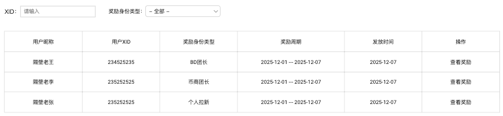
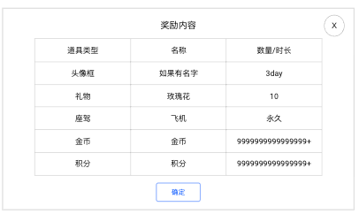

# 运营后台 · V1.5.0

> 状态：**工作区文档，非权威**。不覆盖已收录版本。日常改功能不要读本文件。
>
> 来源：`【PRD】Hayyo v1.5.0 - 测试版4.docx`  
> 需求状态：已确认（2026-09-07）  
> 实现状态：待实施  
> 截图为 demo / 占位，**规则以正文已确认口径为准**。  
> App 侧 Banner 展示、结算单对应的用户奖励见 [`referral.md`](referral.md)。

## 范围

- 现有 Banner 管理增加类型「团队数据」（同一张列表、同一套字段，不新开菜单）。
- 拉新后台新开跨身份「拉新充值结算订单详情」列表 +「查看奖励」弹窗。
- 现有个人 / 币商 / BD 分身份统计与处理页保留，不替换。
- 不在本期：空表、商城/休闲游戏原型、提现主流程、积分作为拉新发奖类型。

## Banner 管理增加类型「团队数据」

覆盖 V1.0.0「类型只保留首页 banner」。本期类型为：**首页**、**团队数据**。其余历史已删除的主播中心 / 主播 / 工会 / 游戏类型仍不恢复。

| 功能名称 | Banner 列表（V1.5.0） |
|---|---|
| 优先级 | 高 |
| 功能描述 | 同一张 Banner 列表增加类型「团队数据」，用于团长团队数据页顶部。 |
| 输入/前置条件 | 运营后台 → 平台配置 → Banner 管理 → Banner 列表 |
| 交互原型 | 沿用现有 Banner 列表页，不新开菜单 |
| 字段描述 | 列表字段（与现有一致，本期列出全文）： 标题：Banner 的标题（用户端无需显示）。 图片：Banner 图片。 类型：首页 / 团队数据（本期新增「团队数据」；列表需能区分两条类型）。 跳转：当前跳转的是页面还是房间。 地址：点击跳转的地址；若是房间则为 ID（纯数字正整数）。 时间：Banner 的有效时间；在设定时间内才在用户端展示。 显示设备：一个端或双端都展现。 语区：按用户在应用中的语区判定，不同语区显示对应 Banner。 排序：数字小的展示在前面。 状态：启用 / 停用。 最低版本号（V1.3.0 已有，非必填）：输入版本号后，大于等于此版本号才显示该 Banner。 H5 多语言标题（V1.3.0 已有）：配置 H5 时增加多语言标题，并于前端展示。 筛选：状态（启用 / 停用 / 全部）；系统（iOS / 安卓 / 全部）；语区（与现有 Banner 列表一致）；**类型（全部 / 首页 / 团队数据）**。 |
| 需求描述 | 进入页面默认显示状态为启用中的 Banner；按生成时间倒序排列。 用户端展示条件：状态启用，且在设置的时间区间内，且匹配语区、显示设备、最低版本号（若已填）。 用户端排序：按排序字段数字小的在前（正整数）。 类型=团队数据的条目只下发到团长团队数据页；类型=首页的条目只下发到首页 / 房间大厅推荐 Banner，互不下发。 |
| 补充说明 | 客户端展示见 [`referral.md`](referral.md)「团队模块新增顶部 Banner」。 |

| 功能名称 | Banner 编辑新增（V1.5.0） |
|---|---|
| 优先级 | 高 |
| 功能描述 | 新增 / 编辑 Banner；类型可选首页或团队数据。 |
| 输入/前置条件 | Banner 列表点击新增或编辑 |
| 交互原型 | 沿用现有 Banner 编辑页 |
| 字段描述 | 标题：Banner 的标题。 图片：上传限制 5MB 以下。 类型：单选。可选「首页」「团队数据」。默认「首页」。覆盖历史「只保留首页 banner」。 跳转类型：单选，默认选择页面；删除代理列表页（历史已删，不恢复）。 地址：非必填。页面则输入链接；房间则输入 ID（纯数字正整数）。 时间：Banner 的有效时间。 显示设备：限制一个端还是双端都展现，默认通用。 语区：按用户在应用中的语区判定，显示在指定语区，单选，默认英语。 排序：权重，数字小的展示在前面，只可输入正整数。 状态：启用 / 停用。 最低版本号：非必填；大于等于此版本号才显示。 H5 多语言标题：配置 H5 时填写，并于前端展示。 |
| 需求描述 | 保存后按类型分别下发。未填地址时可保存；用户端可展示，点击无跳转。 停用或过期：对应用户端不展示、不占位。 |
| 补充说明 | 不为团队数据另造字段。截图中的积分欠款 / 去提现不是 Banner 配置项。 |

## 拉新后台 — 拉新充值结算订单详情

| 功能名称 | 拉新充值结算订单详情 |
|---|---|
| 优先级 | 高 |
| 功能描述 | 在拉新后台新开跨身份汇总列表，查看各身份结算单及实际发放奖励。 |
| 输入/前置条件 | 运营后台 → 拉新后台。现有个人 / 币商 / BD 分身份统计与处理页保留。 |
| 交互原型 | 「图1」列表；「图2」查看奖励弹窗 |
| 字段描述 | **列表列（按截图）** 用户昵称：该结算对象的完整昵称。 用户 XID：外显 ID。 奖励身份类型：BD 团长 / 币商团长 / 个人拉新。 奖励周期：该结算所属活动周期（年月日区间，与现有周期管理一致）。 发放时间：该结算奖励实际发放时间。 操作：查看奖励。 同一用户在不同身份下可以多行。 **筛选** XID 可搜索。 支持 XID + 身份类型联合查询。 身份类型：全部 / BD 团长 / 币商团长 / 个人拉新。 **查看奖励弹窗（三列，按截图）** 道具类型、名称、数量/时长。 只展示该结算单**实际发放**的奖励，没有的类型不占空行凑类型。 道具类型以现有拉新奖励组为准：礼物、VIP、道具（头像框、座驾、房间背景）、宝石。数量按物品属性用个数或天数/小时/分钟。 截图中的金币 / 积分 / 永久是示例，**不新增积分等发奖类型**，不扩散到签到。 |
| 需求描述 | 数据来自现有各身份充值活动结算已发放记录，本页做跨身份汇总查询，不改结算公式、审核流、欠款追溯。 分页沿用现有拉新后台列表。 默认按发放时间近的在前（与现有团队订单「时间近的展示在前面」一致）。 无记录时空列表，不编造占位奖励。 |
| 补充说明 | 不替换个人 / 币商 / BD 各自的充值活动统计与订单处理页。 |

