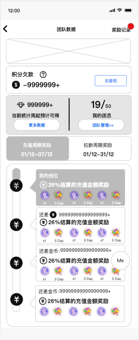
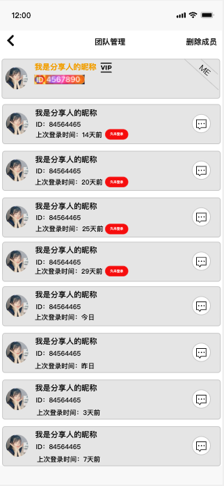
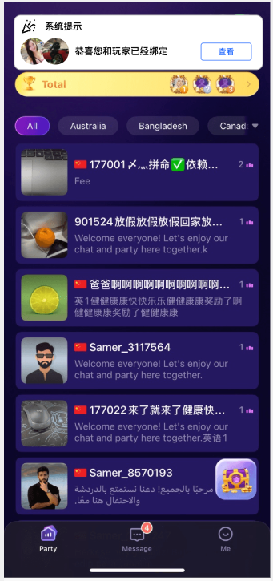
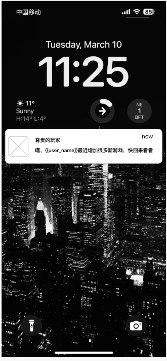
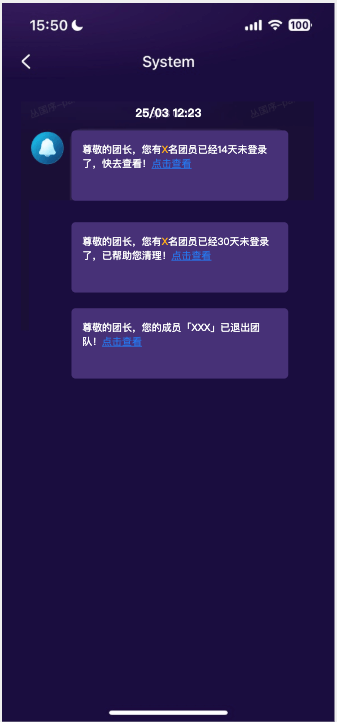
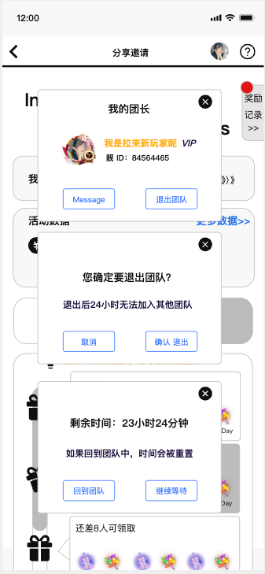
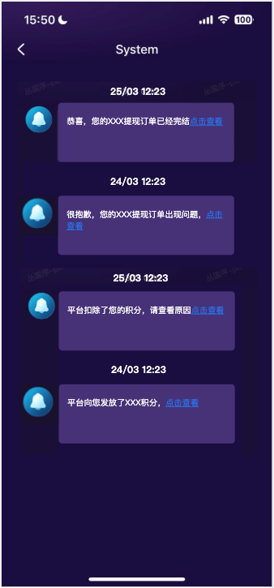

# 拉新 · V1.5.0

> 状态：**工作区文档，非权威**。不覆盖已收录版本。日常改功能不要读本文件。
>
> 来源：`【PRD】Hayyo v1.5.0 - 测试版4.docx`  
> 需求状态：已确认（2026-09-07）  
> 实现状态：待实施  
> 截图为 demo / 占位，**规则以正文已确认口径为准**，不以截图数字、乱序、积分欠款/去提现等未立标题内容为准。  
> 本版覆盖：V1.0.0「团员不支持主动退出，只支持团长踢出和后台移出」；团队管理列表「入团时间」展示改为「上次登录时间」。V1.1.0 团长在列表首位、删除成员时不展示团长，仍然有效。

## 范围

- 客户端：团队数据 Banner、团队管理列表、绑定成功顶部条、未登录提醒与 30 天清人、团员主动退出、提现/积分系统消息。
- 后台页面权威在 [`admin.md`](admin.md)：Banner 增加类型「团队数据」、拉新后台新增结算订单详情。
- 不在本期：Word 空表、同目录商城/休闲游戏原型、截图中的积分欠款与去提现、提现订单列表/积分列表的页面字段（只写跳转）。

---

## 优化模块

### 团队模块新增顶部 Banner

| 功能名称 | 团队模块新增顶部 Banner |
|---|---|
| 优先级 | 高 |
| 功能描述 | 团长「团队数据」页顶部增加 Banner 展示位。 |
| 输入/前置条件 | 用户身份为 BD 团长或币商团长，可进入团队数据页。 |
| 交互原型 | 「图1」 |
| 字段描述 | 展示位：团队数据页顶部。无有效配置时不占位。 可见身份：仅团长。团员分享邀请页、非团玩家页不展示本 Banner。 数据来源：运营后台 Banner 管理中类型为「团队数据」、状态启用、在有效时间内、匹配用户语区与设备（及现有最低版本号，若已配置）的条目。 多条时：用户端展示、轮播、点击跳转与房间大厅推荐 Banner 同一套现有规则（从右向左每 3s 一张，最后一张循环到第一张；加载失败按现有首页 Banner 替代占位）。排序数字小的在前。 |
| 需求描述 | **客户端** 进入团队数据页拉取 Banner 列表并展示；点击按后台配置的跳转类型打开页面链接或房间。 **服务端** 按类型=团队数据 + 启用 + 在有效期 + 语区 + 设备（+ 最低版本，若该字段有值）过滤下发。 **异常** 跳转地址为空：可展示但点击无跳转（与现有 Banner 地址非必填一致）。 团长身份被删除后不再进入团队数据页，自然看不到 Banner。 |
| 补充说明 | 后台字段与配置见 [`admin.md#admin-banner-v150`](admin.md#admin-banner-v150)。截图中「积分欠款 / 去提现」不是本条需求。 |

### 团队管理 — 登录时间与久未登录

| 功能名称 | 团队管理页面新增登录时间和久未登录提示 |
|---|---|
| 优先级 | 高 |
| 功能描述 | 团队管理列表用「上次登录时间」替换「入团时间」，并对满 14 个自然日未登录的团员打「久未登录」。 |
| 输入/前置条件 | 团长进入团队管理（入口仍为团队数据页「我的团员」）。 |
| 交互原型 | 「图1」 |
| 字段描述 | 团长卡片：仍在列表首位（V1.1.0），带个人标签；点头像进自己资料。删除成员模式下仍不展示团长。 团员卡片：头像、昵称、显示 ID、VIP（若有）、**上次登录时间**、消息入口。本页不再展示入团时间。 上次登录：沿用现网「上次登录」字段，本期不另造口径。 时间文案（仅本列表）：按 GMT+3 自然日写成「今日」「昨日」「N 天前」。不写时分，不写 `dd/MM`。系统消息时间仍为历史 `dd/MM hh:mm`。 久未登录标签：上次登录距今满 **14 个 GMT+3 自然日** 则展示（与 14 天提醒同一阈值）。 |
| 需求描述 | **排序（团长始终第一）** 1. 久未登录组：上次登录越久越靠上。 2. 其他团员组：上次登录越近越靠上。 3. 同组同一时间：显示 ID 小的在前。 **服务端** 列表接口返回现网上次登录时间；客户端按 GMT+3 自然日格式化并打标。满 30 个自然日未登录的人会被系统移出（见后文），移出后不再出现在本列表。 **异常 / 边界** 上次登录按现网字段展示，不另造空值文案。 删除成员、私信、点头像看资料：沿用 V1.0.0 / V1.1.0，不改。 |
| 补充说明 | 覆盖 V1.0.0 列表「展示入团时间、按入团时间倒序」的**展示与排序**。入团时间仍可在后台团队成员管理查看。 |

### 被拉新用户绑定成功提示

| 功能名称 | 被拉新用户绑定成功提示 |
|---|---|
| 优先级 | 高 |
| 功能描述 | 绑定成功后，被拉新用户进入 App 再增加一条顶部提示；V1.1.0 成功系统消息仍保留。 |
| 输入/前置条件 | 通过链接/二维码或平台内搜索向上绑定，且绑定成功。 |
| 交互原型 | 「图1」为 demo 场景，**实际形态为 V1.1.0 主页顶部条**，不是常驻 Party 卡片。 |
| 字段描述 | 展示次数：绑定成功后进入 App **只弹出一次**；只要展示过（含未点查看、杀进程），之后再进 App 不再弹出。 动效与关闭：复用 V1.1.0 绑定失败顶部条（[`../../../site/core-docs/prd/design/infra/PRD.md`](../../../site/core-docs/prd/design/infra/PRD.md) 3.4.12），不另造一套。 点「查看」：打开邀请者**已绑定信息**弹窗（头像、昵称、ID、VIP/靓号等，同 V1.1.0 已绑定弹窗）。 |
| 需求描述 | **服务端** 绑定成功时打「待展示顶部条」标记；客户端展示成功后回写已展示，清除标记。 绑定失败顶部条逻辑不变（仅单人拉新链接失败等场景，见 [`../../../site/core-docs/prd/design/infra/PRD.md`](../../../site/core-docs/prd/design/infra/PRD.md) V1.1.0 3.4.12）。 **并存** 绑定成功系统消息仍发，点「我要参与」仍去新手玩法（活动不可展示则 toast「活动已结束」）。 **异常** 用户一直未打开 App：待下次进入 App 再展示一次，展示后不再展示。 |
| 补充说明 | 覆盖范围仅「成功」顶部条；不改失败文案表。 |

### 长期未登录的拉新团队成员的消息提示

| 功能名称 | 长期未登录的拉新团队成员的消息提示 |
|---|---|
| 优先级 | 高 |
| 功能描述 | 满 14 天：通知团长（系统消息）+ 给团员离线推送。满 30 天：系统移出团队。 |
| 输入/前置条件 | 该用户是某团队团员（不含团长自己走主动退出）。上次登录用现网字段。天数按 **GMT+3 自然日**。冷静 24 小时 / CD 24 小时仍按**满小时**，与本条自然日分开。 |
| 交互原型 | 「图1」离线推送 demo；「图2」团长系统消息 demo。 |
| 字段描述 | **14 天 · 团长系统消息** 汇总一条：有 X 名团员已经 14 天未登录。每人从满 14 天起只提醒一次；该团员登录后再次未登录满 14 天才再计入下一次汇总。一直不上线、未满 30 天，不天天重发。 点击「点击查看」：进入团队管理。 **14 天 · 团员离线消息** 系统推送（通知栏/锁屏）。文案用截图：标题「尊贵的玩家」，正文含 `{{user_name}}` 与新游戏召回。每人满 14 天一次，再登录再满 14 天可再发。 点击推送：只唤起 App，进入**默认主页**（游戏或 Party，跟现网落地页）。不进团队管理、分享邀请或其它业务详情。 不给未登录团员发站内系统召回。 **30 天 · 系统清人** 满 30 个 GMT+3 自然日未登录，系统将该团员移出团队，视为**真正脱离**（进 CD，见主动退出）。 团长：该人一条「成员已退出」+ 本批一条汇总「有 X 名团员已经 30 天未登录，已帮助清理」。 团员：历史文案「您已经退出了「团长昵称」的团队…」。 团长点击查看进团队管理；团员点击查看进分享邀请（非团样式）。 |
| 需求描述 | **服务端** 按 GMT+3 自然日扫描团员上次登录。14 天：生成团长汇总与团员推送（每人周期内一次）。30 天：执行移出，走真正脱离（CD、已退出消息、释放名额）。 冷静中的团员仍在团内，若同时满 30 天未登录，按真正脱离处理（立刻脱离 + CD），冷静结束。 **异常** 推送关闭/失败：不补站内召回（已确认不做团员站内召回）。 团长停用/无团队：不发团长侧 14/30 天消息。 |
| 补充说明 | 锁屏「新游戏」文案已确认为本条离线推送正文，不是另开游戏运营需求。 |

### 团队成员主动退出团队流程

| 功能名称 | 团队成员主动退出团队流程 |
|---|---|
| 优先级 | 高 |
| 功能描述 | 团员可主动退出。先冷静 24 小时（人还在团），到期才脱离并进入 CD 24 小时。 |
| 输入/前置条件 | 当前身份为团员（不是团长）。团长不能主动退出，没有「退出团队」；卸任只走后台删团长。 |
| 交互原型 | 「图1」三层弹窗顺序。 |
| 字段描述 | **非冷静时弹窗（三层，按图）** 1. 分享邀请页点「我的团长」→ 资料弹窗（私信 / 退出团队）。 2. 点「退出团队」→ 二次确认（文案跟图，含「退出后 24 小时无法加入其他团队」）。 3. 确认后 → 剩余时间弹窗（回团队 / 继续等待）。 **冷静中** 再点「我的团长」直接出剩余时间，不再走确认。 **回团队**：取消冷静，人还在原团。关掉剩余时间 + 资料弹窗，回到分享邀请。之后再点「我的团长」重新走三层。每次点退出都**重新冷静 24 小时**。 **继续等待**：关掉剩余时间 + 资料弹窗，回到分享邀请；冷静继续。再点「我的团长」仍直接剩余时间。 |
| 需求描述 | **状态机** 冷静 24 小时：点确认后进入。人仍在团队、占名额、出现在团队管理；期间数据仍记入该团队。可「回团队」取消冷静。 冷静到期（满 24 小时）：自动真正脱离，进入 CD 24 小时。 CD 24 小时：真正脱离之后。期间不能加入任何团队（链接/二维码/应用内邀请均不可）。**后台加人可以跳过 CD**。 **真正脱离（一律进 CD，并在脱离时发已退出消息；进入冷静不发）** - 冷静到期自动脱离 - 团长踢出（含冷静中被踢，立刻脱离 + CD） - 后台移出（含冷静中被移出，立刻脱离 + CD） - 删团长 / 团队解散导致离开（含冷静中随团解散） - 满 30 天未登录系统清人 **冷静中后台加人** 不能直接加到别的团。要换团必须先后台移出（脱离 + CD），再后台加人（可跳过 CD 加入新团）。 **消息（真正脱离时）** 团长：截图口径「您的成员「XXX」已退出团队」（历史权威文档无此条，本期新增）。点击查看 → 团队管理。 团员：沿用历史「您已经退出了「团长昵称」的团队。如果有问题请联系您的团长或官方客服。」点击查看 → 分享邀请。 **服务端** 冷静到期按满小时执行脱离。入团校验：冷静中人仍在原团，走历史「您在其他团队中，不可加入其他团队」；已脱离且 CD 未结束、且非后台加人 → 拒绝，提示沿用确认弹窗已确认语义「退出后 24 小时无法加入其他团队」。 **异常** 冷静中团队已满：人仍占名额，团长不能再加人到上限之上（沿用上限规则）。 回团队时原团已被解散或团长已删：按已确认的散团真正脱离处理，不能再取消冷静。 |
| 补充说明 | 覆盖 V1.0.0「团员不支持主动退出」。退出后已绑定用户的充值/拉新仍计原团队、不跟到新团队（历史规则，本期未改）。 |

### 提现订单消息

| 功能名称 | 提现订单消息 |
|---|---|
| 优先级 | 高 |
| 功能描述 | 系统消息四条：提现完结、提现驳回、平台发积分、平台扣积分。 |
| 输入/前置条件 | 对应用户存在提现单状态变更，或后台对其加/扣积分成功。 |
| 交互原型 | 「图1」 |
| 字段描述 | 1. 提现完结：提现单到已完成 / 已打款时发。点击查看 → **提现订单详情列表**。 2. 提现出问题：提现单**被驳回**时同步发。点击查看 → **提现订单详情列表**。 3. 平台发放积分：后台给该用户加积分成功时发（不限于提现）。点击查看 → **积分列表**。 4. 平台扣除积分：后台给该用户扣积分成功时发（不限于提现）。点击查看 → **积分列表**。 时间展示：系统消息仍为 `dd/MM hh:mm`。 |
| 需求描述 | **服务端**在对应成功/驳回节点写系统消息。 **客户端**系统消息列表展示全文；点击查看跳转上述列表。提现列表、积分列表的字段与交互不在本期展开。 **异常**目标页不存在或失败：toast 失败，消息本身保留。 |
| 补充说明 | 四条均在本标题下。提现主流程不在本期，本文只定消息触发点。 |

